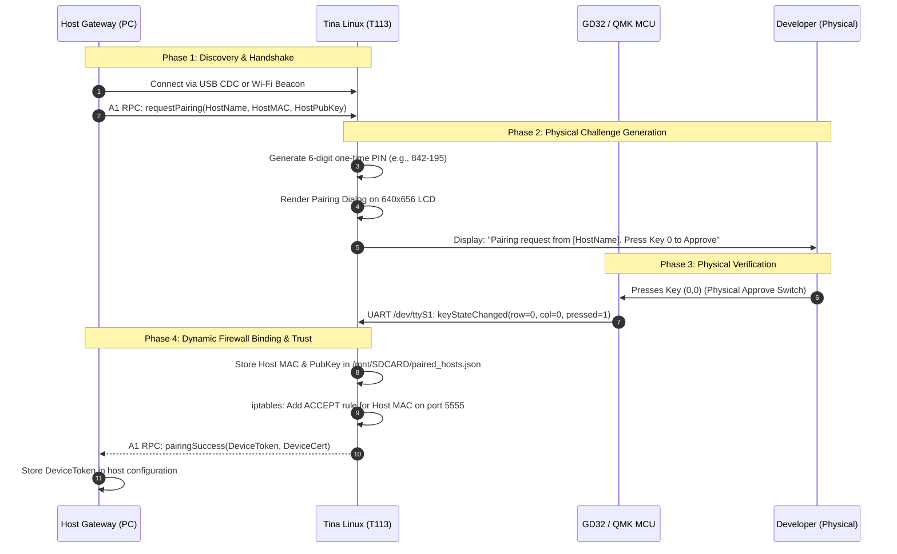

# Snowball Control: System Architecture Specification

## 1. Executive Summary & Vision

Snowball Control transforms the MK20 (Allwinner T113 dual-core ARM Cortex-A7 with GD32/QMK MCU) into a dedicated, physical AI coding control panel (HUD) for developer workflows.

### Architectural Invariant: Host-Owned Intelligence
- **Development machines (Host)** own coding tools, git repositories, language servers, and live provider sessions (Codex app-server, Claude Agent SDK, Gemini ACP).
- **The MK20 (Device)** remains a thin client responsible for visual status display, audio alerts, and low-latency physical key input (approvals, cancellations, retries).

---

## 2. Deliverables Organization

```text
Snowball Ecosystem
├── 1. Firmware Deliverables (Device-Side: MK20 Hardware)
│   ├── GD32 / MCU Firmware (Low-latency Key/HID controller)
│   ├── Tina Linux OS / BSP (Kernel 5.4, DTB, ConfigFS USB Gadget)
│   ├── Device Application (/data/KeyboardDevice / Snowball HUD Daemon)
│   └── SD Recovery Hook (lunch.sh, dev-access.conf, factory fallback)
│
└── 2. Gateway Deliverables (Host-Side: Windows / Mac / Linux)
    ├── Device Transport Layer (Dual-plane: USB CDC A1 RPC + Network TCP)
    ├── Agent Orchestration Engine (Codex, Claude, Gemini adapters)
    ├── Pairing & Security Manager (Host identity, PIN exchange, MAC/Key store)
    └── Developer IPC / CLI (`snowball-gateway`, IDE plugins, system service)
```

### 2.1 Firmware Deliverables (`mk20-firmware`)
Artifacts targeting the physical MK20 hardware:

| Component | Target Architecture | Location / Image | Primary Responsibilities |
|---|---|---|---|
| **GD32 / QMK Firmware** | ARM Cortex-M4 (GD32F303) | MCU Internal Flash | 20-key switch matrix scanning, rotary dial, VIA dynamic keymap protocol, UART communication over `/dev/ttyS1`. |
| **Tina Linux OS & BSP** | ARMv7l Cortex-A7 (Allwinner T113) | Flash Partitions (`/rom`, `/overlay`) | Linux kernel 5.4.61, USB ConfigFS Gadget (CDC ACM `1D6B:0104`), RTL8188GU Wi-Fi driver, ALSA audio. |
| **Device HUD Daemon** | Tina Linux Userspace (Qt5 / C++) | `/data/KeyboardDevice` | 640x656 LCD frame rendering (`/dev/fb0`), A1 protocol server, file management, proactive key event escalation to host. |
| **MicroSD Recovery Hook** | FAT32 MicroSD (`/dev/mmcblk0p1`) | `/mnt/SDCARD/lunch.sh` | Zero-risk boot hook: configures Wi-Fi, launches TCP `adbd` (port 5555), installs MAC firewall rules, logs state, preserves factory rollback. |

### 2.2 Gateway Deliverables (`snowball-gateway`)
Artifacts executing on the developer's host machine (Windows / Mac / Linux):

| Component | Implementation | Responsibilities |
|---|---|---|
| **Transport Layer** | Standalone A1 Protocol Driver (`Mk20Protocol.psm1`, TS/Go) | Wire serialization (`0xA1A55A5E`), bi-directional IEEE 802.3 CRC32 verification, dual-plane connection management (USB CDC + TCP). |
| **Orchestration Engine** | Normalized Event Bus (`SCHEMA.md`) | Normalizes coding turns, model thinking, tool executions, and approval states across OpenAI Codex, Anthropic Claude, and Google Gemini. |
| **Pairing Manager** | Cryptographic & Physical Challenge Handler | Host identity registration, physical challenge verification (MK20 LCD + keypress), dynamic firewall rule synthesis. |
| **Matrix Dispatcher** | Hardware Action Router | Maps physical MK20 keypresses (`row, col, pressed`) directly to agent turn decisions (Approve, Reject, Retry, Cancel). |
| **Host Service / CLI** | Background Service (`snowball-gateway`) | Persistent daemon running as Windows Service / systemd, exposing local IPC (WebSocket/gRPC on `localhost:7700`) for IDE extensions. |

---

## 3. Pairing Architecture: Zero-Trust Physical Presence

### 3.1 Security Threat Model & Requirement
- **USB CDC Link**: Physically secure by virtue of direct cable attachment.
- **Wi-Fi TCP Link (Port 5555 / HUD port)**: Unauthenticated network endpoints on local Wi-Fi present risk of unauthorized device access.
- **Solution**: The MK20 firewall restricts network traffic strictly to authenticated host MAC addresses. To pair a new host machine over Wi-Fi without pre-shared credentials, the system requires **Proof of Physical Presence**.

### 3.2 Pairing Sequence Diagram



### 3.3 Dynamic Firewall Enforcement
Upon successful physical pairing, Tina Linux dynamically updates its firewall rules:
```bash
# Insert accept rule for the verified host MAC ahead of the drop rule
iptables -I INPUT 1 -p tcp --dport 5555 -m mac --mac-source <HOST_MAC> -j ACCEPT
```
The binding persists across reboots in `/mnt/SDCARD/paired_hosts.json`.

---

## 4. Dual Control Planes & Failover Resilience

Snowball Control operates two independent control planes:

```text
+-----------------------+                    +-----------------------+
|                       |  USB CDC (COM5)    |                       |
|   Developer Host PC   |====================|   MK20 Control Panel  |
|   (Snowball Gateway)  |  (Primary Wired)   |    (Tina Linux OS)    |
|                       |                    |                       |
|                       |  TCP Port 5555     |                       |
|                       |--------------------|                       |
|                       |  (Firewalled Wi-Fi)|                       |
+-----------------------+                    +-----------------------+
```

1. **Primary Control Plane (Wired USB CDC ACM)**:
   - Zero-latency serial channel on `COM5` (Linux Gadget VID `1D6B:0104`).
   - Runs the A1 RPC protocol with IEEE 802.3 CRC32 verification.
   - Carries bidirectional product traffic (HUD updates, LCD telemetry, physical keystroke events).
2. **Secondary Control Plane (Firewalled Wi-Fi TCP)**:
   - Dedicated development and recovery channel on port 5555.
   - Firewalled to paired host MAC addresses.
   - Carries diagnostics (`doctor`), fast file synchronization, remote shell, and telemetry.
3. **Seamless Failover**:
   - If the USB cable is disconnected during an active coding turn, the Gateway automatically shifts event transport to the firewalled TCP link without dropping session context or losing turn approval prompts.

---

## 5. Linux <-> GD32 Serial Interface Contract

Communication between the Allwinner T113 SoC and the GD32 MCU occurs over internal UART `/dev/ttyS1` at 115200 8N1:

- **Framing**: `0xAA 0x55 [checksum] [len] [0xFF - len] [payload] 0xF5 0x5F`
- **Key Escalation**: Signal `keyStateChanged(layer, row, col, state, keyCode)`:
  - Rows 0..3, Cols 0..4: 20 mechanical switches.
  - Rows 100..105: Rotary dial and encoder actions.
- **Matrix Mapping**: Reverse-engineered binary format in `/data/KeyboardInfo` (268 bytes: 26 10-byte records + terminator).
