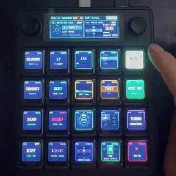
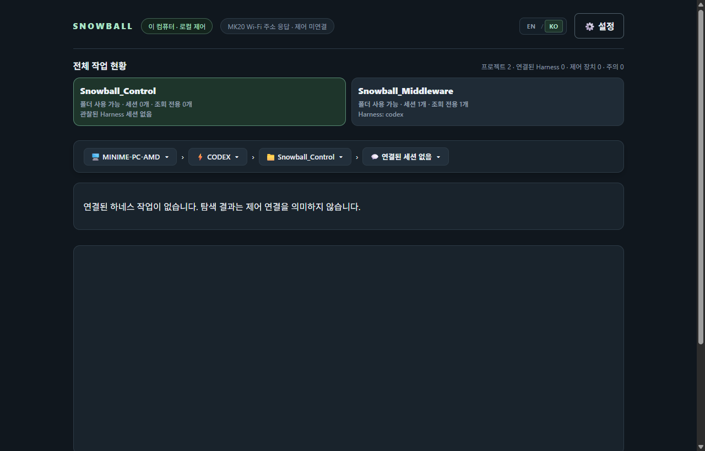

<p align="center">
  
</p>

<h1 align="center">
  
  Snowball Control — Preview
</h1>

<p align="center">
  <strong>Snowball의 inter-Harness 로컬 제어를 위한 물리 데스크 터미널</strong>
</p>

<p align="center">
  <a href="README.md">English</a> | <a href="README.ko.md">한국어</a>
</p>

<p align="center">
  <a href="LICENSE"></a>
  
  
  <a href="https://github.com/fkiller/Snowball_Middleware"></a>
</p>

---

## 🌟 개요 (Overview)

**Snowball은 inter-Harness 로컬 제어 인터페이스입니다.** 개발자가 MK20 데스크 터미널과 로컬 Web Supervisor에서 Codex, AGY, OpenCode를 공통된 조작 방식으로 탐색하고 제어합니다. 사용자가 하네스·프로젝트·세션을 선택하고, 각 하네스는 고유한 실행 환경·이력·모델·권한을 유지합니다.

제품의 철학은 **제어권을 사용자의 손과 컴퓨터에 두는 것**입니다. 도구를 오가고 작업을 확인하는 동작은 즉각적이어야 하며, 기능은 실제 설치 환경에서 발견하고 결과와 한계는 사실대로 보여줘야 합니다. 자세한 [제품 철학](docs/ARCHITECTURE.ko.md#제품-철학-inter-harness-로컬-제어)은 아키텍처 문서에서 중앙 관리합니다.

**Preview:** 개인 PC와 신뢰하는 내부 네트워크 전용입니다. 최초 범주는 Codex, AGY, OpenCode, MK20과 로컬 Web UI입니다. UDP/개발 ADB의 보안(인증 및 암호화)을 생략한 부분은 [현재 설계 문서](docs/ARCHITECTURE.ko.md)에 명시합니다.

**Snowball Control**은 MK20 데스크 터미널의 물리적 인터페이스 펌웨어(QMK), Allwinner T113 Tina Linux용 네이티브 C HUD 엔진, 하드웨어 연동 도구 및 STT 참조 호스트를 제공합니다.

전체 미들웨어와 Web Supervisor는 동반 저장소 [Snowball_Middleware](https://github.com/fkiller/Snowball_Middleware)에 있습니다. 두 저장소를 같은 부모 폴더에 배치하세요. Control의 `host/npm start`는 Codex 전용 참조 런타임입니다.

---

## 🎥 하드웨어 시연 및 비주얼 쇼케이스 (Visual Showcase)

### 1. 계층 네비게이션 및 음성 세션 실기기 시연
MK20에서 구동되는 브레드크럼 계층 네비게이션(`기기 > 하네스 > 프로젝트 > 세션`), 내장 마이크 음성 프롬프트 캡처, 모달 뷰(좌측 상단 타이틀 겸 Close 버튼, 열별 단축키, 4×4 그리드 캔버스), 그리고 로터리 노브 선택 동작 시연입니다:

<p align="center">
  <br>
  <em>실물 하드웨어에서 동작하는 브레드크럼 네비게이션 및 모달 제어.</em><br>
  <a href="assets/videos/mk20_navigation_demo.mp4">▶️ 고화질 전체 MP4 영상 보기</a> &nbsp;|&nbsp; <a href="https://x.com/fkiller/status/2099345561627382015">🔗 X (Twitter) 원본 글</a>
</p>

### 2. UI 엘리먼트 및 키 매트릭스 테스트
20개 기계식 스위치 위의 개별 128×128 LCD 키캡 화면, 듀얼 로터리 엔코더 노브, 동적 명암비 반전 테마, 초저지연 프레임버퍼 렌더링 물리 테스트입니다:

<p align="center">
  <br>
  <em>키 매트릭스 디스플레이, 다이얼 및 동적 테마 렌더링 물리 테스트.</em><br>
  <a href="assets/videos/mk20_ui_elements_test.mp4">▶️ 고화질 전체 MP4 영상 보기</a> &nbsp;|&nbsp; <a href="https://x.com/fkiller/status/2095861881281917119">🔗 X (Twitter) 원본 글</a>
</p>

### 3. 웹 수퍼바이저 대시보드 (Web Supervisor)
탐색된 작업공간, 세션 저널, MK20 하드웨어 연결 상태를 실시간으로 모니터링하는 로컬 루프백 제어 평면(`http://127.0.0.1:8765/`) 화면입니다:

<p align="center">
  
</p>

### 4. MK20 오프라인 대기 화면 및 연결 상태
미들웨어가 실행되지 않았거나 PC와의 네트워크 통신(UDP sync)이 끊어지면, 기기는 자동으로 **Snowball 대기 모드(Standby Mode)**로 전환됩니다:
- **상단 디스플레이 (`/dev/fb21`)**: 좌측에 상태 안내("Host Disconnected", "Snowball Standby Mode")와 우측에 128×128 16비트 Snowball 강아지 아이콘을 렌더링합니다.
- **10번 키 (`/dev/fb10`)**: 128×128 Snowball 아이콘이 점등되고, 나머지 키는 백라이트가 소등되어 대기 상태임을 직관적으로 표시합니다.
- **자동 복귀**: PC 미들웨어가 시작되면 실시간 작업 세션 화면으로 즉시 전환됩니다.

| 대기 모드 상단 화면 (`/dev/fb21`) | 대기 모드 10번 키 (`/dev/fb10`) | 미들웨어 연결 완료 (`/dev/fb21`) |
| :---: | :---: | :---: |
|  |  |  |

---

## 🚀 시작하기 (Getting Started)

Node.js 22.12 이상과 Python 3.10 이상을 준비합니다. 미들웨어를 빌드하기 전에 Control의 공용 STT 호스트 라이브러리를 먼저 빌드합니다.

```bash
# 1. Control 호스트 라이브러리 빌드
cd Snowball_Control/host
npm ci
npm run build

# 2. Middleware 빌드 및 Web Supervisor 실행
cd ../../Snowball_Middleware
npm ci
npm run build
npm run start:local
```

Web UI는 `http://127.0.0.1:8765/`에 로그인/PIN 없이 접근합니다. MK20 전체 통합 Preview는 Middleware에서 `node scripts/start-all.mjs`로 실행합니다. 하네스의 실제 CLI 설치·로그인, 기기 네트워크 설정과 로컬 STT 모델이 필요합니다. 모델/effort는 CLI·캐시에서 발견하고 없는 목록을 대신 만들지 않습니다. 현재 읽은 버전과 검증 범위는 [아키텍처 문서](docs/ARCHITECTURE.ko.md)에 있습니다.

---

## ⌨️ MK20 하드웨어 준비 (MK20 Setup)

- **수정된 MK20 QMK 업데이트 필수**: USB host 연결 없이 독립 전원에서 키 입력 스캔이 멈추는 원래 QMK 버그를 해결하기 위해, 수정된 QMK 펌웨어 업데이트가 **필수**입니다. [플래싱 안내](hardware/mk20/qmk/README.ko.md)를 따르세요.
- **변경 전 SD 전체 이미지 백업 권장**: Snowball 이미지를 적용하기 전 카드 전체 백업을 권장하며, 문제 발생 시 백업 이미지를 복원합니다. [배포·백업·복원 절차](docs/ARCHITECTURE.ko.md#sd-이미지-배포백업복원)를 참고하세요.
- **Wi-Fi 설정**: 실제 접속 정보는 Git에서 제외된 SD 카드의 `dev-access.conf`에 설정합니다. [기기 연결 도구](hardware/mk20/dev-tools/README.md)를 참고하세요.
- **네이티브 HUD 데몬**: 현재 HUD는 Tina Linux(ARMv7)의 C 데몬이며 상단 428×142, 키 128×128 framebuffer를 사용합니다.
- **로컬 STT**: CUDA 또는 CPU 추론을 지원합니다. Python 의존성과 모델은 별도로 준비해야 합니다.

---

## 🧪 검사 및 테스트 (Verification & Tests)

```bash
# 하드웨어 플러그인 계약 테스트 (13개 통과)
npm test --prefix plugins/device-mk20

# Linux <-> GD32/QMK 시리얼 계약 테스트 (14개 통과)
powershell -File hardware/mk20/contract/Test-QmkProtocol.ps1

# 호스트 참조 단위 테스트 (52개 통과)
npm test --prefix host
```

---

## 📁 저장소 구조 (Repository Structure)

```text
Snowball_Control/
├── assets/                     # 브랜딩, 부트로더 로고, 시연 영상 및 기기 캡처 스크린샷
│   ├── banner.png
│   ├── icon.png
│   ├── bootlogo.bmp            # U-Boot 로고 (160x160 24-bit BMP)
│   ├── mk20-plus.bin           # 상단 디스플레이 부팅 리소스 (428x142 RGB565)
│   ├── screenshots/            # 실제 기기 프레임버퍼 캡처, GIF 및 웹 UI 화면
│   │   ├── mk20_navigation_demo.gif
│   │   ├── mk20_ui_elements_test.gif
│   │   ├── web_supervisor_dashboard_ko.png
│   │   ├── web_supervisor_dashboard_en.png
│   │   ├── standby_top_display.png
│   │   ├── standby_key10.png
│   │   └── online_top_display.png
│   └── videos/                 # 원본 고화질 MP4 녹화 영상
│       ├── mk20_navigation_demo.mp4
│       └── mk20_ui_elements_test.mp4
├── docs/                       # 아키텍처 및 상세 사양서 (단일 설계 원천)
│   ├── ARCHITECTURE.md         # 영문 아키텍처 사양서 (기본)
│   └── ARCHITECTURE.ko.md      # 한글 아키텍처 사양서
├── hardware/mk20/
│   ├── contract/               # Tina Linux <-> QMK 하드웨어 시리얼 계약
│   ├── dev-tools/              # MK20 부트스트랩 스크립트, lunch.sh & mk20ctl
│   ├── hud/                    # Tina Linux용 초저지연 네이티브 C HUD 엔진
│   └── qmk/                    # 독립 구동 지원 수정 QMK 펌웨어 소스 및 바이너리
├── host/                       # 참조 호스트 런타임 및 STT 어댑터
├── plugins/device-mk20/        # 격리된 하드웨어 전송 계층 및 스킨 엔진
├── LICENSE                     # Apache-2.0 라이선스
├── README.md                   # 영문 기본 README
└── README.ko.md                # 한글 README
```

---

## 📄 라이선스와 공개 범위 (License)

Snowball 자체 코드는 [Apache-2.0](LICENSE)입니다. QMK와 Allwinner T113 펌웨어 소스는 제조사로부터 직접 이메일로 제공받았습니다. QMK 기반 펌웨어의 GPL 고지와 제조사·제3자 구성의 조건은 별개입니다. 제조사 SDK/BSP, 개인 설정, SD 백업은 이 저장소에 포함하지 않습니다. 배포 대상과 빌드 기록은 [단일 설계 문서](docs/ARCHITECTURE.ko.md)에서 관리합니다.
