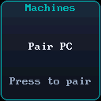
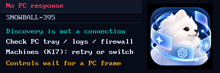

<p align="center">
  
</p>

<h1 align="center">
  
  Snowball Control — Preview
</h1>

<p align="center">
  <strong>Snowball의 inter-Harness 로컬 제어를 위한 물리 데스크 터미널</strong>
</p>

<p align="center">
  <a href="README.md">English</a> | <a href="README.ko.md">한국어</a>
</p>

<p align="center">
  <a href="LICENSE"></a>
  
  
  <a href="https://github.com/fkiller/Snowball_Middleware#one-shot-install"></a>
</p>

---

<a id="one-shot-install"></a>
## Snowball 한 번에 설치

**PC마다 Snowball을 한 번 설치하세요.** 기본 설치에 Web UI, MK20 검색·연결·음성 런타임, M5Stack 검색·게이트웨이, Codex·Antigravity·OpenCode 하네스 플러그인 3종이 모두 포함됩니다. 기기 프로필을 고르거나 USB 기기를 연결할 필요가 없습니다.

Windows PowerShell에서 실행하세요.

```powershell
& ([scriptblock]::Create((irm 'https://raw.githubusercontent.com/fkiller/Snowball_Middleware/main/install.ps1')))
```

설치기는 Node/Git/Python과 구성 요소를 준비하고 실제 격리 하네스 워커를 확인한 뒤, 트레이 아이콘이 있는 사용자별 숨김 백그라운드 앱을 시작합니다. 소유 런타임이 응답하면 설치 터미널로 돌아옵니다. 트레이에서 Web UI, 상태, 설정, 일시정지/재개, 재시작, 종료, 로그인 자동 시작을 제공합니다. Web UI는 **http://127.0.0.1:8765/**이며 기본 설치 위치는 `%LOCALAPPDATA%\Snowball`입니다. **Start-Snowball.ps1**은 다운로드 없이 다시 실행합니다. 네이티브 하네스 앱과 로그인은 공급자를 통해 준비하며, 없으면 사용 불가로 표시합니다.

기존 설치 업데이트는 같은 `-InstallRoot`에 `-Update`를 추가하고 `-Profile`은 생략하세요. 기존 단일 기기 설치에도 두 어댑터를 준비하며 기기 설정·페어링 키·컨트롤러 상태·음성 캐시·사용자 지정 API 포트·로그인 자동 시작 설정을 보존합니다. 사설 LAN이 없거나 선택이 모호하면 자동 검색은 대기·재시도하고 Web UI는 유지합니다. 필요하면 `-Bind PC의_사설_IP`를 지정하세요.

독립 MK20은 Wi-Fi에 연결한 뒤 K17(Machines)에서 PC를 페어링·선택합니다. PC 추가에 USB·ADB·SD 변경은 필요 없습니다. M5Stack 게이트웨이도 이미 설치돼 있지만, 기존 보안 경계에 따라 미등록 PC에는 최초 USB 등록이 필요하고 여러 PC 전환에는 펌웨어 0.3.0이 필요합니다. 설치 루트의 **Register-M5Stack.ps1**(선택: `-Serial COM번호`)로 재설치·다운로드·플래싱 없이 설치된 도구를 사용해 기존 펌웨어를 확인하고 USB 등록을 준비하세요. 최초 펌웨어 설치·업그레이드가 필요할 때만 `-Flash`를 추가하면 전체 플래시 백업 뒤 업로드합니다. macOS는 **Register-M5Stack.sh**와 선택 옵션 `--serial` / `--flash`를 사용합니다. 실행 중이던 트레이는 재시작하며, 멈춰 있었다면 USB 연결 상태로 실행해 등록을 마칩니다. 설치기에 준비를 함께 요청하는 고급 옵션은 각각 `-PrepareM5Stack -NoFlash`, `-PrepareM5Stack`입니다. 일반 설치와 `-Update`는 USB를 조사하거나 펌웨어를 쓰지 않습니다. 설치기의 `-Serial`과 `-NoFlash`는 `-PrepareM5Stack`과 함께 사용합니다. 등록 뒤 USB를 분리하고 기기의 Machine 목록에서 PC를 선택하세요. 검색만으로 미등록 PC를 자동 등록하지 않습니다.

옵션: `-Update`, `-InstallRoot 경로`, `-Bind PC의_사설_IP`, `-Port 8765`, `-NoStart`, `-NoShortcut`. `-Profile web|mk20|m5stack`은 개발·진단용 명시적 부분 구성으로 유지하며 일반 설치에서는 필요 없습니다. 같은 루트에 이미 설치된 어댑터는 유지합니다. Node/Git/Python이 준비된 macOS 소스 환경에서는 같은 부모 폴더 체크아웃으로 `npm run setup --`을 실행하며, USB 준비는 `--prepare-m5stack [--no-flash]`로 명시합니다. Linux 전체 워커 런타임은 아직 지원하지 않습니다. 프로토콜·인증·실물 검증 범위는 중앙 명세를 확인하세요.

[공통 아키텍처와 저장소 역할](https://github.com/fkiller/Snowball_Control/blob/main/docs/ARCHITECTURE.md)

[Control · MK20](https://github.com/fkiller/Snowball_Control) · [Middleware · Installer / Web UI](https://github.com/fkiller/Snowball_Middleware) · [Device · M5Stack](https://github.com/fkiller/Snowball_Device_M5Stack) · Harness: [Codex](https://github.com/fkiller/Snowball_Harness_Codex), [Antigravity](https://github.com/fkiller/Snowball_Harness_Antigravity), [OpenCode](https://github.com/fkiller/Snowball_Harness_OpenCode)

---

## 🌟 개요 (Overview)

**Snowball은 inter-Harness 로컬 제어 인터페이스입니다.** 개발자가 MK20 데스크 터미널과 로컬 Web Supervisor에서 Codex, AGY, OpenCode를 공통된 조작 방식으로 탐색하고 제어합니다. 사용자가 하네스·프로젝트·세션을 선택하고, 각 하네스는 고유한 실행 환경·이력·모델·권한을 유지합니다.

제품의 철학은 **제어권을 사용자의 손과 컴퓨터에 두는 것**입니다. 도구를 오가고 작업을 확인하는 동작은 즉각적이어야 하며, 기능은 실제 설치 환경에서 발견하고 결과와 한계는 사실대로 보여줘야 합니다. 자세한 [제품 철학](docs/ARCHITECTURE.ko.md#제품-철학-inter-harness-로컬-제어)은 아키텍처 문서에서 중앙 관리합니다.

**Preview:** 개인 PC와 신뢰하는 내부 네트워크 전용입니다. 최초 범주는 Codex, AGY, OpenCode, MK20과 로컬 Web UI입니다. UDP/개발 ADB의 보안(인증 및 암호화)을 생략한 부분은 [현재 설계 문서](docs/ARCHITECTURE.ko.md)에 명시합니다.

**Snowball Control**은 MK20 데스크 터미널의 물리적 인터페이스 펌웨어(QMK), Allwinner T113 Tina Linux용 네이티브 C HUD 엔진, 하드웨어 연동 도구 및 STT 참조 호스트를 제공합니다.

전체 설치와 실행은 위의 [Snowball Middleware](https://github.com/fkiller/Snowball_Middleware) 공통 진입점을 사용합니다. 이 저장소는 MK20 기기 구성 요소이며, Control의 `host/npm start`는 Codex 전용 참조 런타임입니다.

---

## 🎥 하드웨어 시연 및 비주얼 쇼케이스 (Visual Showcase)

### 1. 계층 네비게이션 및 음성 세션 실기기 시연
MK20에서 구동되는 브레드크럼 계층 네비게이션(`기기 > 하네스 > 프로젝트 > 세션`), 내장 마이크 음성 프롬프트 캡처, 모달 뷰(좌측 상단 타이틀 겸 Close 버튼, 열별 단축키, 4×4 그리드 캔버스), 그리고 로터리 노브 선택 동작 시연입니다:

<p align="center">
  <br>
  <em>실물 하드웨어에서 동작하는 브레드크럼 네비게이션 및 모달 제어.</em><br>
  <a href="assets/videos/mk20_navigation_demo.mp4">▶️ 고화질 전체 MP4 영상 보기</a> &nbsp;|&nbsp; <a href="https://x.com/fkiller/status/2099345561627382015">🔗 X (Twitter) 원본 글</a>
</p>

### 2. UI 엘리먼트 및 키 매트릭스 테스트
20개 기계식 스위치 위의 개별 128×128 LCD 키캡 화면, 듀얼 로터리 엔코더 노브, 동적 명암비 반전 테마, 초저지연 프레임버퍼 렌더링 물리 테스트입니다:

<p align="center">
  <br>
  <em>키 매트릭스 디스플레이, 다이얼 및 동적 테마 렌더링 물리 테스트.</em><br>
  <a href="assets/videos/mk20_ui_elements_test.mp4">▶️ 고화질 전체 MP4 영상 보기</a> &nbsp;|&nbsp; <a href="https://x.com/fkiller/status/2095861881281917119">🔗 X (Twitter) 원본 글</a>
</p>

### 3. 웹 수퍼바이저 대시보드 (Web Supervisor)
탐색된 작업공간, 세션 저널, MK20 하드웨어 연결 상태를 실시간으로 모니터링하는 로컬 루프백 제어 평면(`http://127.0.0.1:8765/`) 화면입니다:

<p align="center">
  
</p>

### 4. MK20 오프라인 대기 화면 및 연결 상태
선택한 미들웨어의 유효한 화면이 없으면 **Machines(K17)**를 계속 표시하여 페어링·재시도·전환할 수 있습니다. 선택하면 실제 PC 이름과 `Connecting to PC`를 표시하며, 8초 동안 유효한 화면이 없으면 `No PC response`를 표시합니다. 최근 알림을 받은 `available`과 실제 화면을 받은 `connected`를 구분합니다. 일반 조작은 선택 PC의 유효한 화면과 scope를 확인한 뒤 가능합니다. 저장된 선택은 페어링된 PC를 다시 발견하고 유효한 화면이 돌아오면 복귀합니다.

| 미연결 Machines 안내 (`/dev/fb17`) | 선택 PC의 화면 응답 없음 (`/dev/fb21`) |
| :---: | :---: |
|  |  |

2026-10-08에 런타임 0.2.1에서 캡처한 실제 프레임버퍼입니다. 응답 없음 화면은 미해결 연결을 기록하며 PC 페어링/제어 성공을 뜻하지 않습니다. 교차 구성 검증과 남은 실물 확인은 [중앙 문서](docs/ARCHITECTURE.ko.md#변경-영향과-문서-동기화)에 기록합니다.

---

## ⌨️ MK20 하드웨어 준비 (MK20 Setup)

- **수정된 MK20 QMK 업데이트 필수**: USB host 연결 없이 독립 전원에서 키 입력 스캔이 멈추는 원래 QMK 버그를 해결하기 위해, 수정된 QMK 펌웨어 업데이트가 **필수**입니다. [플래싱 안내](hardware/mk20/qmk/README.ko.md)를 따르세요.
- **변경 전 SD 전체 이미지 백업 권장**: Snowball 이미지를 적용하기 전 카드 전체 백업을 권장하며, 문제 발생 시 백업 이미지를 복원합니다. [배포·백업·복원 절차](docs/ARCHITECTURE.ko.md#sd-이미지-배포백업복원)를 참고하세요.
- **Wi-Fi 설정**: 실제 접속 정보는 Git에서 제외된 SD 카드의 `dev-access.conf`에 설정합니다. [기기 연결 도구](hardware/mk20/dev-tools/README.md)를 참고하세요.
- **네이티브 HUD 데몬**: 현재 HUD는 Tina Linux(ARMv7)의 C 데몬이며 상단 428×142, 키 128×128 framebuffer를 사용합니다.
- **로컬 STT**: CUDA 또는 CPU 추론을 지원합니다. 기본 설치가 MK20의 Python 의존성을 준비하고, 런타임이 실제 하드웨어에 맞는 로컬 모델을 확인·다운로드합니다.

---

## M5Stack + FACES 실기 영상

[](https://github.com/fkiller/Snowball_Device_M5Stack/blob/main/assets/videos/m5stack_navigation_demo.mp4)

[기기 펌웨어와 설치](https://github.com/fkiller/Snowball_Device_M5Stack) · [GitHub 전체 MP4](https://github.com/fkiller/Snowball_Device_M5Stack/blob/main/assets/videos/m5stack_navigation_demo.mp4) · [X](https://x.com/fkiller/status/2106892916149158101?s=20)

---

## 🧪 검사 및 테스트 (Verification & Tests)

```bash
# 하드웨어 플러그인 계약 테스트 (13개 통과)
npm test --prefix plugins/device-mk20

# Linux <-> GD32/QMK 시리얼 계약 테스트 (14개 통과)
powershell -File hardware/mk20/contract/Test-QmkProtocol.ps1

# 호스트 참조 단위 테스트 (52개 통과)
npm test --prefix host
```

---

## 📁 저장소 구조 (Repository Structure)

```text
Snowball_Control/
├── assets/                     # 브랜딩, 부트로더 로고, 시연 영상 및 기기 캡처 스크린샷
│   ├── banner.png
│   ├── icon.png
│   ├── bootlogo.bmp            # U-Boot 로고 (160x160 24-bit BMP)
│   ├── mk20-plus.bin           # 상단 디스플레이 부팅 리소스 (428x142 RGB565)
│   ├── screenshots/            # 실제 기기 프레임버퍼 캡처, GIF 및 웹 UI 화면
│   │   ├── mk20_navigation_demo.gif
│   │   ├── mk20_ui_elements_test.gif
│   │   ├── web_supervisor_dashboard_ko.png
│   │   ├── web_supervisor_dashboard_en.png
│   │   ├── mk20_no_pc_response.png
│   │   ├── mk20_pairing_key17.png
│   │   └── online_top_display.png
│   └── videos/                 # 원본 고화질 MP4 녹화 영상
│       ├── mk20_navigation_demo.mp4
│       └── mk20_ui_elements_test.mp4
├── docs/                       # 아키텍처 및 상세 사양서 (단일 설계 원천)
│   ├── ARCHITECTURE.md         # 영문 아키텍처 사양서 (기본)
│   └── ARCHITECTURE.ko.md      # 한글 아키텍처 사양서
├── hardware/mk20/
│   ├── contract/               # Tina Linux <-> QMK 하드웨어 시리얼 계약
│   ├── dev-tools/              # MK20 부트스트랩 스크립트, lunch.sh & mk20ctl
│   ├── hud/                    # Tina Linux용 초저지연 네이티브 C HUD 엔진
│   └── qmk/                    # 독립 구동 지원 수정 QMK 펌웨어 소스 및 바이너리
├── host/                       # 참조 호스트 런타임 및 STT 어댑터
├── plugins/device-mk20/        # 격리된 하드웨어 전송 계층 및 스킨 엔진
├── LICENSE                     # Apache-2.0 라이선스
├── README.md                   # 영문 기본 README
└── README.ko.md                # 한글 README
```

---

## 📄 라이선스와 공개 범위 (License)

Snowball 자체 코드는 [Apache-2.0](LICENSE)입니다. QMK와 Allwinner T113 펌웨어 소스는 제조사로부터 직접 이메일로 제공받았습니다. QMK 기반 펌웨어의 GPL 고지와 제조사·제3자 구성의 조건은 별개입니다. 제조사 SDK/BSP, 개인 설정, SD 백업은 이 저장소에 포함하지 않습니다. 배포 대상과 빌드 기록은 [단일 설계 문서](docs/ARCHITECTURE.ko.md)에서 관리합니다.
