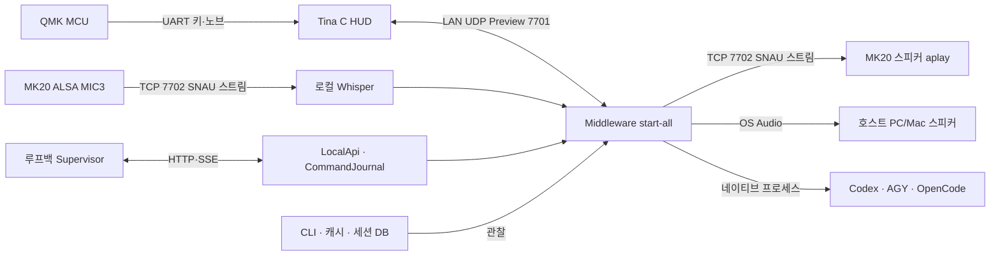
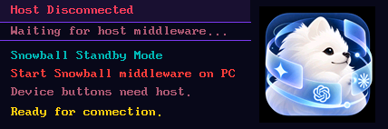
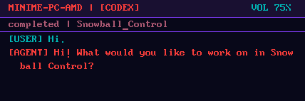
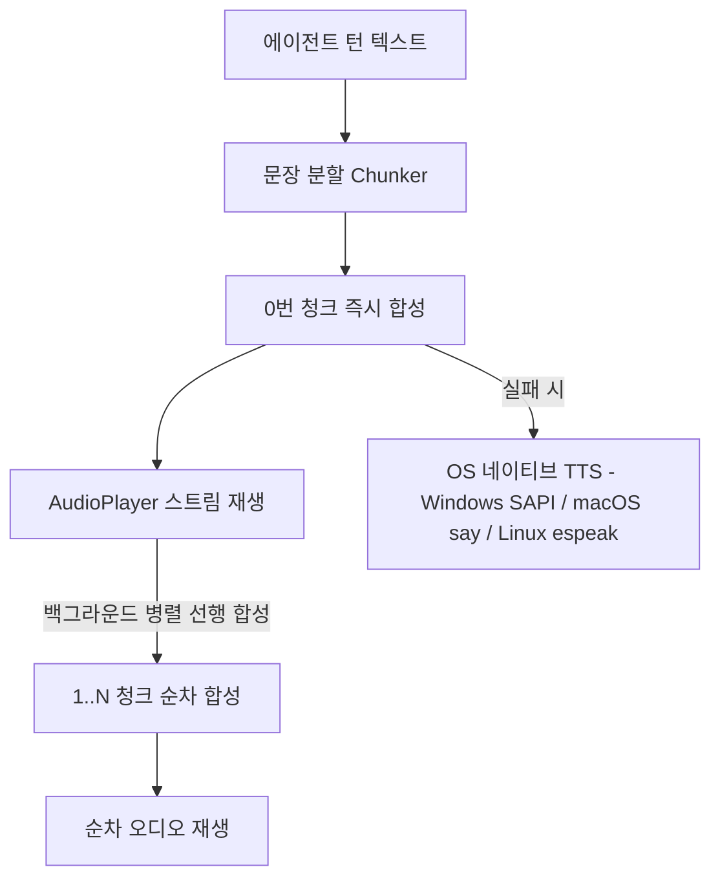

<p align="right">
  <a href="ARCHITECTURE.md">English</a> | <strong>한국어</strong>
</p>

# Snowball Control & Middleware — Preview

이 문서는 기기와 미들웨어 전체의 현재 설계를 관리하는 단일 원천이다. 최초 범주는 **Codex, AGY, OpenCode, MK20, 로컬 Web Supervisor**다. 공개 Preview는 신뢰하는 개인 PC와 내부 네트워크용이며, 인터넷이나 다중 사용자 환경에 대한 보안 보장을 제공하지 않는다.

## 제품 철학: inter-Harness 로컬 제어

**Snowball은 사용자가 자신의 여러 컴퓨터에서 AI 하네스를 오가며 직접 통제하는 inter-Harness 로컬 제어 인터페이스다.** Codex, AGY, OpenCode를 물리 데스크 터미널과 로컬 Web Supervisor에서 탐색하고 관찰하며, 지원되는 네이티브 동작을 실행한다. 여기서 **inter-Harness**는 하네스를 가로지르는 공통 사용자 제어 인터페이스를 뜻한다. 독립된 MK20에서 작업 대상은 사용자가 선택한 `머신 > 하네스 > 프로젝트 > 세션`으로 명확하게 정한다.

제품은 다음 원칙을 따른다.

- **작업의 주인은 사용자다.** 사용자의 PC가 프로젝트·네이티브 프로세스·세션 데이터를 소유한다. 프롬프트를 보낼 곳과 사용할 도구는 사용자가 선택한다. MK20은 키·노브·화면·음성 입력으로 그 선택을 손에 닿는 동작으로 만든다.
- **공통 인터페이스 안에서도 하네스의 차이를 존중한다.** 각 하네스의 세션 이력, 모델 식별자, 지원 effort, 권한 의미를 유지한다. 어댑터는 네이티브 기능을 연결하며, 호환성은 실제 설치 버전과 관찰한 동작을 기준으로 판단한다. 하네스 간 세션 변환·대화 이관·에이전트의 자율 협업은 현재 Preview 범위에 포함되지 않는다.
- **로컬 제어가 먼저다.** 제어 경로에 클라우드 제어 플레인을 필수로 두지 않는다. 로컬 의존성을 준비한 뒤에는 인터넷 없이도 기기 조작과 로컬 관찰·제어가 가능해야 한다. 클라우드 모델 추론에는 해당 제공자의 네트워크 연결이 필요하다. 루프백 Supervisor는 로그인/PIN 없이 열며 기기 페어링은 별도 경계로 관리한다.
- **실제가 원천이다.** 모델·effort·프로젝트·세션은 네이티브 도구와 로컬 데이터에서 발견한다. 실행과 완료는 실제 네이티브 이벤트로 확인하고, 승인·중단은 하네스가 실제 제공하는 기능에 맞춰 처리해야 한다. 발견 실패나 미지원 동작은 성공으로 꾸미지 않고 드러낸다.
- **편의성의 경계를 명시한다.** 플러그인 권한을 제한하면서 승인된 호스트의 실행·관찰은 유지해야 한다. 현재 Preview는 개인 PC와 신뢰하는 내부 네트워크용이며, 문서에 명시한 보안 생략과 미완성 네이티브 연동도 제품의 한계로 공개한다.

이 원칙은 제품이 지향하는 방향이다. 아래 각 절에서 현재 구현·검증된 동작·남은 작업을 구분하며, 모든 하네스에서 모든 제어 기능이 완성되었다는 뜻은 아니다.

### 독립 MK20과 여러 미들웨어 머신

제품의 의도된 흐름은 MK20이 독립 기기로 Wi-Fi에 연결되고, 내부 LAN의 미들웨어 호스트를 발견하며, 사용자가 여러 호스트를 페어링하는 것이다. 두 호스트를 페어링하면 머신 두 개, 세 호스트를 페어링하면 머신 세 개가 보인다. 머신을 선택하면 해당 미들웨어에 등록된 하네스·프로젝트·세션을 표시하고, 지원되는 동작을 선택한 머신으로 전달한다. 발견은 후보 탐색이며 페어링은 사용자가 선택한 호스트의 등록이다. 페어링된 호스트 목록과 선택은 특정 PC 하나에 의존하지 않고 기기가 유지한다.

새 미들웨어 PC의 추가와 전환은 일반적인 발견·페어링 동작이어야 한다. 이를 위해 SD 편집, PC MAC 교체, USB 재연결, ADB 활성화를 요구해서는 안 된다. SD 이미지 설치·Wi-Fi 초기 설정·펌웨어 유지보수·복원은 별도 기기 준비 작업이다. 현재 개발 부팅 설정의 `DEV_PC_MAC`은 TCP ADB 접근을 제한하는 값이며 제품의 머신 페어링 목록이 아니다.

**현재 구현:** 네이티브 HUD가 발견·페어링·머신 선택(K17)을 직접 관리한다. 미들웨어의 영속 host ID와 실제 OS 호스트명을 발견하며, 기기는 최대 16개 페어링과 마지막 선택을 `/mnt/SDCARD/snowball-hosts.v1`에 보관한다. 선택한 PC만 입력을 받고 자기 PC의 네이티브 하네스·프로젝트·세션을 제공한다. PC를 떠나도 그 PC의 컨트롤러 컨텍스트와 실행 중인 네이티브 작업은 유지한다. 실제 PC 2·3대의 전환 검증은 아직 필요하며, 한 PC의 여러 프로세스나 테스트 fixture를 그 증거로 취급하지 않는다.

- `SNMK1` UDP 발견: 기기가 서브넷 브로드캐스트 47772에 `DISCOVER`를 보내며 PC도 선택한 NIC에서 2초마다 `OFFER`를 알린다. 기기는 응답의 실제 송신 IP/포트에 `SELECT`·`RELEASE`·선택 heartbeat를 보낸다. Windows의 유니캐스트 응답 정책을 이용하며 방화벽 규칙을 임의로 추가하지 않는다. 브로드캐스트/응답이 차단된 네트워크는 로컬 네트워크 설정이 필요하다.
- K17은 Machines, 왼쪽 노브는 이동·선택, K16도 선택, K4는 돌아가기, K8은 페어링 해제다. 미등록 후보는 만료되고 페어링된 오프라인 PC는 남는다. 발견만으로 선택/등록하지 않는다. host ID를 유지하므로 DHCP/PC명 변경으로 같은 머신을 중복 생성하지 않는다. 자동 NIC 선택은 시작마다 다시 수행하며 명시한 `-Bind`만 고정한다.
- 선택마다 새 lease를 만든다. 화면은 선택 IP·lease와 controller/run/sequence를 검사하며 이전 lease와 재생된 입력은 거부한다. 머신을 떠나면 발화를 중단하고 캡처한 음성은 원래 세션 초안에 전사한다. 진행 중인 네이티브 작업은 원래 PC에 남고 돌아오면 같은 컨텍스트·소유한 Stop 핸들을 사용한다. 전송 여부가 불명확하면 `unknown`으로 남기며 자동 재전송하지 않는다.
- lease는 **신뢰하는 LAN용 Preview의 평문 라우팅 경계**이며 암호화된 신원 증명/인증이 아니다. ADB는 명시적인 유지보수·디버깅 전용이다. 일반 `mk20` PC 설치는 호스트 라이브러리·로컬 음성 의존성을 준비하고 PC를 알린다. 기기 배포, ADB 발견, Wi-Fi/개발 MAC 변경은 수행하지 않는다.


## 1. 저장소와 실제 실행 경로

**Snowball**은 전체 로컬 제어 시스템이며, **Snowball Middleware**가 공통 설치·PC 실행·Web UI를 담당한다. **Snowball Control**은 MK20 기기 구성 요소와 이 공통 아키텍처 문서를 관리한다. 두 번째 미들웨어가 아니다. **Snowball Device · M5Stack**은 ESP32 펌웨어·게이트웨이를 관리하고, **Snowball Harness · Codex / Antigravity / OpenCode**는 모든 설치에 포함하는 독립 빌드 플러그인이다.

Windows 공통 진입점은 `Snowball_Middleware/install.ps1 -Profile web|mk20|m5stack`이다. `scripts/setup.mjs`가 누락된 공식 저장소를 복제하고 미들웨어·하네스 3종을 빌드한 뒤, 실제 격리 워커의 초기화를 검사한다. `.snowball/suite.json`에 소스 커밋·승인된 진입점 다이제스트를 기록한다. 기존 추적 파일 수정은 거부하고 체크아웃을 강제로 초기화하지 않는다. 네이티브 공급자 앱·계정 로그인은 공급자별 사용자 단계이며, 앱이 없으면 사용 불가로 유지한다. 모델·Effort·세션은 네이티브 CLI/캐시에서 관찰한다.

| 프로필 | 설치 저장소 | 기기 준비 |
| --- | --- | --- |
| `web` | Middleware + Harness 3종 | 없음. Control·기기 전송·STT를 불러오지 않는다. |
| `m5stack` | Middleware + Harness 3종 + Device M5Stack | Python venv, 실제 UART/ESP32 확인, 4MB/16MB 용량별 빌드, 전체 플래시 백업, USB 업로드, 실제 펌웨어/FACES 확인, 게이트웨이 등록 |
| `mk20` | Middleware + Harness 3종 + Control 호스트 라이브러리 | 로컬 음성 의존성과 LAN 머신 알림. 기기에서 페어링하며 펌웨어·Wi-Fi 준비는 별도 유지보수다. |

`Start-Snowball.ps1`은 `scripts/start-installed.mjs`를, Windows 바로가기는 네이티브 Electron 트레이를 직접 실행한다. 설치기는 고정된 Electron 바이너리를 준비하고 자식 프로세스를 숨김 실행한다. 자신이 시작한 런타임의 IPC 준비 응답과 루프백 스냅샷을 확인하면 터미널로 돌아온다. 트레이가 모든 프로필에서 동일한 전체 `start-suite.mjs` / `start-all.mjs` 런타임을 관리하므로 MK20도 포함된다. 상태, Web UI, 설정, 일시정지/재개, 재시작, 종료, OS 로그인 자동 시작을 제공한다. 일시정지는 MK20의 새 음성 녹음·Send도 차단하며 기존 네이티브 작업은 계속된다. 브라우저나 설치 터미널을 닫아도 실행을 유지하고, 종료·부모 IPC 연결 해제는 소유한 프로세스만 정리하며 명령을 재전송하지 않는다. 로그는 `.snowball/desktop.log`에 크기를 제한해 보관한다.

실행 형태는 **사용자별 백그라운드 앱**이다. 로그인한 사용자의 네이티브 하네스·트레이에 접근해야 하므로 Windows SYSTEM 계정 서비스로 실행하지 않는다. Windows는 이름이 구분되는 네이티브 로그인 항목, macOS 소스 설치는 사용자별 LaunchAgent를 사용한다. 서명 없는 소스 Electron 앱의 macOS 앱 로그인 등록은 신뢰할 수 없기 때문이다. 최초 설치는 로그인 자동 시작을 켜고 트레이·설정에서 변경하며, 업데이트는 선택한 값을 유지한다. `-NoStart`는 실행·자동 시작 등록 없이 준비만 한다. macOS 자동 시작은 실물 Mac 검증이 남아 있다. 점유된 루프백 포트는 거부하고 다른 서비스의 프로세스를 채택하거나 종료하지 않는다.

MK20 발견과 루프백 API는 음성 다운로드와 독립적으로 준비된다. 선택 후 실제 연결·네이티브 목록 읽기 상태를 주기적으로 표시하고, 호스트 단위 STT 준비를 백그라운드에서 한 번 수행한다. 모델 다운로드·워밍업 실패에도 탐색을 유지하고 Talk에서 준비 상태나 실제 오류를 표시한다. 실제 워커의 응답 전에는 음성 준비 완료를 주장하지 않는다. 연결 전에도 기기 자체 K17 **Machines / Pair PC / Press to pair**와 페어링 안내를 항상 표시한다.

재실행은 소스를 자동 업데이트하지 않는다. 명시적 `-Update`로 공식 main을 가져와 Middleware·Control·하네스 3종을 fast-forward하며, 추적 파일 수정이나 분기 충돌은 거부한다. 해당 설치의 등록된 트레이만 종료한 뒤 다시 빌드하고 모델·컨트롤러 상태·페어링은 보존한다. 기존 LAN 설치는 같은 경로를 유지한다: `install.ps1 -Profile mk20 -InstallRoot "$env:LOCALAPPDATA\Snowball-LAN" -Update`. PC 설치는 MK20 펌웨어를 배포하지 않으며, 이전 HUD의 K17 표시는 별도의 검증된 기기 런타임 업데이트가 필요하다.

Windows 부트스트랩은 지원 Node(공식 LTS ZIP·SHA-256 검사), Git, 필요한 Python을 준비한다. macOS 소스 설치는 Node/Git/Python 사전 준비가 필요하고, Linux 전체 플러그인 워커는 아직 지원하지 않는다. M5Stack USB·DFU 준비와 공급자 로그인은 사용자 단계다. `-NoFlash`는 M5Stack 기존 펌웨어 확인에 적용한다. MK20 유지보수 전 SD 이미지 백업을 권장하며 PC 추가는 SD를 변경하지 않는다. 모든 README는 동일 배너·아이콘과 `Snowball <구성 요소> · <공급자> — Preview` 명칭을 사용한다.

| 구성 | 위치 | 현재 역할 |
| --- | --- | --- |
| 키보드 MCU | `Snowball_Control/hardware/mk20/qmk/` | QMK 키 스캔, USB HID, Tina Linux와 UART 통신 |
| 기기 Linux | 제조사 Tina T113 기반 Snowball SD 배포 | 프레임버퍼, ALSA, Wi-Fi, ADB 제공. SDK/BSP는 이 저장소에 포함되지 않는다. |
| 기기 HUD | `Snowball_Control/hardware/mk20/hud/` | 현재 네이티브 C HUD 데몬. `/mnt/SDCARD/mk20-hud`에서 실행 (UDP 7701) |
| 기기 오디오 데몬 | `Snowball_Control/hardware/mk20/hud/` | 네이티브 C 오디오 스트리밍 데몬. `/mnt/SDCARD/mk20-audio`에서 실행 (TCP 7702 SNAU 프로토콜) |
| 기기 부팅 도구 | `Snowball_Control/hardware/mk20/dev-tools/` | SD 설정, Wi-Fi, ADB, HUD/오디오 시작 |
| MK20 장치 플러그인 | `Snowball_Control/plugins/device-mk20/` | 격리된 Preview 전송/화면 인코딩 모듈 |
| 미들웨어·Web API | [Snowball_Middleware](https://github.com/fkiller/Snowball_Middleware) `packages/core`, `packages/api`, `apps/supervisor` | 세션/명령 저널, 작업공간, 로컬 API와 Web UI |
| 통합 MK20 런타임 | `Snowball_Middleware/scripts/start-all.mjs` | 실물 MK20, STT, 실제 하네스 스캔·dispatch와 Web UI 연결 |
| 네이티브 하네스 실행 | `Snowball_Middleware/scripts/harness-dispatch.mjs` | Codex app-server, AGY stream-json, OpenCode run. 플러그인 격리와 호스트 실행 권한은 별개의 경계다. |
| 설치·모델 발견 | `harness-runtime.mjs`, `harness-catalog-scanner.mjs` | PATH/명시적 실행 파일과 네이티브 CLI·캐시에서 발견. 실패하면 빈 목록/미확인 표시 |
| 세션·프로젝트 발견 | `harness-session-scanner.mjs`, `harness-db-scanner.py`, `harness-project-scanner.mjs` | 네이티브 인덱스/DB를 관찰. 스캔 자체는 DB에 쓰지 않는다. |
| 데스크톱 트레이 | `Snowball_Middleware/apps/desktop/` | 설치된 전체 런타임을 관리하는 사용자별 백그라운드 셸. 트레이와 OS 로그인 자동 시작을 제공한다. |
| 이전 호스트 | `Snowball_Control/host/`, Middleware `reference/legacy-host/` | 참조 구현. Control의 기본 `npm start`는 Codex 전용이며 전체 미들웨어 시작 명령이 아니다. |
| 이전 PowerShell 오케스트레이션 | `hardware/mk20/orchestration/` | 레거시 진단 자료. 실제 물리 승인·안전한 페어링 구현으로 사용하지 않는다. |

제조사 Qt `KeyboardDevice`는 현재 제품 HUD가 아니다. 기존 자료의 Qt 화면/공장 애플리케이션 설명은 제조사 런타임에 대한 참고이며, 현재 네이티브 HUD의 사양으로 해석하지 않는다.



MK20은 화면·키·양방향 음성 오디오 스트리밍(TCP 7702 `SNAU` 바이너리 프로토콜)을 맡고, PC가 작업공간과 하네스 실행을 소유한다. 오디오 입출력은 기기 플래시 디스크 I/O 없이 실시간 네트워크 스트리밍으로 동작한다. USB HID/CDC 패키지와 승인된 LAN transport는 별도 경로이며, 위 UDP Preview가 자동으로 유선 failover나 production 페어링을 제공하지 않는다.

**2026-10-07 검증:** 제조사 SDK로 HUD/audio를 빌드하고, 네이티브 발견·scope 계약, Control host(69 통과·선택 검사 2 생략), 장치 플러그인(15 통과), Middleware 전체 테스트(261 통과·선택 5 생략, Node 24.19.0), QMK 계약(14 통과), MK20 UX parity, 실제 하네스 카탈로그 전환을 검사했다. 실물 Wi-Fi MK20에서 저장된 호스트 선택 복원과 그 PC의 실제 Codex 프로젝트·세션 렌더링을 확인했다. 복원 검사용 실제 호스트 기록은 유지보수 도구로 입력했으므로 물리 버튼 페어링 검증으로 간주하지 않는다. TCP로 실제 마이크 PCM 28,000바이트를 수신했고, 잘못된 lease 거부, 재생 중 볼륨 응답 64ms·Stop 응답 141ms를 확인했다. 로컬 CUDA Whisper가 주변 소리 캡처를 처리했으며 결과는 빈 텍스트였다. CPU Supertonic은 2,120ms 음성을 합성했고, 음소거한 네이티브 ALSA 재생의 DONE을 확인했다. 하네스에 실제 프롬프트는 보내지 않았다. 실제 2·3대 PC 전환, 손으로 키·노브를 눌러 페어링, 전체 SD 이미지 복원은 현장 검증으로 남는다. 배포 전 기기 파일을 비공개로 백업했으며 카드 전체 이미지 백업은 아니다. 자동 승인 검토가 상세 이유 없이 기존 8765 미들웨어 재시작을 거부해, 별도 상태 디렉터리와 루프백 8766에서 검증했다. PC를 다시 선택할 때 네이티브 프로젝트·세션을 재관찰하고 진행 중 작업의 객체를 유지하며, 이름이 같은 디렉터리는 실제 경로로 구분한다.

**설치 문제 후속 검증 (2026-10-07):** Middleware 262개 통과·선택적 생략 5개, Control 호스트 70개 통과·생략 2개, 기기 플러그인 15개 통과, UX parity 10개 통과·생략 1개, 실제 네이티브 목록 기반 전환 검증 통과. 새 테스트는 실제 Electron과 전체 런타임을 실행해 설치 실행기 종료 후 API 유지, 단일 인스턴스, 재시작 후 일시정지·언어 보존, 점유 포트 거부와 기존 프로세스 보존, 소유 프로세스 종료를 검증했다. Windows 로그인 자동 시작 등록·해제(공백 경로 포함)와 창 없는 트레이 검증도 통과했다. 공개 PowerShell 부트스트랩으로 공식 Node 24.21.0과 공개 하네스 저장소 3종을 사용한 Web 신규 설치·명시적 Update가 통과했고, 설치기가 반환한 뒤에도 실제 트레이·API가 실행됐다. Windows 패키지는 앱 파일 129개의 다이제스트 126개와 네이티브 트레이·루프백·일시정지 검증을 통과했다. 제조사 툴체인 HUD 빌드·실제 렌더러 계약 및 MK20 프레임버퍼로 미연결 K17 안내와 숨김 트레이 런타임의 저장된 머신·Codex 세션 표시를 확인했다. UI 시작 뒤 실제 음성 준비·CUDA 워커 응답을 관찰했다. 하네스 프롬프트 전송·QMK 플래싱은 수행하지 않았다. 기기 기존 HUD·페어링 목록을 비공개 백업하고 HUD만 교체했다. 새 PC의 실제 버튼 페어링과 macOS 로그인 자동 시작은 현장 검증이 남아 있다.

## 2. Preview 보안 경계

- Web Supervisor는 **`127.0.0.1:8765`**에만 바인딩하며 로그인/PIN 없이 사용한다. 기기 페어링과 별개다. 외부 주소로 바인딩하거나 인터넷 프록시로 공개하지 않는다.
- MK20의 UDP 상태·키 이벤트와 개발용 TCP ADB는 내부 LAN을 사용한다. Preview UDP는 암호화된 기기 인증을 제공하지 않는다. IP/포트 고정과 입력 검증은 인증을 대신하지 않는다.
- Tina 개발 이미지의 ADB 인증은 생략되어 있다. 부팅 스크립트의 MAC 필터는 내부 개발용 제한이다. 물리적 신원 증명이나 완전한 접근 제어라고 표현하지 않는다.
- `plugins/device-mk20`의 lab/Preview 경로와 `packages/core`의 승인된 production transport 경로를 구분한다. 현재 lab 통합이 모든 production 페어링·서명 보장을 구현했다고 주장하지 않는다.
- `packages/plugin-host`는 승인한 entry digest, manifest capability, 프레임·요청·이벤트 한도를 검사하고 별도 프로세스로 장애를 격리한다. 현재 자식 Node 프로세스는 OS 파일 시스템 sandbox가 아니다. 신뢰하지 않는 플러그인을 실행하는 용도로 공개하지 않으며, 임의 플러그인 확장에는 추가 권한 격리가 필요하다.
- 네이티브 dispatch는 실제 하네스의 권한·승인 정책을 따른다. stdout에서 실행 후 관찰한 이벤트나 콘솔 입력/timeout을 물리 승인으로 바꾸지 않는다. 승인 브리지가 없는 경로는 명시적으로 미지원이다.
- 인터넷 없이 로컬 UI·기기 제어·이미 설치한 STT 모델은 사용할 수 있다. 클라우드 모델의 추론과 최초 모델 다운로드에는 해당 공급자의 연결이 필요할 수 있다.

## 3. 현재 설치 버전 기준과 변경 관찰

2026-10-02 현재 리뷰 PC에서 읽은 기준이다. 다른 PC의 설치 버전이나 전체 동작 검증 결과로 추정하지 않는다.

| 구성 | 읽은 버전 | 근거 |
| --- | --- | --- |
| Codex PATH CLI | `0.160.0` | `codex --version`, PATH의 npm 네이티브 실행 파일 |
| Codex 앱 내 app-server | `0.159.2` | 현재 실행 중인 앱의 codex.exe `--version` |
| AGY CLI | `1.2.13` | `agy --version` |
| OpenCode Desktop | `1.18.33` | 설치된 app.asar package.json 및 exe ProductVersion |
| OpenCode CLI | 미발견 | Desktop 버전으로 CLI 호환성을 추정하지 않음 |
| 미들웨어 Node 요구 | `>=22.12` | package.json. 검증용 Node `24.19.0` 사용 가능 |
| Python | `3.12.10` | 현재 Python 런타임 |

기계가 읽는 기준은 Middleware `config/harness-compatibility.json`이다. 모델·effort 목록은 이 버전 표에서 고정하지 않고 네이티브 원천에서 읽는다. Windows의 `.cmd`에 사용자 프롬프트를 넣어 실행하지 않도록 네이티브 실행 파일을 찾는다. 필요하면 `SNOWBALL_CODEX_EXECUTABLE`, `SNOWBALL_AGY_EXECUTABLE`, `SNOWBALL_OPENCODE_EXECUTABLE`에 실제 파일의 절대 경로를 지정한다.

아직 버전별 adapter 분기는 없다. 새로운 버전을 발견하면 app-server RPC, stream-json, 세션/DB 스키마, 모델/variant, 승인·중단, 작업공간 전달을 비교한다. [Codex 릴리즈](https://github.com/openai/codex/releases), [AGY 릴리즈](https://github.com/google-antigravity/antigravity-cli/releases), [OpenCode 릴리즈](https://github.com/anomalyco/opencode/releases)를 모니터링한다. 자동 점검은 하네스 설치, 펌웨어 플래싱, DB 변경, 프롬프트 전송을 수행하지 않는다. 작업 환경의 예약 점검은 저장소 복제만으로 설치되지 않는다.

## 4. MK20 펌웨어와 Snowball SD 이미지

QMK 펌웨어와 Allwinner T113 펌웨어 소스는 사용자가 제조사로부터 직접 이메일로 제공받았다(2026-10-02 사용자 확인). 제조사 제공 소스를 기반으로 우리가 구성하는 Snowball SD 이미지가 배포·검증 대상이다. 이전 SD의 내용 분석이나 공장 이미지 재구성은 작업 범위에 포함하지 않는다. 소스의 입수 경로와 배포 산출물의 재현 가능한 빌드 기록은 구분한다.

### 필수 수정 QMK

기존 QMK는 USB host 열거를 기다려 독립 전원에서 키 스캔/UART가 시작되지 않는 문제가 있다. MK20 독립 동작에는 수정된 QMK 업데이트가 **필수**다. `mk20_plus/rules.mk`의 `NO_USB_STARTUP_CHECK = yes`, `NO_SUSPEND_POWER_DOWN = yes`가 그 조건이다.

현재 제조사 안내와 함께 보관된 MK20 바이너리는 `hardware/mk20/qmk/bin/syk_keyboards_mk20_plus_via.bin`이며 SHA-256은 `28415537c79b7b08a0d735e337423633838d857dcae9e4968d4fbd103a2fff19`다. 제조사 릴리즈 안내는 USB 시작 검사 수정 적용을 설명한다. 배포 시 이 파일의 해시와 사용한 소스·toolchain·빌드 명령을 기록한다. 현재 기기의 플래시를 읽거나 USB host를 뺀 상태의 키 입력을 이번 리뷰에서 검증하지 않았다.

DFU 진입은 USB 분리 → 왼쪽 위 키를 누른 채 USB 연결 → QMK Toolbox에서 **MK20에 맞는** 위 파일 선택이다. MK10 바이너리를 MK20에 사용하지 않는다. 업데이트 전 SD 백업과 현재 키맵/복구 자료 확보를 권장한다. 펌웨어 플래싱은 이번 이력 정제와 별개이며 실행하지 않았다.

### SD 이미지 배포·백업·복원

`dev-access.conf.example`을 SD의 `dev-access.conf`로 복사하여 본인의 Wi-Fi와 개발 PC MAC을 설정한다. 실제 설정은 Git에서 제외한다. `lunch.sh`, HUD, 필요한 글꼴을 같은 SD에 배치한다.

운영 절차는 **변경 전 SD 전체 백업 → Snowball 이미지 적용 → 문제가 생기면 백업 이미지 복원**이다. 이전 SD에 어떤 애플리케이션이 있었는지 분석하지 않아도 백업·복원할 수 있다.

1. 기기를 종료하고 SD의 파티션 테이블을 포함한 전체 이미지를 저장소 밖에 백업한다. 카드 용량·백업 일자·SHA-256을 기록하고, 백업 파일을 다시 읽어 해시를 확인한다. 개인 설정의 파일 백업도 함께 보관한다.
2. Snowball 배포 이미지의 버전·해시와 대상 SD를 확인한 뒤 적용한다. 부팅, 수정 QMK의 독립 키 입력, HUD, 네트워크 및 PC 연결을 검사한다.
3. 문제가 생기면 기기를 종료하고 해당 SD에 백업 전체 이미지를 다시 기록한 뒤 부팅을 확인한다. 복원은 백업 당시 SD 상태를 되돌리는 절차이며 QMK MCU 플래시는 별도 대상이다.

Wi-Fi 비밀번호가 포함된 SD 설정·개인 백업은 공개하지 않는다. 이 백업·복원 절차의 실물 시험은 아직 수행하지 않았으며, 이전 공장 환경 조사나 공장 복구 인증을 공개 조건으로 요구하지 않는다.

### HUD 빌드·화면 및 대기 모드

실제 상단 화면은 **428×142**, 각 키는 **128×128**이다. `/dev/fb21`과 키 framebuffer를 RGB565로 사용한다.

- **부트로더 및 부팅 로고**:
  - U-Boot 160×160 로고: `/mnt/SDCARD/bootlogo.bmp` (저장소 `assets/bootlogo.bmp`)
  - 상단 화면 428×142 부팅 리소스: `/mnt/SDCARD/mk20-plus.bin` (저장소 `assets/mk20-plus.bin`)
- **오프라인 대기 화면 (Standby & Offline Mode)**:
  - 호스트 미들웨어(`start-all.mjs`)가 시작되지 않았거나 UDP sync 패킷이 15초 이상 끊기면 자동으로 Snowball 대기 화면으로 진입한다.
  - **상단 디스플레이 (`/dev/fb21`)**: 좌측에 "Host Disconnected" 경고, "Waiting for host middleware...", "Snowball Standby Mode" 안내 문구를 렌더링하고, 우측(x=286, y=7)에 128×128 RGB565 Snowball 강아지 아이콘을 배치한다.
  - **키 디스플레이 (`/dev/fb10` 및 1~20)**: 중앙 10번 키에 128×128 Snowball 강아지 아이콘을 띄우고, 나머지 19개 키는 백라이트를 꺼서(COLOR_BLACK) 오프라인 상태임을 직관적으로 전달한다.
  - 호스트 미들웨어가 연결되면 즉시 실제 작업공간 세션 화면으로 복원된다.

| 대기 모드 상단 화면 (`/dev/fb21`) | 대기 모드 10번 키 (`/dev/fb10`) | 미들웨어 연결 완료 (`/dev/fb21`) |
| :---: | :---: | :---: |
|  |  |  |

- **펌웨어 업데이트 시 보존 및 복원**:
  - **일반 재부팅 / 전원 온오프**: `/mnt/SDCARD`는 eMMC의 FAT32 `boot-resource` 파티션(`/dev/mmcblk0p1`)에 상주하므로 전원 순환 및 재부팅 후에도 커스텀 로고와 `mk20-hud` 설정이 100% 영구 보존된다.
  - **전체 펌웨어 플래싱 (LiveSuite / PhoenixCard / OTA)**: 파티션 전체를 새로 포맷하여 기록하는 전체 펌웨어 리플래시 시에는 기본 이미지로 덮어씌워진다. 이를 방지하려면 Tina Linux BSP 소스의 boot-resource 번들에 교체 포함하거나, `lunch.sh` 부팅 훅에 자동 복원 스크립트를 구성한다.

기본 대기 화면은 호스트 sync 이전에 실제 세션이나 모델이 있는 것처럼 표시하지 않는다. 긴 UTF-8 텍스트는 코드포인트 경계에서 자르고, 잘린 목록 값의 나머지도 끝까지 소비한다. 한글 스크롤은 Unicode 렌더러로 clipping한다.

HUD는 ARMv7 hard-float의 **Tina 이미지와 호환되는 sysroot/toolchain**이 필요하다. 제조사 SDK는 Git에 포함되지 않는다. SDK가 있으면 기본 `make`를 사용하고, 외부 환경에서는 `CROSS_COMPILE`, `FREETYPE_HEADERS` 또는 `FREETYPE_ARCHIVE`를 제공한다. 최신 배포판의 ARM 컴파일러로 빌드가 성공했다고 Tina의 오래된 glibc에서 실행된다고 보장하지 않는다. 글꼴은 `SNOWBALL_FONT` 또는 SD의 `fonts/D2Coding.ttf`에서 읽는다. STT backend는 CUDA 또는 CPU이며 Metal/Vulkan 지원을 주장하지 않는다.

## 5. 실제 상태와 전송

- 프로젝트/세션 원천이 비어 있으면 빈 상태를 보여준다. 개인 프로젝트, 모델, 성공 응답을 대신 만들지 않는다.
- MK20의 `New task`는 첫 네이티브 실행 전의 로컬 초안이며 네이티브 세션 생성 완료가 아니다. Web API에서 아직 연결되지 않은 네이티브 생성 기능은 오류/미지원으로 응답한다.
- 전송은 선택한 세션의 실제 cwd를 사용한다. cwd가 없거나 존재하지 않으면 임의의 기본 프로젝트로 보내지 않는다.
- MK20 모델·effort 편집은 발견한 항목만 제공한다. Access는 현재 `Native policy` 한 항목으로 표시하며 UI 선택만으로 네이티브 권한이 변경되었다고 주장하지 않는다. Codex 신규 턴의 현재 요청은 `on-request`/`read-only`이며, 기존 세션은 네이티브 resume 정책을 따른다.
- K4 전송 중단은 해당 세션에 연결한 네이티브 자식 프로세스에 AbortSignal을 전달한다. 외부에서 실행 중인 하네스 전체나 손자 프로세스의 종료를 보장하지 않는다. 모델 응답 완료는 실제 하네스 완료 이벤트/exit로 판단한다.
- 네이티브 DB와 인덱스는 기본적으로 하네스가 관리한다. `SNOWBALL_ENABLE_LEGACY_DESKTOP_SYNC=1`은 이전 데스크톱 메타데이터 복사 경로를 켜는 실험 옵션이며 현재 스키마에 대한 호환성을 보장하지 않는다. 관찰을 위해 켜지 않는다.
- Codex Desktop 도구가 오류를 반환하면 초안을 지우지 않는다. 전송 여부를 확정할 수 없으면 unknown 상태로 보존하며 자동 재전송하지 않는다.
- 백엔드 종료 시 보류 중 승인을 만료시켜 재시작한 서버의 동일 ID 요청과 섞이지 않게 한다.
- STT 워커의 ready와 실제 마이크 PCM 생성 확인 전에는 준비 성공을 반환하지 않는다. 생산 코드에서 mock capture 환경변수로 가짜 녹음을 만들지 않는다. 테스트는 별도 주입한 fixture transport를 사용한다.
- Git 파일 diff는 인수 배열로 실행하며 shell/외부 diff/textconv를 사용하지 않는다. rename과 Unicode 이름은 NUL 구분 status로 읽는다.

**상태 소유와 내구성:** MK20 `ContextManager`는 하네스·기기·프로젝트별 scope와 세션별 초안을 유지한다. 음성 캡처와 dispatch는 시작 당시의 세션 객체에 연결하고, 다른 세션으로 전환한 뒤에도 원래 목적지에 결과를 기록한다:
- `K13`: 하네스 선택
- `K9`: 프로젝트 선택
- `K5`: 세션 선택
- `K1`: 로컬 새 초안 (New task)
- `K12`: **MK20 기기 본체 스피커** 음성 출력 (대상: `device`. TCP 7702 포트 `SNAU` 바이너리 프로토콜로 `mk20-audio` 데몬 $\rightarrow$ ALSA `aplay`로 실시간 스트리밍, 기기 플래시 쓰기 제로, 하드웨어 믹서로 기기 볼륨 조절; 다시 누르면 중단)
- `K8`: **호스트 PC / Mac 스피커** 음성 출력 (대상: `host`. Windows/Linux는 `Speak PC`, macOS는 `Speak Mac` 라벨; 오른쪽 노브 음량과 연동된 16비트 PCM 소프트웨어 스케일링; 다시 누르면 중단)
- `K20`: 마이크 음성 녹음 토글 (TCP 7702 포트 실시간 스트리밍 캡처; 하울링 및 ALSA 디바이스 충돌 방지를 위해 실행 중인 TTS 음성을 즉시 차단)
- `K16`: 전사 및 전송 (Transcribe & Send)
- `K4`: 취소 / 초안 폐기 / 양쪽 스피커 음성 재생 즉시 중단 (호스트 플레이어 프로세스 kill + `mk20-audio` 정지 시그널)
- `왼쪽 노브`: 목록·본문 탐색과 선택 커밋
- `오른쪽 노브`: 시스템 음량(0..100) 조절 및 클릭 음소거. MK20 하드웨어 스피커(믹서 게인 + PCM 배율)와 PC 호스트 스피커에 실시간 동적 적용.
- `양쪽 노브 동시 클릭`: HOST 모드(키 입력 마스킹) 및 HID 모드(PC 키 입력 전달) 전환.

### 음성 합성 (TTS) 3계층 폴백 파이프라인

에이전트의 텍스트 응답은 로컬 우선, 초저지연 음성 합성 파이프라인을 통해 전달된다:



1. **Tier 1 (Supertonic 최적화 ONNX CPU)**: Supertonic-3 상주 합성 엔진.
   - **처리량 프로파일**: Supertonic은 멀티 스텝 루프를 포함하는 ONNX 확산 모델 파이프라인이다. ONNX Runtime `CPUExecutionProvider`(AVX2/AVX-512)는 CUDA 루프에서 발생하는 200회 이상의 PCIe 호스트-디바이스 `Memcpy` 병목을 제거하여 문장당 **~1.5초**(RTF 0.37)의 실시간 초저지연을 달성한다.
   - **문장 파이프라인 스트리밍**: 300자 이상의 긴 응답을 한 번에 블로킹 합성하지 않고, 문장 단위로 분할하여 첫 문장(0번 청크)의 실제 합성이 끝난 뒤 재생하며, 재생되는 동안 1..N번 문장을 백그라운드에서 병렬 사전 합성(Prefetch)한다.
2. **Tier 2 (Supertonic 대안 EP)**: 필요 시 `CUDAExecutionProvider`, `DmlExecutionProvider`, `CoreMLExecutionProvider` 동적 평가 지원.
3. **Tier 3 (OS 네이티브 TTS)**: 플랫폼 기본 음성 합성기(`PowerShell SAPI`, macOS `say`, Linux `espeak`)를 최후의 오프라인 안전망으로 사용하여 설치되어 있을 때 사용한다. 모든 엔진이 실패하면 요청에 오류를 반환한다.

#### 발화 텍스트 정제 및 음성 필터링 (`host/src/audio/korean-transliterate.ts`)
합성 전 모든 발화 문장은 `cleanTextForSpeech()`를 통과한다:
1. **마크다운 구문 제거**: 코드 블록(```...```) $\rightarrow$ "코드 블록 생략", 인라인 백틱, 링크, 제목(#), 인용구(>), 불릿 목록 제거.
2. **무의미 토큰/해시 제거** (`stripMeaninglessHashes`): UUID, `0x...` 메모리 주소, `sha256:` 다이제스트, 7~64자리의 영숫자 혼합 Git 커밋 해시 등을 자동 인식하여 제거하고 한글 조사(`-을/를`, `-은/는`, `-이/가`, `-과/와`)를 문맥에 맞게 재정렬(`attachParticle`).
3. **개발자 영단어 한글 발음 표기** (`transliterateEnglishToHangul`, 텍스트가 한국어일 때만 동작): 개발 용어 사전(`GitHub` $\rightarrow$ 깃허브, `PowerShell` $\rightarrow$ 파워셸, `MK20` $\rightarrow$ 엠케이이십, `PC` $\rightarrow$ 피씨 등), 키 이름(`K12` $\rightarrow$ 케이십이), 2~5자리 영문 약어 철자 발음 변환.

### 하드웨어 가속 매트릭스 (STT & TTS)

현재 상주 STT 구현은 `faster-whisper`의 CPU/CUDA다. 진단 도구의 Vulkan/Metal 탐지가 성공해도 whisper.cpp/MLX 상주 adapter를 활성화하지 않는다. 지원하지 않는 결과는 CPU와 실제 CPU용 모델 계획으로 바꾼다. TTS 기본값은 실제 CPU ONNX provider이며, 가속 provider를 명시하려면 해당 런타임이 설치되어 있어야 한다. 합성 지연 측정은 모든 문장의 완료 시한을 보장하지 않는다.

| 호스트 환경 | 상주 STT | 기본 TTS | 오프라인 폴백 |
| :--- | :--- | :--- | :--- |
| Windows + 사용 가능한 NVIDIA CUDA | faster-whisper CUDA, 런타임 실패 시 CPU | Supertonic CPU | 설치된 Windows SAPI |
| Windows AMD/Intel 또는 CUDA 없음 | faster-whisper CPU | Supertonic CPU | 설치된 Windows SAPI |
| macOS 소스 설치 | faster-whisper CPU, 실물 Mac 검증은 남음 | Supertonic CPU | 설치된 macOS `say` |
| Linux | CPU/CUDA worker 코드가 있으나 전체 suite 미지원 | Supertonic CPU | 설치된 `espeak` |

### 네이티브 음성 스트리밍 (`mk20-audio`, `SNAU`)

부팅 시 HUD와 TCP 7702 음성 서비스를 함께 시작한다. 재생·녹음 워커와 연결 수락 루프를 분리하여 스트리밍 중에도 Ping·Stop·볼륨을 처리한다. 데몬이 소유한 ALSA 프로세스 그룹만 중단하며 ADB 폴백과 전역 `killall aplay`는 사용하지 않는다. 두 바이너리는 제조사 Tina SDK의 glibc 기준으로 빌드한다.

고정 LE 헤더는 **16바이트**다: `magic:SNAU`(4), `mode`(1), `channels`(1), `volume`(1), `muted`(1), `sample_rate:LE32`(4), `data_len:LE32`(4). mode는 재생 1·녹음 2·ping 3·볼륨 4·stop 5이며 `0x80`은 lease 요청이다. lease 요청은 32바이트 ASCII hex를 붙여 총 48바이트다. 녹음은 16000Hz·모노 PCM16이며 `data_len=0xffffffff`, 재생은 실제 바이트 길이, 제어는 0이다. 별도 `format`·`reserved` 필드는 없다.

HUD가 선택 PC IP·lease·6초 만료를 mode-0600 RAM 파일에 기록하고 연결 중에 갱신한다. 음성 데몬은 수락 전과 스트리밍 중에 소유를 확인한다. 머신 전환·연결 종료·HUD 중단으로 권한이 만료된다. 미선택/이전 요청은 `ERR1`, 읽기 전용 ping은 `PONG`만 반환한다. 이것은 Preview의 라우팅 경계이며 적대적인 LAN에서의 암호 인증이 아니다.

- 녹음은 실제 `arecord -D hw:0,0 -f S16_LE -r 16000 -c 3 -t raw`의 MIC3을 추출한다. 마이크 바이트가 나온 뒤에만 `RDY1`을 보낸다. 호스트는 120초/3.84MB로 제한하고 WAV로 변환한 호스트 임시 파일을 Whisper에 전달한 뒤 지운다. 기기에 음성 임시 파일을 쓰지 않는다.
- 재생은 PCM16을 `aplay -D default`에 전달한다. `RDY1`은 스트림 수락이며, 모든 바이트를 처리하고 소유한 player가 정상 종료해야 `DONE`이다. busy·stale lease·중단·실패는 완료로 표현하지 않는다. 기기 볼륨은 하드웨어 믹서를 사용하여 중복 감쇄를 피하고 호스트 볼륨은 문장 청크마다 적용한다.
- Stop은 소유한 워커 종료를 기다린다. 단일 코덱의 재생·녹음은 배타적이다. 늦은 준비 응답이나 취소가 이전 캡처/재생을 새 작업에 붙이지 못한다. 전사 결과는 시작한 host/controller/harness/session/capture ID에 속하며 명시적 Send 전까지 초안으로 남는다.
- 데몬 부재·구버전은 음성 오류로 표시한다. 일반 런타임은 ADB·helper 업로드·음성 pull·Wi-Fi 변경을 수행하지 않는다. 별도 `hardware/mk20/dev-tools/install-mk20.ps1` 유지보수는 검토한 `-RuntimeZip`과 `-RuntimeSha256`을 받아 기기 파일을 백업한 뒤 HUD·음성·부팅 번들을 설치한다. 복원을 위한 전체 SD 이미지 백업을 권장한다.

Web 명령은 `CommandJournal`의 세션 소유, revision, 명령 fingerprint와 상태 기록을 사용한다. `WorkspaceStore`의 발견 후보는 파일 읽기 권한이 아니며, 사용자가 선택한 디렉터리의 파일 시스템 identity를 확인하고 grant를 영속 저장한 뒤 제공한다. MK20 Preview의 직접 dispatch/파일 브라우저는 이 production 서비스와 동일한 경로가 아니므로 Web과 MK20의 동시 전송·프로세스 소유를 모두 저널이 직렬화한다고 설명하지 않는다. Supervisor 단독 런타임(`apps/supervisor/run.mjs`)은 명시적으로 연결한 adapter의 기능만 제공한다.

## 6. 설치·검증

두 저장소를 같은 부모 폴더에 둔다. 통합 Preview의 장치/STT import가 Control을 참조하므로 Middleware만 복제한 환경은 전체 MK20 실행 환경이 아니다.

```text
Snowball_Control/
Snowball_Middleware/
```

Control `host`에서 `npm ci && npm run build`, Middleware에서 `npm ci && npm run build` 후 `npm run start:local`로 루프백 Supervisor를 시작한다. 전체 MK20 통합은 Middleware에서 `node scripts/start-all.mjs`다. 로컬 모델·마이크 환경이 준비되어야 하며 하네스마다 네이티브 로그인/설치가 필요하다.

필수 검사: Control `host`의 `npm test`, 명시적으로 나열한 `plugins/device-mk20/tests/*.test.mjs` 파일의 `node --test`, `hardware/mk20/contract/Test-QmkProtocol.ps1`, Middleware의 `npm test`, `node --test tests/mk20-ux-parity.test.mjs`, `node scripts/test-harness-switching.mjs`. STT는 Python 의존성과 실제 발화 WAV fixture를 준비한 뒤 Control `host`에서 `npm run test:stt`로 별도 실행한다. 일반 테스트는 STT 통합을 명시적으로 skip하며 설치되지 않은 모델을 몰래 다운로드하지 않는다.

실물 화면은 Middleware `scripts/dump_mk20_screens.py --adb PATH --device ADDRESS:PORT --output-dir LOCAL_DIRECTORY`로 캡처한다. framebuffer 크기를 실물에서 읽으며 개인 절대 경로를 코드에 고정하지 않는다. 새 HUD 배포 후 한글 긴 목록, 모델 선택, 물리 키 승인·중단, USB host 없는 부팅은 별도 실물 확인이 필요하다. 자동 통과 숫자나 100% 커버리지를 배지로 고정하지 않는다.

2026-10-02 로컬 검증에서 Control 66개(별도 STT 2개 제외), 별도 실제 WAV STT 2개, MK20 plugin 13개, QMK 계약 14개, 레거시 승인 차단 15개가 통과했다. Middleware는 241개 통과/5개 선택 검사 제외, MK20 encoder·카탈로그·파일 경계 검사는 15개 통과했다. 선택 STT runtime 검사 6개도 로컬에 준비된 환경에서 별도로 통과했다. 실제 설치 목록을 이용한 하네스 전환 검사도 통과했으나 OpenCode CLI 턴 실행은 검사하지 않았다. HUD는 실제 Tina ARM SDK로 빌드하고 C 파서를 sanitizer로 검사했다. 현재 기기의 framebuffer 캡처는 확인했지만 수정 바이너리를 기기에 배포한 결과는 아니다. 이 결과는 Windows 리뷰 환경의 기록이며 다른 OS나 모든 하네스 버전의 인증이 아니다.

Supervisor 단독 런타임의 기본 하네스 survey는 현재 Windows/macOS에서만 연결된다. Linux 코어·API의 자동 검사를 전체 Linux 하네스 제어·네이티브 tray 패키지 지원으로 확대 해석하지 않는다. 기본 STT runtime 테스트는 형제 Control checkout과 Python 의존성 설치를 수행하는 검사를 `SNOWBALL_TEST_STT=1`일 때만 실행한다.

검토한 LAN 런타임은 `mk20-preview-lan-runtime.zip`이며 SHA-256은 `838f4e161f9e32875dd249fc876410e07006aef18680c917c9249d485dfa04eb`다. manifest는 네이티브 소스 커밋 `e3b1ffd`, SNMK1과 SNAU-lease-v1을 기록한다. HUD/audio/부팅 바이너리, 폰트·라이선스, HUD 소스와 추적 중인 제조사 QMK 소스·고지를 포함한다. `-NoDeploy -RuntimeZip ... -RuntimeSha256 ...` 유지보수 검사로 실제 실행 중인 두 프로세스 이미지와 번들의 일치를 확인했다. LAN 구현은 Control/Middleware main에 포함한다(`e3b1ffd` / `2b07c19`). 검토한 기기 번들은 공개 릴리즈 자산이 아닌 로컬 유지보수 산출물이다. 기존 공개 `mk20-preview-0.1.0` 기기 번들은 새 설치 도구가 거부하므로 새 릴리즈 전까지 검토한 로컬 번들을 지정한다. 일반 PC 추가 설치는 기기에 이 번들을 배포하지 않는다.

## 7. 공개 전 남은 검증과 질문

1. **배포 산출물 기록**: 제조사 이메일로 받은 QMK·T113 소스를 기반으로 Snowball SD 이미지와 수정 QMK의 버전·해시·소스·toolchain·빌드 절차를 기록한다. 소스 입수 경로는 확인된 사항이며, 재현 빌드 기록은 별도 관리한다. QMK 기반 구성의 원래 라이선스 고지를 유지한다.
2. **실제 제어 대상 PC**: 현재 리뷰 PC에는 OpenCode CLI가 없고 다른 PC의 실행 버전은 읽지 않았다. 사용 중인 제어 PC의 CLI 경로와 버전도 baseline에 추가해야 한다.
3. **하네스별 승인/중단**: 레거시 PowerShell의 콘솔·타이머 승인은 제품 경로가 아니다. 통합 dispatch의 네이티브 승인·취소 브리지와 오래 걸리는 턴에 대한 종료 처리는 하네스별 실물 검증이 남아 있다.
4. **우리 이미지의 배포와 복원 시험**: 변경 전 SD 전체 백업을 권장하고, Snowball 이미지의 부팅·수정 HUD·수동 키 입력과 백업 이미지 복원 결과를 확인한다. 이전 SD 내용 분석과 공장 복구는 범위 밖이다.
5. **Git 이력 재작성 이후**: 두 원격 저장소의 main(및 Middleware 태그)을 교체했다. 기존 복제본에서 과거 이력을 다시 push하지 말고 재복제하거나 새 이력에 변경만 옮긴다. GitHub의 과거 commit URL/캐시 및 다른 복제본 정리는 원격 ref 재작성만으로 보장할 수 없다. [GitHub 정제 안내](https://docs.github.com/en/authentication/keeping-your-account-and-data-secure/removing-sensitive-data-from-a-repository)를 따른다.
6. **플러그인·동시 제어 범위**: 신뢰한 내장 플러그인으로 Preview 범위를 제한한다. 악성 플러그인의 OS 권한 격리와 Web/MK20이 같은 네이티브 세션에 동시에 전송하는 경로의 공통 직렬화는 추가 구현·검증이 필요하다.

위 항목이 남아 있으므로 공개 범위를 Preview로 명시하더라도 완전한 배포/복구 인증이라고 표현하지 않는다. 리뷰에서 발견한 미완성 기능을 새 모델 목록이나 가짜 승인으로 보완하지 않는다.
