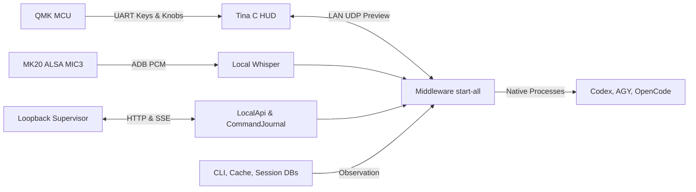

<p align="right">
  <strong>English</strong> | <a href="ARCHITECTURE.ko.md">한국어</a>
</p>

# Snowball Control & Middleware — Preview Architecture

This document serves as the **Single Source of Truth (SSOT)** governing the design, boundaries, and interfaces across the physical device and host middleware. The initial scope encompasses **OpenAI Codex, Google Antigravity (AGY), OpenCode, MK20 hardware, and local Web Supervisor**. This public Preview is intended strictly for personal workstations and trusted local networks; it does not provide security guarantees for multi-tenant or untrusted Internet environments.

---

## 1. Repositories and Concrete Execution Paths

| Subsystem | Location | Current Role & Responsibility |
| --- | --- | --- |
| **Keyboard MCU** | `Snowball_Control/hardware/mk20/qmk/` | QMK mechanical key matrix scan, USB HID, and UART escalation to Tina Linux |
| **Device Linux OS** | Vendor Tina T113-based Snowball SD Release | Framebuffers, ALSA, Wi-Fi, and ADB. Tina BSP SDK is not tracked in this repository |
| **Device HUD** | `Snowball_Control/hardware/mk20/hud/` | Native C low-latency HUD daemon running on `/mnt/SDCARD/mk20-hud` |
| **Device Boot Tools** | `Snowball_Control/hardware/mk20/dev-tools/` | MicroSD bootstrap, Wi-Fi configuration, TCP ADB launcher, and HUD startup |
| **MK20 Device Plugin** | `Snowball_Control/plugins/device-mk20/` | Isolated lab Preview transport and framebuffer encoding module |
| **Middleware & Web API** | [Snowball_Middleware](https://github.com/fkiller/Snowball_Middleware) `packages/core`, `packages/api`, `apps/supervisor` | Session/command journal, workspace grants, local REST/SSE API, and Web UI |
| **Integrated MK20 Runtime** | `Snowball_Middleware/scripts/start-all.mjs` | Unified entrypoint binding physical MK20, local STT, live harness discovery, and Web UI |
| **Native Harness Dispatch** | `Snowball_Middleware/scripts/harness-dispatch.mjs` | Native process spawns: Codex app-server, AGY stream-json, OpenCode run. Plugin sandboxing and host execution privileges are separate boundaries |
| **Installation & Catalog Scan** | `harness-runtime.mjs`, `harness-catalog-scanner.mjs` | Discovers PATH/explicit executables and local CLI caches. Emits empty catalog on discovery failure |
| **Session & Project Scan** | `harness-session-scanner.mjs`, `harness-db-scanner.py`, `harness-project-scanner.mjs` | Non-mutating observation of native indexes/DBs. Scanners never write to harness storage |
| **Desktop System Tray** | `Snowball_Middleware/apps/desktop/` | Electron system tray management shell. Does not automatically guarantee parity with integrated MK20 daemon |
| **Legacy Host** | `Snowball_Control/host/`, Middleware `reference/legacy-host/` | Reference implementation. Control's `npm start` is a legacy Codex-only runtime, not the full middleware launcher |
| **Legacy PowerShell Tools** | `hardware/mk20/orchestration/` | Diagnostic archive. Not used for production physical approvals or secure pairing |

> ⚠️ **Notice on Vendor Qt App**: The factory Qt application (`/data/KeyboardDevice`) is not the current product HUD. Descriptions of factory Qt screens in legacy manuals serve solely as vendor reference and must not be interpreted as the specification for the native C HUD.



The MK20 terminal handles screen rendering, physical keys, knobs, and voice audio capture, while the host PC retains absolute ownership of workspace filesystem grants and native agent process execution. USB HID/CDC and LAN transport operate on decoupled paths; the Preview UDP protocol does not provide automated wired failover or cryptographic device pairing.

---

## 2. Preview Security Boundaries

- **Web Supervisor Loopback Binding**: Binds strictly to **`127.0.0.1:8765`** without authentication/PIN for personal loopback ergonomics. It must never be exposed to public network interfaces or unauthenticated reverse proxies.
- **LAN Communication**: MK20 UDP status packets, key events, and development TCP ADB operate over the local network. Preview UDP contains no cryptographic signature or replay protection; IP pinning is an operational sanity check, not a cryptographic security boundary.
- **Development ADB Shell**: The Tina Linux developer image omits ADB authentication keys. The MAC address filter in `lunch.sh` is an internal LAN guard and does not constitute cryptographic identity verification or access control.
- **Plugin Sandboxing**: `packages/plugin-host` validates entrypoint digests, manifest capabilities, and payload limits, isolating failures into child Node.js processes. This child process model is not an OS-level filesystem sandbox; untrusted arbitrary plugins must not be loaded without additional isolation.
- **Native Privilege Execution**: Tool approvals and command execution defer strictly to each harness's native policy engine. Observed stdout events or console timeouts are never converted into synthetic physical approvals.
- **Air-Gapped Operation**: Local Web UI, hardware control, and locally cached STT speech models operate completely offline. Cloud model inference and initial weight downloads require upstream vendor connectivity.

---

## 3. Installed Baseline Versions & Continuous Observation

The following baseline was validated on the primary review workstation (Windows 11) as of 2026-10-02:

| Component | Detected Version | Verification Evidence |
| --- | --- | --- |
| **Codex PATH CLI** | `0.160.0` | `codex --version`, native npm executable in system PATH |
| **Codex App-Server (Embedded)** | `0.159.2` | Running desktop app executable: `codex.exe --version` |
| **AGY CLI** | `1.2.13` | `agy --version` |
| **OpenCode Desktop** | `1.18.33` | Installed `app.asar/package.json` and PE ProductVersion |
| **OpenCode CLI** | Not Detected | CLI compatibility is not inferred from Desktop app version |
| **Node.js Requirement** | `>=22.12.0` | Defined in `package.json`. Validated on Node `24.19.0` |
| **Python** | `3.12.10` | Active Python virtual environment runtime |

The machine-readable reference specification is maintained in `Snowball_Middleware/config/harness-compatibility.json`. Models, effort variants, and active session lists are discovered dynamically from native CLI outputs rather than hardcoded tables. Upstream releases are monitored via [Codex Releases](https://github.com/openai/codex/releases), [AGY Releases](https://github.com/google-antigravity/antigravity-cli/releases), and [OpenCode Releases](https://github.com/anomalyco/opencode/releases).

---

## 4. MK20 Firmware, Recovery & SD Image

QMK firmware sources and Allwinner T113 BSP source code were provided directly by the hardware manufacturer via email (confirmed on 2026-10-02). The Snowball SD distribution built from these sources constitutes the official deployment and verification target. Factory firmware reverse-engineering is outside the project scope.

### Mandatory Modified QMK Firmware

Factory QMK firmware enters an indefinite wait loop on cold boot when USB host enumeration is absent, disabling matrix scanning and UART escalation on standalone power supplies. Applying the modified QMK build is **mandatory**:
- Build flags in `mk20_plus/rules.mk`: `NO_USB_STARTUP_CHECK = yes`, `NO_SUSPEND_POWER_DOWN = yes`.
- Official MK20 binary: `hardware/mk20/qmk/bin/syk_keyboards_mk20_plus_via.bin` (SHA-256: `28415537c79b7b08a0d735e337423633838d857dcae9e4968d4fbd103a2fff19`).
- Flashing procedure: Disconnect USB → hold top-left physical key while plugging in USB → flash via [QMK Toolbox](https://qmk.fm/toolbox). *Do not flash MK10 firmware onto MK20.*

### MicroSD Deployment, Backup & Rollback

1. Copy `dev-access.conf.example` to `dev-access.conf` on the microSD root and configure local 2.4 GHz Wi-Fi credentials and the workstation MAC address.
2. **Full Disk Backup**: Prior to deployment, create a full raw block-level image of the microSD card. Record the total capacity, date, and SHA-256 checksum outside the repository.
3. Deploy `lunch.sh`, `dev-access.conf`, custom HUD binary (`mk20-hud`), and fonts (`fonts/D2Coding.ttf`) to `/mnt/SDCARD/`.
4. In case of operational failure, write the backup raw image back to the card to restore the known state.

### HUD Engine, Boot Splash & Standby Mode

The MK20 hardware features a **428×142** header display (`/dev/fb21`) and 20 individual **128×128** key displays (`/dev/fb1`..`/dev/fb20`) operating in 16-bit RGB565:

- **Bootloader & Kernel Splash**:
  - U-Boot 160×160 BMP: `/mnt/SDCARD/bootlogo.bmp` (Source: `assets/bootlogo.bmp`)
  - Top header 428×142 RGB565 splash: `/mnt/SDCARD/mk20-plus.bin` (Source: `assets/mk20-plus.bin`)
- **Offline Standby Mode**:
  - If host middleware (`start-all.mjs`) is unreachable or UDP sync packets cease for > 15 seconds, the HUD automatically engages **Snowball Standby Mode**.
  - **Top Display (`/dev/fb21`)**: Left pane displays connection status alerts ("Host Disconnected", "Waiting for host middleware...", "Snowball Standby Mode"), while the right pane (x=286, y=7) renders the 128×128 RGB565 Snowball puppy icon.
  - **Key Matrix (`/dev/fb10` & others)**: Center Key 10 illuminates with the 128×128 Snowball puppy icon; all other 19 keys turn black (backlight off) to visually signal standby.
  - **Live Restoration**: When middleware sync resumes, all displays immediately switch to the active workspace session.

| Standby Top Display (`/dev/fb21`) | Standby Key 10 (`/dev/fb10`) | Connected Active Display (`/dev/fb21`) |
| :---: | :---: | :---: |
|  |  |  |

- **Firmware Update Persistence**:
  - **Power Cycles & Normal Reboots**: `/mnt/SDCARD` is mounted on the non-volatile FAT32 `boot-resource` eMMC partition (`/dev/mmcblk0p1`). Boot logos, `mk20-hud`, and configs **100% persist** across reboots.
  - **Full Firmware Reflashing (OTA, LiveSuite, PhoenixCard)**: Writing a raw firmware image (`.img`) completely formats all partitions, resetting `bootlogo.bmp` and `mk20-plus.bin` to factory defaults. To preserve custom assets, either embed them directly into the Tina BSP SDK build tree (`Tina-t113-pro/.../boot-resource`) or maintain an auto-restore verification check in `lunch.sh`.

---

## 5. Live State Management & Transport

- **No Synthetic State**: If native project or session sources are empty, the UI displays an empty state. Fake projects, dummy models, or synthetic completions are strictly prohibited.
- **Draft & Execution Ownership**: MK20's `New task` represents a local uncommitted draft. Dispatch uses the explicit working directory (`cwd`) of the active session.
- **Dynamic Controls**: Model, effort variant, and permissions reflect discovered capabilities. Codex new turns default to `on-request`/`read-only`; existing threads inherit their native resume policy.
- **Abort & Cancellation**: Key 4 (Stop) sends an `AbortSignal` directly to the child process bound to the active session. It does not blindly terminate external or grandchild processes.
- **State Partitioning**: MK20 `ContextManager` maintains distinct scopes per harness, device, and project. Audio captures and dispatch operations bind immutably to their initiating session:
  - `K13`: Harness selector
  - `K9`: Project selector
  - `K5`: Session selector
  - `K1`: New task draft
  - `K20`: Voice recording toggle
  - `K16`: Transcribe & Send
  - `K4`: Cancel / Discard draft
  - `Left Knob`: Scroll navigation and item commit
  - `Right Knob`: System volume and mute
  - `Dual-Knob Chord`: Simultaneous press toggles HOST Mode (keystroke masking) and HID Mode (keystroke passthrough to PC).

---

## 6. Installation & Verification

Place both repositories in the same parent directory:

```text
Snowball_Control/
Snowball_Middleware/
```

```bash
# 1. Build Control host library
cd Snowball_Control/host
npm ci && npm run build

# 2. Build Middleware and launch local Web Supervisor
cd ../../Snowball_Middleware
npm ci && npm run build
npm run start:local

# 3. Launch full integrated MK20 runtime
node scripts/start-all.mjs
```

### Verification Checklist

- **Control Hardware Plugin Tests**: `npm test --prefix plugins/device-mk20` (13 passed)
- **QMK Serial Contract**: `powershell -File hardware/mk20/contract/Test-QmkProtocol.ps1` (14 passed)
- **Control Host Unit Tests**: `npm test --prefix host` (52 passed, 2 optional STT skipped)
- **Middleware Comprehensive Tests**: `npm test` in `Snowball_Middleware` (241 passed, 5 optional skipped)
- **Live Framebuffer Capture**: `python scripts/dump_mk20_screens.py --adb <PATH> --device <IP:PORT> --output-dir <DIR>`

---

## 7. Pre-Release Verification & Remaining Scope

1. **Reproducible Build Documentation**: Maintain precise source hashes, toolchain versions, and compilation instructions for both QMK and Tina Linux SD images. Preserve all upstream GPLv2 licensing notices.
2. **Workstation CLI Baseline**: Document exact CLI versions on all development machines. OpenCode CLI path and capabilities must be explicitly verified when available.
3. **Approval & Abort Verification**: Native tool approval and turn cancellation bridges must be physically validated across all supported harness CLIs on live hardware.
4. **SD Image Deployment & Rollback Testing**: Verify full-image backup, custom Snowball SD card booting, HUD performance, and clean recovery using physical microSD media.
5. **Git History Hygiene**: Both repositories have undergone history sanitization. Contributors must clone fresh checkouts rather than force-pushing stale refs.
6. **Plugin Sandboxing Evolution**: Current Preview limits plugin execution to trusted internal adapters. Future extensions require kernel-level filesystem and process capability isolation.

---

## 📄 License

Snowball proprietary code is licensed under [Apache-2.0](file:///E:/developments/projects/Snowball_Control/LICENSE). Hardware QMK firmware code is governed by upstream GNU General Public License v2 (GPLv2). Vendor SDKs, proprietary BSPs, private credentials, and binary disk images are intentionally excluded from version control.
