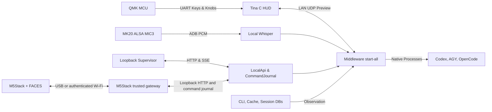

<p align="right">
  <strong>English</strong> | <a href="ARCHITECTURE.ko.md">한국어</a>
</p>

# Snowball Control & Middleware — Preview Architecture

This document serves as the **Single Source of Truth (SSOT)** governing the design, boundaries, and interfaces across the physical device and host middleware. The initial scope encompasses **OpenAI Codex, Google Antigravity (AGY), OpenCode, MK20 hardware, and local Web Supervisor**. This public Preview is intended strictly for personal workstations and trusted local networks; it does not provide security guarantees for multi-tenant or untrusted Internet environments.

---

## 1. Repositories and Concrete Execution Paths

| Subsystem | Location | Current Role & Responsibility |
| --- | --- | --- |
| **Keyboard MCU** | `Snowball_Control/hardware/mk20/qmk/` | QMK mechanical key matrix scan, USB HID, and UART escalation to Tina Linux |
| **Device Linux OS** | Vendor Tina T113-based Snowball SD Release | Framebuffers, ALSA, Wi-Fi, and ADB. Tina BSP SDK is not tracked in this repository |
| **Device HUD** | `Snowball_Control/hardware/mk20/hud/` | Native C low-latency HUD daemon running on `/mnt/SDCARD/mk20-hud` |
| **Device Boot Tools** | `Snowball_Control/hardware/mk20/dev-tools/` | MicroSD bootstrap, Wi-Fi configuration, TCP ADB launcher, and HUD startup |
| **MK20 Device Plugin** | `Snowball_Control/plugins/device-mk20/` | Isolated lab Preview transport and framebuffer encoding module |
| **M5Stack Device Plugin** | [Snowball_Device_M5Stack](https://github.com/fkiller/Snowball_Device_M5Stack) | Native ESP32 firmware for original M5Stack + FACES QWERTY, English/Korean keyboard UI, and a Protocol 1 hardware worker backed by a trusted local gateway |
| **Middleware & Web API** | [Snowball_Middleware](https://github.com/fkiller/Snowball_Middleware) `packages/core`, `packages/api`, `apps/supervisor` | Session/command journal, workspace grants, local REST/SSE API, and Web UI |
| **Integrated MK20 Runtime** | `Snowball_Middleware/scripts/start-all.mjs` | Unified entrypoint binding physical MK20, local STT, live harness discovery, and Web UI |
| **Native Harness Dispatch** | `Snowball_Middleware/scripts/harness-dispatch.mjs` | Native process spawns: Codex app-server, AGY stream-json, OpenCode run. Plugin sandboxing and host execution privileges are separate boundaries |
| **Installation & Catalog Scan** | `harness-runtime.mjs`, `harness-catalog-scanner.mjs` | Discovers PATH/explicit executables and local CLI caches. Emits empty catalog on discovery failure |
| **Session & Project Scan** | `harness-session-scanner.mjs`, `harness-db-scanner.py`, `harness-project-scanner.mjs` | Non-mutating observation of native indexes/DBs. Scanners never write to harness storage |
| **Desktop System Tray** | `Snowball_Middleware/apps/desktop/` | Electron system tray management shell. Does not automatically guarantee parity with integrated MK20 daemon |
| **Legacy Host** | `Snowball_Control/host/`, Middleware `reference/legacy-host/` | Reference implementation. Control's `npm start` is a legacy Codex-only runtime, not the full middleware launcher |
| **Legacy PowerShell Tools** | `hardware/mk20/orchestration/` | Diagnostic archive. Not used for production physical approvals or secure pairing |

> ⚠️ **Notice on Vendor Qt App**: The factory Qt application (`/data/KeyboardDevice`) is not the current product HUD. Descriptions of factory Qt screens in legacy manuals serve solely as vendor reference and must not be interpreted as the specification for the native C HUD.



The MK20 terminal handles screen rendering, physical keys, knobs, and voice audio capture, while the host PC retains absolute ownership of workspace filesystem grants and native agent process execution. USB HID/CDC and LAN transport operate on decoupled paths; the Preview UDP protocol does not provide automated wired failover or cryptographic device pairing.

---

## 2. Preview Security Boundaries

- **Web Supervisor Loopback Binding**: Binds strictly to **`127.0.0.1:8765`** without authentication/PIN for personal loopback ergonomics. It must never be exposed to public network interfaces or unauthenticated reverse proxies.
- **LAN Communication**: MK20 UDP status packets, key events, and development TCP ADB operate over the local network. Preview UDP contains no cryptographic signature or replay protection; IP pinning is an operational sanity check, not a cryptographic security boundary.
- **Development ADB Shell**: The Tina Linux developer image omits ADB authentication keys. The MAC address filter in `lunch.sh` is an internal LAN guard and does not constitute cryptographic identity verification or access control.
- **Plugin Sandboxing**: `packages/plugin-host` validates entrypoint digests, manifest capabilities, and payload limits, isolating failures into child Node.js processes. This child process model is not an OS-level filesystem sandbox; untrusted arbitrary plugins must not be loaded without additional isolation.
- **Native Privilege Execution**: Tool approvals and command execution defer strictly to each harness's native policy engine. Observed stdout events or console timeouts are never converted into synthetic physical approvals.
- **Air-Gapped Operation**: Local Web UI, hardware control, and locally cached STT speech models operate completely offline. Cloud model inference and initial weight downloads require upstream vendor connectivity.

---

## 3. Installed Baseline Versions & Continuous Observation

The following baseline was validated on the primary review workstation (Windows 11) as of 2026-10-02:

| Component | Detected Version | Verification Evidence |
| --- | --- | --- |
| **Codex PATH CLI** | `0.160.0` | `codex --version`, native npm executable in system PATH |
| **Codex App-Server (Embedded)** | `0.159.2` | Running desktop app executable: `codex.exe --version` |
| **AGY CLI** | `1.2.13` | `agy --version` |
| **OpenCode Desktop** | `1.18.33` | Installed `app.asar/package.json` and PE ProductVersion |
| **OpenCode CLI** | Not Detected | CLI compatibility is not inferred from Desktop app version |
| **Node.js Requirement** | `>=22.12.0` | Defined in `package.json`. Validated on Node `24.19.0` |
| **Python** | `3.12.10` | Active Python virtual environment runtime |

The machine-readable reference specification is maintained in `Snowball_Middleware/config/harness-compatibility.json`. Models, effort variants, and active session lists are discovered dynamically from native CLI outputs rather than hardcoded tables. Upstream releases are monitored via [Codex Releases](https://github.com/openai/codex/releases), [AGY Releases](https://github.com/google-antigravity/antigravity-cli/releases), and [OpenCode Releases](https://github.com/anomalyco/opencode/releases).

---

## 4. MK20 Firmware, Recovery & SD Image

QMK firmware sources and Allwinner T113 BSP source code were provided directly by the hardware manufacturer via email (confirmed on 2026-10-02). The Snowball SD distribution built from these sources constitutes the official deployment and verification target. Factory firmware reverse-engineering is outside the project scope.

### Mandatory Modified QMK Firmware

Factory QMK firmware enters an indefinite wait loop on cold boot when USB host enumeration is absent, disabling matrix scanning and UART escalation on standalone power supplies. Applying the modified QMK build is **mandatory**:
- Build flags in `mk20_plus/rules.mk`: `NO_USB_STARTUP_CHECK = yes`, `NO_SUSPEND_POWER_DOWN = yes`.
- Official MK20 binary: `hardware/mk20/qmk/bin/syk_keyboards_mk20_plus_via.bin` (SHA-256: `28415537c79b7b08a0d735e337423633838d857dcae9e4968d4fbd103a2fff19`).
- Flashing procedure: Disconnect USB → hold top-left physical key while plugging in USB → flash via [QMK Toolbox](https://qmk.fm/toolbox). *Do not flash MK10 firmware onto MK20.*

### MicroSD Deployment, Backup & Rollback

1. Copy `dev-access.conf.example` to `dev-access.conf` on the microSD root and configure local 2.4 GHz Wi-Fi credentials and the workstation MAC address.
2. **Full Disk Backup**: Prior to deployment, create a full raw block-level image of the microSD card. Record the total capacity, date, and SHA-256 checksum outside the repository.
3. Deploy `lunch.sh`, `dev-access.conf`, custom HUD binary (`mk20-hud`), and fonts (`fonts/D2Coding.ttf`) to `/mnt/SDCARD/`.
4. In case of operational failure, write the backup raw image back to the card to restore the known state.

### HUD Engine, Boot Splash & Standby Mode

The MK20 hardware features a **428×142** header display (`/dev/fb21`) and 20 individual **128×128** key displays (`/dev/fb1`..`/dev/fb20`) operating in 16-bit RGB565:

- **Bootloader & Kernel Splash**:
  - U-Boot 160×160 BMP: `/mnt/SDCARD/bootlogo.bmp` (Source: `assets/bootlogo.bmp`)
  - Top header 428×142 RGB565 splash: `/mnt/SDCARD/mk20-plus.bin` (Source: `assets/mk20-plus.bin`)
- **Offline Standby Mode**:
  - If host middleware (`start-all.mjs`) is unreachable or UDP sync packets cease for > 15 seconds, the HUD automatically engages **Snowball Standby Mode**.
  - **Top Display (`/dev/fb21`)**: Left pane displays connection status alerts ("Host Disconnected", "Waiting for host middleware...", "Snowball Standby Mode"), while the right pane (x=286, y=7) renders the 128×128 RGB565 Snowball puppy icon.
  - **Key Matrix (`/dev/fb10` & others)**: Center Key 10 illuminates with the 128×128 Snowball puppy icon; all other 19 keys turn black (backlight off) to visually signal standby.
  - **Live Restoration**: When middleware sync resumes, all displays immediately switch to the active workspace session.

| Standby Top Display (`/dev/fb21`) | Standby Key 10 (`/dev/fb10`) | Connected Active Display (`/dev/fb21`) |
| :---: | :---: | :---: |
|  |  |  |

- **Firmware Update Persistence**:
  - **Power Cycles & Normal Reboots**: `/mnt/SDCARD` is mounted on the non-volatile FAT32 `boot-resource` eMMC partition (`/dev/mmcblk0p1`). Boot logos, `mk20-hud`, and configs **100% persist** across reboots.
  - **Full Firmware Reflashing (OTA, LiveSuite, PhoenixCard)**: Writing a raw firmware image (`.img`) completely formats all partitions, resetting `bootlogo.bmp` and `mk20-plus.bin` to factory defaults. To preserve custom assets, either embed them directly into the Tina BSP SDK build tree (`Tina-t113-pro/.../boot-resource`) or maintain an auto-restore verification check in `lunch.sh`.

---

## 5. Live State Management & Transport

- **No Synthetic State**: If native project or session sources are empty, the UI displays an empty state. Fake projects, dummy models, or synthetic completions are strictly prohibited.
- **Draft & Execution Ownership**: MK20's `New task` represents a local uncommitted draft. Dispatch uses the explicit working directory (`cwd`) of the active session.
- **Dynamic Controls**: Model, effort variant, and permissions reflect discovered capabilities. Codex new turns default to `on-request`/`read-only`; existing threads inherit their native resume policy.
- **Abort & Cancellation**: Key 4 (Stop) sends an `AbortSignal` directly to the child process bound to the active session. It does not blindly terminate external or grandchild processes.
- **State Partitioning**: Each registered controller owns a canonical `ControllerContext`. The MK20 composition root creates its own `ContextManager`, with independent harness/project/session memory, execution choices, reader position, device skin, volume and session-bound voice drafts. The M5Stack gateway and each Supervisor tab have separate controller identities and UI state. Native session content and journal/approval revisions are shared resources; another controller's UI selection is never shared. Audio captures and dispatch operations bind immutably to their initiating session:
  - `K13`: Harness selector
  - `K9`: Project selector
  - `K5`: Session selector
  - `K1`: New task draft
  - `K20`: Voice recording toggle
  - `K16`: Transcribe & Send
  - `K4`: Cancel / Discard draft
  - `Left Knob`: Scroll navigation and item commit
  - `Right Knob`: System volume and mute
  - `Dual-Knob Chord`: Simultaneous press toggles HOST Mode (keystroke masking) and HID Mode (keystroke passthrough to PC).

---

### 5.1 M5Stack + FACES Runtime (0.2.2)

The M5Stack terminal is a separate device implementation in `Snowball_Device_M5Stack`, not an MK20 firmware image. Its first release uses FACES QWERTY keyboard input only; no PC microphone or device audio capture is enabled. The original Core/FACES assembly has a speaker but does not include a microphone in its standard bill of materials.

- **Verified hardware**: CP210x USB UART on COM7 (`10C4:EA60`), ESP32-D0WDQ6-V3 revision 3.0, MAC `24:0a:c4:f8:16:78`, 16MB flash. The UART VID/PID is only a candidate hint; ESP32 interrogation and the firmware's real FACES I²C probe establish this deployment's evidence. Other original Core units may have 4MB flash and require the corresponding build setting.
- **Firmware**: Arduino ESP32 via PlatformIO `espressif32@6.12.0`, M5Unified `0.2.11`, M5GFX `0.2.32`, ArduinoJson `6.21.5`. Native 320×240 display; FACES at I²C `0x08`, SDA/SCL 21/22, interrupt GPIO5. The 3MB application partition uses USB updates, without OTA. Large protocol and capture buffers are heap/static allocated to fit the ESP32 loop task's stack.
- **Navigation (0.2.2)**: Native session content is the default. The 30-pixel top area contains the existing Snowball menu icon, the harness's plugin-defined icon, the project name without brackets, and clipped session title. Focusing the harness replaces its icon with its full name. Each harness manifest owns validated presentation metadata: a name, sixteen unsigned 16-bit visibility-mask rows, and optional canonical base64 encoding of exactly 512 bytes of big-endian RGB565 pixels. Older monochrome renderers retain the mask fallback. Original Codex app, Antigravity and OpenCode icons are alpha-cropped, aspect-fit with Lanczos to 16×16, and Floyd-Steinberg quantized for the RAM-bounded 8-bit RGB332 canvas, then transported as RGB565; source credit and SHA-256 are embedded in each plugin presentation module. `scripts/build-harness-icon.py` generates these local assets from explicitly supplied originals. No image conversion or download occurs at runtime. The loopback snapshot carries this metadata; the device renders fixed native pixels without fetching URLs or interpreting executable graphics. The actual machine name appears only when focus moves left past the harness. Single Up above the first content line enters the rightmost/session breadcrumb; selecting it opens that project's sessions with the current selection anchored at the first, middle, or last visible position. Home then Up exits a source list back to session content with its originating breadcrumb focused; left traverses session → project → harness → machine → menu. Project grouping uses actual native working directories when available, preserving distinct paths even when display names match. Selecting the menu opens Wi-Fi, middleware discovery, theme, display language, input settings, and device information. Native lists expose global indexes with seven-row windows; content uses twelve-line windows of real native messages, with explicit PREVIEW labeling when only a summary exists. This gateway observes one actual host.
- **Input contract**: A/C universally mean up/left and down/right; holding repeats PgUp/PgDn, double-click means Home/End. B selects, with contextual hold/double actions. Session B opens Prompt Edit, held B opens model/effort/refresh actions, double B follows the latest content. Moving down past the final content page also opens Prompt Edit, as does typing while session content has focus; the first printable key is preserved as literal input. Source-list held B returns, double B returns to content. Leaving a settings list above its first item focuses the menu icon and keeps the main Settings list in Content; selecting a display language returns to its Settings row. In Prompt Edit A/C move the UTF-8 cursor left/right, holding repeats that movement, and double-click moves to Home/End. A left click, held-left step or keyboard Left at byte offset zero returns to session content at its preserved reader position, retaining the draft and caret; double-A Home stays in the editor. B or Enter directly executes; held B or Tab switches English/Korean two-beolsik, double B or Esc returns to content, Backspace deletes at the cursor, and Ctrl+U explicitly clears the draft. Editing commits active composition before moving across whole codepoints. Korean compound vowels/finals, resyllabification, shifted consonants and composition backspace use the same native IME header exercised by host C++ tests. The editor wraps by actual M5GFX pixel widths and follows its caret. Top, Content and Bottom drawing is clipped to each area and reset before framebuffer transfer, protecting breadcrumbs and footer from text drawing. M5GFX renders UTF-8 without PC IME dependency. Wi-Fi credentials use ASCII input. Click admission waits 250ms so a B double-click cannot first dispatch a single-click action; hold begins at 500ms and repeats at 180ms. The bottom 27 pixels contain three rectangular boxes with aligned dot/two-dot/minus gesture markers and original Lucide action glyphs in a single graphical row. All source hashes/licenses and generated RGB332 pixels accompany the fixed PROGMEM atlas; the device does not download or rasterize graphics. There are no ABC labels or textual gesture legends.
- **Wi-Fi UX**: Scan 2.4GHz networks, enter a password or hidden SSID, connect, change the selected network, and explicitly forget saved credentials. Scans are explicit, asynchronous, and guarded against repeated requests. A bounded local AP snapshot survives driver scan cleanup/reconnect; the Wi-Fi screen owns its scanning/result/error notice, independently of middleware status. Consume results after the actual `SCAN_DONE` event, with bounded retries and a 12-second overall limit; suspend an unfinished association/reconnect while an offline scan runs, then resume the last saved network. Pause middleware polling/discovery in Wi-Fi screens. USB scan/provision requests cannot interrupt password entry. Tab or held B toggles password visibility; Backspace erases. A/C navigate Connect, Show/Hide, Back with the universal gestures; double B cancels. Selecting a previously successful SSID prefills its saved password and always starts masked. Up to eight successful network profiles are retained in NVS, with compatibility for the old single-network credentials; explicit Forget clears every profile. Persist a network only after a matching existing association or a fresh `GOT_IP`, rather than a stale `WL_CONNECTED` return from `begin()`. Retire a nonmatching association before admitting another network/key. Each association binds an immutable SSID/key snapshot, and persistence also checks the driver's matching PSK; editing a Wi-Fi draft during background reconnect cannot save that draft as the successful key. Failed attempts preserve saved credentials. A foreground connection view displays Wi-Fi attempt/success and middleware attempt/success from real observations: IP association confirms Wi-Fi, while a signed response with this board/controller identity and a connected native middleware view confirms middleware. Reverse TCP authentication alone does not confirm middleware readiness. After success, a monotonic 1000ms hold opens session content; subsequent polls cannot restart the hold. Wi-Fi failures return to the masked password/connection screen with entered text retained; middleware discovery/response failures return to an explicit Find middleware menu. Background scan resume does not enter this foreground flow or interrupt editing. Wi-Fi association has a 20-second bound and middleware connection a 15-second bound; timers only report failure or delay navigation after an observed success. Credentials are never emitted in diagnostic state, screenshots, or source control; framebuffer capture masks even an LCD-visible password. USB can provision a matching saved Windows WLAN profile through the explicit `scripts/provision_wifi.py` utility, without staging credentials in a file.
- **Transport and enrollment**: The trusted gateway connects to the existing middleware's loopback `/v1/snapshot`, dynamic model API, and command journal. Supervisor remains `127.0.0.1:8765` without PIN. Initial physical USB enrollment stores a random key in device NVS and the gateway's ignored `.local` directory. Standalone Wi-Fi requires an explicitly selected private PC interface. UDP 47770 discovers a reachable middleware gateway; TCP 47771 accepts only bounded device actions authenticated with HMAC-SHA256. Request/response directions, fresh gateway epoch, device boot ID, and monotonic sequence bind signatures and reject replay. Discovery replies bind the nonce and endpoint; the device also checks subnet membership. HMAC authenticates but does not encrypt LAN content: use only a trusted private LAN. Reset enrollment with a deliberate A+B+C hold.
- **Control ownership**: Sessions, models, and each model's effort options come from the actual middleware/native sources. Session pages preserve an explicit selection; UTF-8 drafts bind to the selected session key. Execution requires real native control ownership and a stable command ID; ambiguous delivery never automatically repeats or switches transport. Rejected, cancelled, unknown, or unconfirmed receipts retain the draft; only a connected receipt for this device's matching `cmd_m5_` ID with admitted journal status clears it. A foreign controller's command receipt cannot clear input. The editor retains pending/error status and the journal exposes command status; the next periodic poll waits from response time rather than immediately replacing a receipt. Journal admission is not reported as native completion. The first release selects existing sessions; it does not invent sessions when native creation is unavailable.
- **Device state (0.2.2)**: The enrolled ESP32 ID produces a stable controller ID from SHA-256 of `snowball.controller.v1`, plugin ID, instance `physical`, and verified board ID separated by newlines. The gateway uses this identity for `/v1/controller`; firmware verifies both board and controller IDs before accepting a connected view. Selecting sessions, execution settings, theme and scroll checkpoints only this controller. Gateway restart restores its own saved state; another USB board cannot silently replace the enrolled identity. When there is no valid saved selection, choose the actual session with the newest native activity timestamp or admitted journal activity, then derive its harness/project; stale model, effort and reader state are cleared. The native scanner preserves Codex, Antigravity and OpenCode activity times. Later activity from another controller does not replace this selection. No choose-a-session instruction is displayed. Display locale (`displayKo`) and keyboard input language (`korean`) are independently stored in this board's NVS. Only display locale is included in the bounded authenticated action's optional `locale` field (`en`/`ko`) and checkpointed in this controller's `preferences.language`. Changing either setting cannot change another controller's language, session, or draft. Existing Wi-Fi editing/scan protections remain independent of middleware refresh.
- **Internationalization**: Device UI strings are centralized in `firmware/i18n.h`, and gateway presentation strings in `src/i18n.mjs`, with English and Korean only. Display language and Input settings are separate device menus; held B/Tab changes only the real on-device EN/Korean two-beolsik IME. Source-native titles, working directories, model IDs, session contents, and protocol identifiers retain their source values. The device repository provides linked English/Korean READMEs and actual locale-specific framebuffers under `assets/screenshots/en` and `assets/screenshots/ko`. USB diagnostics mask visible Wi-Fi passwords; gallery input is disposable and never submitted. 표시 언어와 입력 언어는 별도로 선택·저장하며, 연결 성공은 실제 IP 할당과 인증된 미들웨어 응답으로 확인한 뒤 1초 후 세션 화면을 엽니다. 실패는 Wi-Fi 입력 또는 미들웨어 검색 화면으로 돌아갑니다.
- **Plugin boundary**: `src/manifest.mjs` computes the worker's entrypoint SHA-256 for the existing Protocol 1 PluginHost. The worker declares only `devices.list`/`devices.render` and accesses a closed list/render broker on `127.0.0.1:47772`. It receives no enrollment secret, serial handle, filesystem path, or harness command capability. The trusted gateway owns hardware I/O and command dispatch. The existing child-process PluginHost is still not an OS sandbox. This first release provides its worker for explicit host loading; it does not silently change the middleware's plugin registration policy.
- **Recovery**: Before first deployment, the entire original 16,777,216-byte flash was read with esptool `4.9.0`. Backup SHA-256: `733894d655a473f5ae9d4ee9fd44d7185073ebe59adc797d0d62d841a593fa40`. The backup remains outside Git in the device repository's ignored `artifacts/original-flash.bin` because original firmware may contain credentials. esptool `5.4.0` produced incomplete/corrupt reads on this USB connection and is not the verified recovery tool. Restore the complete backup at flash address 0 only to this same board.

Run the gateway from the device repository with Node >=22.12: `node scripts/gateway.mjs --serial COM7 --python <PYTHON> --bind <PRIVATE_LAN_IP>`. Stop the serial gateway before opening COM7 for an upload or diagnostic capture. Device capture reads the actual firmware framebuffer; software-injected IME checks do not certify physical button presses. The capture scripts request native RGB332 rows from the 8-bit sprite and expand those exact pixels on the host; legacy RGB888 capture remains supported. Both paths mask Wi-Fi passwords. Small USB commands allocate according to their bounded frame size instead of reserving the full 24KB view budget. Inspection sizes its copy from the current view's memory usage, reports free heap and the largest allocation block, and returns an explicit allocation error rather than an empty success object. The firmware's inspection endpoint reports real FACES, Wi-Fi, enrollment, heap, and UI state. Test and physical evidence must distinguish compiled functionality from credentials, actual association, LAN reachability, and native harness completion.

**Outbound Wi-Fi path**: If PC inbound firewall policy blocks UDP/HTTP, the gateway can initiate TCP to the enrolled device on port 47774 (`--device <PAIRED_DEVICE_IP>`). The device issues a fresh random challenge for each connection; the PC authenticates its new gateway epoch with the enrollment key. Only then does the device exchange the same bounded signed request/response envelopes over that socket. USB and TCP pending receipts are tracked separately; switching routes never retries a send. Device identity remains bound to its enrollment key and previously verified ID. The USB-reported or explicitly selected private device address is remembered; DHCP changes require a fresh verified address. This path leaves the PC firewall and Supervisor loopback boundary unchanged.

- **Editor execution controls**: Prompt Edit shows current Model, Effort and Access instead of the redundant shortcut strip. Stock FACES consumes bare Fn and Alt in its AVR and does not transmit their standalone state. Its real Fn+Z event (`0xBA`) opens or cancels the execution selector. A/B/C open model/effort/access popups anchored above their respective footer boxes; popup A/C retain navigation, paging and Home/End, B commits, and Fn+Z/Esc cancels with draft/caret/settings preserved. Bare Fn requires a separate ATmega keyboard firmware change and cannot be certified through the Core USB UART.
- **Native Access**: The trusted Middleware `/v1/harness/access` callback asynchronously runs the installed Codex CLI's JSON-schema generator, extracts string approval policies from the actual turn/start approvalPolicy field, and invalidates its local cache when the executable changes. Unsupported providers advertise no choices. Model-specific efforts still use the native model catalog. Access is an independent controller preference bound to the selected session and passed with an explicit next-turn command. Codex dispatch validates it again against the installed schema and sends approvalPolicy to turn/start. Native requirements may reject it; no filesystem sandbox or workspace grant is changed. Cancellation and UI selection do not dispatch a prompt.
- **Content/footer geometry**: Session content expands to twelve 14-pixel lines up to the universal footer; the old controllability/model/status strip and static focus line are removed. The proportional scrollbar uses actual returned contentOffset/contentTotal, clamps to the valid viewport range, and meets the track endpoints at Home/End. Footer action glyphs retain original Lucide geometry and RGB332 dithering. Hand gesture assets are removed; same-viewbox dot, two-dot (outer ellipsis circles) and minus glyphs represent click, double-click and hold on one aligned baseline.

---

### 5.2 Controller isolation and recovery

`ControllerStateStore` supplies the same canonical contexts to the device registry and local API. `GET /v1/controller` reads only the authenticated controller; `POST` requires its observed revision, validates a closed selection/preferences/draft payload, and rejects stale updates. In normal loopback mode the SDK supplies a distinct `X-Snowball-Controller`; token mode uses the token-bound identity. This endpoint grants no dispatch rights and emits no global SSE repaint. Selection can change while a pending draft or approval retains its original destination. Native command/approval admission remains governed by the shared journal's owner, immutable target and revision checks.

The trusted runtime atomically checkpoints bounded controller state under the private middleware directory. MK20 additionally saves its controller-specific session draft/UI memory, resolving recovered selections against actual native metadata. Interrupted sends recover as unknown, with no automatic replay. Its input queue serializes only this controller's navigation. A delayed native session read updates the originating cache and repaints only if that session is still selected. Skins and reader state are restored separately from transport leases.

The Supervisor uses a tab-local controller ID and a held Web Lock to distinguish duplicated tabs. Language, hierarchy, model/effort choice and prompt drafts remain scoped to that tab; changing a session swaps its bound draft rather than retargeting typed text. Reload restores that tab's state. Tray language, autostart and control pause remain explicit shared system settings. UI state is not included in another client's snapshot.

Native catalogs, installations, projects and session scans run in a bounded worker pool outside the API/MK20 heartbeat event loop. A model request scans only its requested harness; concurrent identical reads coalesce, and a later read observes the living source again. Worker timeouts/capacity failures return unavailable rather than fabricated models. Windows worker environments preserve the main process's native `PATH` casing.

MK20 lab packets carry the stable physical controller ID, a fresh transport run ID and a monotonic sequence. The HUD rejects foreign controllers, replayed/out-of-order frames and its last 16 retired runs before mutating display/theme state; input echoes the current scope and uses its own sequence. Once scoped, legacy preview/KEY/DIAL datagrams cannot change that state or inject physical navigation. The peer IP remains pinned, and hardware UART/GPIO events still use the real input path. Disconnect rendering preserves the last native state. The installed HUD's `-d` option detaches it from the ADB launch session. These routing/replay guards do not turn the existing unpaired UDP lab firmware into authenticated production pairing; USB/LAN control identities are not merged from address or VID/PID alone. The MK20 lab identity is obtained through the owner's native ADB board MAC observation, not its routing IP.

## 6. Installation & Verification

Place both repositories in the same parent directory:

```text
Snowball_Control/
Snowball_Middleware/
```

```bash
# 1. Build Control host library
cd Snowball_Control/host
npm ci && npm run build

# 2. Build Middleware and launch local Web Supervisor
cd ../../Snowball_Middleware
npm ci && npm run build
npm run start:local

# 3. Launch full integrated MK20 runtime
node scripts/start-all.mjs
```

**Desktop package CI storage**: Middleware push checks build real Windows x64, macOS ARM64 and macOS x64 packages, verify their file inventories and native tray/loopback/pause behavior, then repeat verification after ZIP extraction. SHA-256 and results appear in each job summary. Push checks do not retain full binaries in Actions storage. Explicit `workflow_dispatch` with `save_packages=true` creates a draft prerelease bound to the exact commit/run; only successfully verified archives and their checksum files are uploaded as Release assets. The draft is not automatically published, and existing releases remain intact. Matrix failures remain failures and do not cancel other platforms' checks. Workflow concurrency retires duplicate runs for the same ref/event. On 2026-10-04, 37 superseded package artifacts totaling 5,183,499,261 bytes were removed; the newest three main-branch platform artifacts (421,357,402 bytes), workflow histories, and published releases were preserved.

### Verification Checklist

- **Control Hardware Plugin Tests**: `npm test --prefix plugins/device-mk20` (13 passed)
- **QMK Serial Contract**: `powershell -File hardware/mk20/contract/Test-QmkProtocol.ps1` (14 passed)
- **Control Host Unit Tests**: `npm test --prefix host` (52 passed, 2 optional STT skipped)
- **Middleware Comprehensive Tests**: `npm test` in `Snowball_Middleware` (251 passed, 5 optional skipped)
- **Live Framebuffer Capture**: `python scripts/dump_mk20_screens.py --adb <PATH> --device <IP:PORT> --output-dir <DIR>`

**M5Stack verification on 2026-10-04**: Firmware 0.2.2 built and flashed to COM7 with esptool's flash hash verification. Current firmware SHA-256: `358dead3b6472dd57d0f728ebe86b0733521ad4494910efd57da2cdabb23e927`. Real FACES `0x08`, 16MB flash, NVS enrollment, Wi-Fi association at `192.168.1.163`, and authenticated outbound Wi-Fi to `192.168.1.197` were observed. Actual 320×240 framebuffers verify project breadcrumbs, full focused harness names, three native harness icons, source lists, settings, English/Korean Prompt Edit, and the graphical single-row footer. Actual saved AP selection prefills its NVS password in both display locales, keeps it masked by default, and protects entry from scan requests. Real radio association to an unregistered disposable SSID reaches the Wi-Fi failure screen, preserves the previous saved profile, then reconnects successfully. With the actual gateway stopped, the middleware deadline returns to its search menu; restoring the gateway reconnects. English/Korean display/input independence is checked on hardware and in linked locale-specific framebuffer galleries. The native transition admits session navigation at 1000ms after authenticated success; uncaptured USB observation reached session content at 1258–1301ms, while synchronous diagnostic captures intentionally extend display time. All other persisted controller records remained unchanged through this QA. The MK20 initially showed standby while the real host started, then recovered its own original active session. A fresh active-session baseline and a second capture across M5Stack locale/input/navigation QA had identical native framebuffer hashes. USB QA exercises the actual firmware handlers for content-end/first-key editor entry, UTF-8 middle insertion/deletion, repeated left/right, Home/End, and left-edge return with a preserved draft/caret, without dispatching native commands. Device Node tests passed 18; native C++ IME/navigation/connection assertions cover project path separation, latest-activity fallback, whole-codepoint editing, and rejection of foreign or ambiguous receipts. Latest-activity initialization was also checked against 92 actual native sessions without changing a controller. Middleware regressions passed 251 with five optional skips; MK20 parity passed 10 with one opt-in skip and harness switching passed against actual catalogs. Control host passed 52 with two optional skips, MK20 plugin passed 14. During real M5Stack editor QA, MK20 selection/preferences/draft remained intact and its actual framebuffer hashes were identical; the native command count did not increase. The Windows package verified 125 hashes across 128 application files and passed actual native tray/loopback/pause smoke, using the installed official Electron ZIP after its executable hash was verified; the standard network download timed out. Standalone Codex, OpenCode and Antigravity plugin builds/tests passed with their own glyph metadata. Earlier verification loaded the hardware worker through the actual PluginHost/DeviceRegistry as `lan/ready`, and checked authenticated discovery, replay rejection and native model-specific efforts. No native prompt was sent; physical A/B/C and FACES keypresses were not manually exercised, so this evidence does not certify a completed harness turn.

**M5Stack menu/editor follow-up on 2026-10-04**: The updated native Core firmware was flashed with esptool hash verification. Node device tests passed 19; native IME/connection assertions and scrollbar endpoint/clamping/monotonicity tests passed. Middleware regressions passed 254 with five optional skips; MK20 parity passed ten with one opt-in skip; actual harness switching passed with the absent OpenCode CLI catalog left empty. Control host passed 52 with two optional skips and MK20 plugin passed 14. The installed Codex 0.160.0 schema reported untrusted/on-request/never; those identifiers are discovered, not a source-code list. Hardware captures and diagnostic handlers exercise actual Settings return, menu focus/content retention, twelve-line scroll convergence, execution popup geometry and cancellation without native prompt dispatch. Bilingual device galleries use disposable keyboard text and omit native transcripts. Fn-alone delivery is unavailable on the factory keyboard firmware. Actual English/Korean USB menu/editor QA passed, with zero native commands added; four other persisted controller records were unchanged. The active MK20 native framebuffer PNG SHA-256 was identical before/after (`e7c94590a7895eb5549c0217892545e0fc373fcbe87e670b54e3285aae75a959`). This does not certify human physical keypresses or a completed harness turn.

**Wi-Fi correction verification on 2026-10-03**: Three repeated real scans found 12 APs each in 3.157–3.172 seconds including USB observation; a repeated request during each active scan preserved its job and cached list. A separate real offline association attempt followed by an AP scan found 10 APs in 2.593 device seconds and restored the last saved network. Explicit disposable Wi-Fi input QA exercised the same firmware keyboard handler for show/hide and backspace, verified that USB rescan returned `editing` without changing the password page, and sent no harness prompt. New human input observed during a later check stopped further test key injection. Native device tests, Control host/device tests, middleware, MK20 parity, harness switching, and actual MK20 framebuffer capture passed again. Physical held-B behavior still requires manual exercise.

---

## 7. Pre-Release Verification & Remaining Scope

1. **Reproducible Build Documentation**: Maintain precise source hashes, toolchain versions, and compilation instructions for both QMK and Tina Linux SD images. Preserve all upstream GPLv2 licensing notices.
2. **Workstation CLI Baseline**: Document exact CLI versions on all development machines. OpenCode CLI path and capabilities must be explicitly verified when available.
3. **Approval & Abort Verification**: Native tool approval and turn cancellation bridges must be physically validated across all supported harness CLIs on live hardware.
4. **SD Image Deployment & Rollback Testing**: Verify full-image backup, custom Snowball SD card booting, HUD performance, and clean recovery using physical microSD media.
5. **Git History Hygiene**: Both repositories have undergone history sanitization. Contributors must clone fresh checkouts rather than force-pushing stale refs.
6. **Plugin Sandboxing Evolution**: Current Preview limits plugin execution to trusted internal adapters. Future extensions require kernel-level filesystem and process capability isolation.

---

## 📄 License

Snowball proprietary code is licensed under [Apache-2.0](file:///E:/developments/projects/Snowball_Control/LICENSE). Hardware QMK firmware code is governed by upstream GNU General Public License v2 (GPLv2). Vendor SDKs, proprietary BSPs, private credentials, and binary disk images are intentionally excluded from version control.
