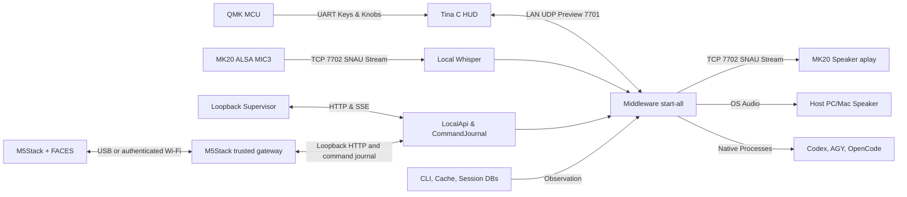
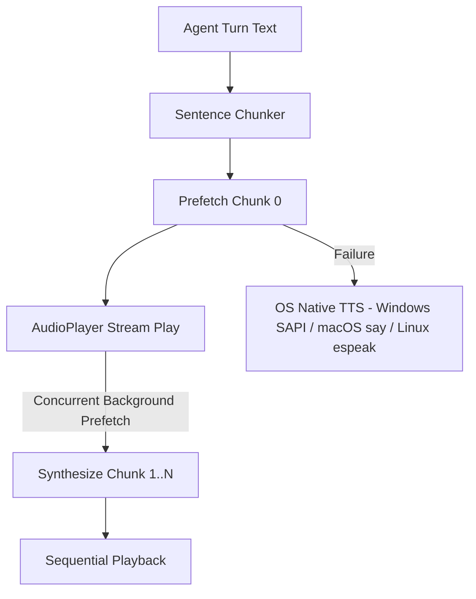

<p align="right">
  <strong>English</strong> | <a href="ARCHITECTURE.ko.md">한국어</a>
</p>

# Snowball Control & Middleware — Preview Architecture

This document serves as the **Single Source of Truth (SSOT)** governing the design, boundaries, and interfaces across the physical device and host middleware. The initial scope encompasses **OpenAI Codex, Google Antigravity (AGY), OpenCode, MK20 hardware, and local Web Supervisor**. This public Preview is intended strictly for personal workstations and trusted local networks; it does not provide security guarantees for multi-tenant or untrusted Internet environments.

---

## Product Philosophy: inter-Harness Local Control

**Snowball is an inter-Harness local control interface: the user stays in control while moving between AI harnesses on their own computers.** Codex, AGY, and OpenCode share a physical desk terminal and local Web Supervisor for navigation, observation, and supported native actions. Here, **inter-Harness** means a common user control surface across harnesses, with a deliberate choice of `Machine > Harness > Project > Session` as the destination for work from the independent MK20 terminal.

The product follows these principles:

- **The user owns the work.** The user's PC owns projects, native processes, and session data. The user chooses where a prompt goes and which installed tool to use. MK20 makes those choices tangible through keys, knobs, displays, and voice input.
- **A common interface preserves native differences.** Each harness retains its session history, model identifiers, supported effort values, and permission semantics. Adapters expose native capabilities; compatibility follows the installed version and observed behavior. Session conversion, conversation transfer between harnesses, and autonomous agent coordination are outside the current Preview scope.
- **Local control comes first.** The control path does not require a cloud control plane. Once local dependencies are installed, device interaction and local observation/control should remain available without Internet access. Cloud model inference still depends on its provider's connectivity. The loopback Supervisor opens without a login or PIN; device pairing is a separate boundary.
- **Reality is the source of truth.** Models, efforts, projects, and sessions come from native tools and local data. Execution and completion must be backed by native events, and approval or interruption must respect the harness's actual capabilities. Discovery failures and unsupported actions remain visible rather than being presented as success.
- **Convenience carries explicit boundaries.** Plugin permissions should be limited while authorized host dispatch and observation remain possible. The current Preview is for personal workstations and trusted local networks; its documented security omissions and unfinished native integrations remain part of the product's stated limits.

These principles define the product direction. The sections below distinguish the current implementation, verified behavior, and remaining work; this philosophy does not certify that every native control operation is implemented for every harness.

### Independent MK20 and Multiple Middleware Machines

The intended product flow is an MK20 that joins Wi-Fi as an independent device, discovers middleware hosts on its private LAN, and lets the user pair more than one host. Two paired hosts appear as two machines; three appear as three. Selecting a machine exposes that middleware's registered harnesses, projects, and sessions, and routes supported actions to that selected machine. Discovery finds candidates; pairing registers the user's chosen hosts. The device retains its paired host list and selection independently of any one PC.

Adding or switching a middleware PC must be an ordinary discovery/pairing operation. It must not require editing the SD card, replacing a PC MAC address, reconnecting USB, or enabling ADB. SD image installation, Wi-Fi provisioning, firmware maintenance, and recovery are separate device setup tasks. The `DEV_PC_MAC` restriction in the current development bootstrap controls TCP ADB access; it is not the product's machine pairing registry.

**Implemented Preview path:** The native HUD owns discovery, pairing and the machine selector (K17). Middleware advertises its stable host ID and real OS hostname; the device stores up to 16 paired hosts plus its last selection in `/mnt/SDCARD/snowball-hosts.v1`. The selected PC alone receives controller input and supplies its local native catalog. UI state and ongoing native operations stay in that PC's controller context when the device leaves and returns. Each selection re-reads native sessions/projects, retains objects owned by pending operations, and separates identically named project directories by their actual paths. This implementation still needs a physical two/three-PC field run; a test fixture or multiple processes on one PC is not that evidence.

- `SNMK1` discovery uses bounded UTF-8 UDP messages: `DISCOVER` queries go to subnet broadcast port 47772. PCs also broadcast `OFFER` every two seconds from a socket bound to the chosen NIC. Devices send `SELECT`/`RELEASE` and selection heartbeats to that advertised socket's actual source endpoint. Windows broadcast-response exemptions depend on the active firewall profile/policy; receiving an advertisement does not prove that the PC can receive selection. Networks that block broadcasts or unicast responses need local network/firewall configuration; no Internet discovery service is used. Middleware logs the actual listening endpoint and first selection receipt without lease tokens.
- K17 opens Machines, the left knob moves and commits, K16 also commits, K4 returns, and K8 forgets the focused pairing. Unpaired candidates expire; paired offline PCs remain visible. Discovery alone cannot select a PC. Stable host IDs prevent DHCP/hostname changes from creating extra paired machines. Automatic NIC selection is repeated at startup; an explicitly supplied `-Bind` remains the owner's override.
- Machines distinguishes `available` (recent advertisement) from `connected` (a recent accepted frame from the selected PC). Committing a selection displays `Connecting to PC` with its name; eight seconds without an accepted frame displays `No PC response` and a tray/log/firewall hint. The device continues connection requests and permits K17 retry/switch while ordinary controls stay fenced. Pairing persistence alone never confirms runtime readiness.
- Each selection creates a fresh device lease. Frames require the selected address and lease, plus controller/run/sequence checks. Old leases and replayed input are rejected. Leaving a PC stops device/host speech, finishes already captured audio into its originating session draft and retains running native turns on their originating PC. Returning to the PC reuses the same controller context and owned Stop handles. An ambiguous native send remains `unknown` and is not automatically resubmitted.
- These leases are cleartext routing fences for a **trusted-LAN Preview**, not encrypted identity proof or production authentication. ADB is used only by explicit maintenance/debug tools. The ordinary `mk20` PC profile builds host libraries and local speech dependencies, advertises the PC, and does not deploy firmware, discover ADB or rewrite device Wi-Fi/debug access.


## 1. Repositories and Concrete Execution Paths

**Snowball** is the complete local control system. **Snowball Middleware** owns installation, host execution and the Web UI. **Snowball Control** owns the MK20 component and this common architecture specification; it is not a second competing middleware. **Snowball Device · M5Stack** owns the ESP32 firmware/gateway. The three **Snowball Harness · Codex / Antigravity / OpenCode** repositories are independently buildable plugins included in every installation.

The common Windows entry point is `Snowball_Middleware/install.ps1`, with **all supported devices included by default** (`all`). It installs/builds Middleware, Control host libraries, the M5Stack gateway and all three standalone harness plugins. No USB connection, profile selection or firmware operation is required for this PC installation. `scripts/setup.mjs` checks real isolated-worker handshakes and writes `.snowball/suite.json` with source commits and approved entrypoint digests. Existing tracked edits are refused; checkouts are never reset. Native vendor applications/sign-in remain separate prerequisites; missing providers stay unavailable. Model, effort, project and session data remain dynamically observed.

A normal update in the **same install root** enables both adapters even for older Web/MK20/M5Stack-only configurations. `deviceProfiles` and `devices` preserve separate Python, NIC and enrollment paths; M5Stack `.local` pairing/device/navigation files, controller state, speech caches, the custom API port and login startup choice are retained. One owned tray/suite/API serves both devices. `-Profile web|mk20|m5stack` is an explicit development/diagnostic subset, retaining already installed adapters. It does not implicitly prepare USB hardware. Discovery finds candidates; device enrollment and selection remain separate trust/ownership operations.

| Operation | Components / device effect |
| --- | --- |
| Normal installation / `-Update` | Both MK20 and M5Stack host adapters, Web UI, all three harnesses; no USB probe, enrollment or firmware write |
| MK20 first connection | Independent Wi-Fi device; K17 discovers and pairs the chosen host. Firmware/Wi-Fi/SD preparation remains separate maintenance |
| M5Stack first PC enrollment, firmware already 0.3.0 | `Register-M5Stack.ps1 [-Serial COMx]` uses installed tools to verify the physical device and enable gateway USB enrollment, without reinstall/download/flash |
| M5Stack initial firmware / upgrade | Explicit `Register-M5Stack.ps1 -Flash [-Serial COMx]` performs physical ESP32/flash interrogation, full private flash backup, upload and real firmware/FACES verification before enrollment |
| Development subsets | `-Profile web`, `mk20` or `m5stack`; all three harness plugins remain included |

The installed `Register-M5Stack.ps1` / `.sh` launchers use `scripts/prepare-installed-m5stack.mjs --config EXISTING_SUITE [--serial PORT] [--flash]`. They stop only this install's running tray, use existing tools without dependency installation/downloads, update its USB port after actual verification, and restart the previously running tray even after preparation failure. Default mode never flashes; `-Flash` / `--flash` is explicit. If the tray was stopped, start it with USB connected to finish gateway enrollment. Installer `-PrepareM5Stack [-NoFlash]` remains an advanced equivalent combining setup and preparation; installer `-NoFlash` and `-Serial` require that switch.

Installing another PC no longer requires adding a device-discovery component. M5Stack still requires one explicit physical enrollment per unknown PC under its existing authenticated pairing design; it is not silently paired through LAN discovery. Automatic LAN discovery waits and retries if no unambiguous private interface exists while the loopback Web UI stays available. Supply `-Bind` for ambiguous adapters. Listener bind failures and invalid explicit overrides remain errors; waiting for a NIC is not reported as a device connection. Gateway readiness is based on real listener receipts. After a running adapter's NIC changes, restart the tray to reselect the interface.

`Start-Snowball.ps1` uses `scripts/start-installed.mjs`; the Windows shortcut directly launches the native Electron tray. Installation downloads the pinned Electron binary, starts the suite with hidden child processes, waits for an IPC readiness receipt from its own runtime plus a successful loopback snapshot, and then returns to the shell. The tray owns the same full `start-suite.mjs` / `start-all.mjs` runtime for the default complete installation and explicit development subsets. It provides status, Web UI, Settings, Pause/Resume, Restart, Quit and OS login startup. Control pause also prevents new MK20 voice capture/Send; existing native tasks continue. Closing the browser or installer terminal does not stop the suite. Quit/IPC disconnect stops its owned processes without replaying commands. Logs are kept in `.snowball/desktop.log` with bounded rotation.

Startup is a **per-user background application**, preserving the signed-in user's native CLI/app sessions and tray access. Windows uses a named native login item; macOS source installs use a per-user LaunchAgent because unsigned source Electron apps cannot reliably register as native app login items. Initial installation enables login startup, which can be changed from the tray or Settings. An upgrade preserves the chosen setting. `-NoStart` prepares the suite without starting or registering it. macOS login startup still needs a real Mac field check. An occupied loopback port is refused; another running service is never adopted or terminated.

MK20 discovery and the loopback API become ready independently of speech downloads. Once selected, the PC sends actual connecting/loading status heartbeats while reading native catalogs. A single host-level STT preparation runs in the background; model download/warmup failure leaves navigation alive and makes Talk report the preparation/error state. No model-ready state is claimed before the real worker acknowledgement. The disconnected device keeps K17 **Machines / Pair PC / Press to pair** visible and displays a pairing instruction.

Rerunning installation is offline-safe and does not silently update source. Use the explicit `-Update` switch to fetch official main branches and fast-forward Middleware, Control, M5Stack and the three harness checkouts, refusing tracked local edits or diverged history. It stops only that install's registered tray before rebuilding and preserves models, controller state and pairing. For an existing LAN install, keep the original install root: `install.ps1 -InstallRoot "$env:LOCALAPPDATA\Snowball-LAN" -Update`. PC installation never deploys MK20 firmware; a device already running an older HUD needs the separate reviewed runtime update for the K17 change.

Windows bootstrap prepares supported Node (official LTS ZIP plus official SHA-256), Git and Python where needed. macOS source installation needs Node/Git/Python beforehand; Linux is not yet supported by the suite's native plugin workers. M5Stack USB/DFU preparation and vendor sign-in remain owner steps. `-NoFlash` applies only to explicit `-PrepareM5Stack` verification. MK20 SD image backup is recommended before device maintenance; adding another PC does not touch the SD image. Repository README headers share identical banner/icon assets and the `Snowball <component> · <provider> — Preview` naming pattern.

| Subsystem | Location | Current Role & Responsibility |
| --- | --- | --- |
| **Keyboard MCU** | `Snowball_Control/hardware/mk20/qmk/` | QMK mechanical key matrix scan, USB HID, and UART escalation to Tina Linux |
| **Device Linux OS** | Vendor Tina T113-based Snowball SD Release | Framebuffers, ALSA, Wi-Fi, and ADB. Tina BSP SDK is not tracked in this repository |
| **Device HUD** | `Snowball_Control/hardware/mk20/hud/` | Native C low-latency HUD daemon running on `/mnt/SDCARD/mk20-hud` (UDP 7701) |
| **Device Audio Daemon** | `Snowball_Control/hardware/mk20/hud/` | Native C audio streaming daemon running on `/mnt/SDCARD/mk20-audio` (TCP 7702 SNAU protocol) |
| **Device Boot Tools** | `Snowball_Control/hardware/mk20/dev-tools/` | MicroSD bootstrap, Wi-Fi configuration, TCP ADB launcher, and HUD/audio startup |
| **MK20 Device Plugin** | `Snowball_Control/plugins/device-mk20/` | Isolated lab Preview transport and framebuffer encoding module |
| **M5Stack Device Plugin** | [Snowball_Device_M5Stack](https://github.com/fkiller/Snowball_Device_M5Stack) | Native ESP32 firmware for original M5Stack + FACES QWERTY, English/Korean keyboard UI, and a Protocol 1 hardware worker backed by a trusted local gateway |
| **Middleware & Web API** | [Snowball_Middleware](https://github.com/fkiller/Snowball_Middleware) `packages/core`, `packages/api`, `apps/supervisor` | Session/command journal, workspace grants, local REST/SSE API, and Web UI |
| **Integrated Native Runtime** | `Snowball_Middleware/scripts/start-all.mjs` | Common live harness/session/journal/Web API; Default suite enables MK20 discovery and M5Stack gateway; MK20 transport/speech activate on device selection |
| **Native Harness Dispatch** | `Snowball_Middleware/scripts/harness-dispatch.mjs` | Native process spawns: Codex app-server, AGY stream-json, OpenCode run. Plugin sandboxing and host execution privileges are separate boundaries |
| **Installation & Catalog Scan** | `harness-runtime.mjs`, `harness-catalog-scanner.mjs` | Discovers PATH/explicit executables and local CLI caches. Emits empty catalog on discovery failure |
| **Session & Project Scan** | `harness-session-scanner.mjs`, `harness-db-scanner.py`, `harness-project-scanner.mjs` | Non-mutating observation of native indexes/DBs. Scanners never write to harness storage |
| **Desktop System Tray** | `Snowball_Middleware/apps/desktop/` | Native per-user background shell owning the installed full suite, with tray controls and OS login startup |
| **Legacy Host** | `Snowball_Control/host/`, Middleware `reference/legacy-host/` | Reference implementation. Control's `npm start` is a legacy Codex-only runtime, not the full middleware launcher |
| **Legacy PowerShell Tools** | `hardware/mk20/orchestration/` | Diagnostic archive. Not used for production physical approvals or secure pairing |

### Change Impact and Documentation

Changes to behavior, installation, operation or protocol include documentation in the same change set before completion or publication: this specification, its Korean translation and affected README/developer instructions. Companion repositories link here for design instead of copying it. Check affected profiles, native adapter/worker contracts, retained state and lifecycle; document automated evidence separately from physical verification and unresolved faults.

| Reviewed change | Affected components | Compatibility / verification boundary |
| --- | --- | --- |
| K17 standby cue and available/connected/timeout display | MK20 C HUD only | JSON `v2_sync`, `SNMK1`, controller/run/sequence and lease checks remain unchanged. Runtime 0.2.1 is a HUD update; it does not change QMK, audio, M5Stack firmware or harness RPC. Actual framebuffer verified; 395's logged duplicate-registration failure is addressed by the reconnect path below, and the user confirmed physical connectivity on the updated 395. |
| LAN listener/selection diagnostics | Installed MK20 adapter only | Logs actual endpoints and receipt without lease values. Advertisement is not proof of inbound delivery; no new firewall rule is installed. Normal installation includes this listener and the M5Stack gateway; explicit Web/M5Stack development subsets can omit it. |
| Complete default installation and explicit device preparation (2026-10-09) | Installer, suite lifecycle, Web/MK20/M5Stack and all three harness hosts | Default setup includes both adapters without USB; legacy migration preserves settings and paths. Middleware: 276 tests, 270 pass, 6 optional skips; Control host: 72/70 pass/2 skips; M5Stack: 19 pass; parity: 10 pass/1 skip; real catalog switching passed. Separate actual all-device native tray lifecycle and dual discovery/MK20 composition/M5Stack signed polling passed. Read-only physical MK20 captures show the existing 395 selection/content. No firmware, pairing protocol, SDK/worker or harness dispatch/approval change. Clean-PC bootstrap, new USB preparation and actual M5Stack two-PC switching were not exercised; no firmware or native prompt was sent. |
| Additive device installation and M5Stack multiple PCs | Suite lifecycle, M5Stack gateway/firmware and public API host identity metadata | Retains existing MK20 adapter and per-device settings, one loopback API and all three harness workers. M5Stack uses separate signed discovery and per-PC USB enrollment; MK20 wire/lease, QMK, audio and worker Protocol 1 remain unchanged. New firmware and two physical PC switching need field verification. |
| MK20 reselection and retry after startup failure | DeviceRegistry binding in the Middleware `mk20` composition only | Reconnect the matching source/MAC identity at its current revision rather than registering twice; retain device/controller IDs and selection while rotating the registry lease. Release/failure marks only that revision offline, so delayed disposal cannot disconnect a replacement. Shared registry API, USB/HID, Web/M5Stack and harness/worker protocols are unchanged. |
| Installed tray, login startup, update and settings persistence | Shared Web/MK20/M5Stack suite and all three harness worker hosts | Same owned runtime and loopback API; no worker protocol, manifest approval or SDK major change. Windows native tray/login, isolated worker startup, source-update/state preservation and conflicts tested. macOS login and an installed M5Stack tray-to-physical-gateway run remain field checks. M5Stack USB/enrollment is an explicit `-PrepareM5Stack` operation; add `-NoFlash` to verify existing firmware. |
| Control pause / resume | Common API plus MK20's direct Talk/Send handlers | New commands/create/attach are fenced by the API for Web and M5Stack; MK20 direct voice/send is fenced too. Observation/navigation and already running native operations continue. Shared API/settings and persisted tray pause tests pass; this is not physical approval/cancellation certification. |
| Nonblocking speech preparation and closed-worker guard | MK20 full runtime and Control's legacy `LocalWhisperProvider` consumers | Speech uses actual readiness/error and cannot restart after close. Public signatures retain optional cancellation parameters. Explicit Web/M5Stack development subsets need no Control checkout or STT process; default installation includes both adapters. Their native APIs start/stop with an absent Control path. |
| Device/harness plugin contracts | Protocol 1 SDK/PluginHost, three harnesses, HID/LAN/virtual and M5Stack worker | Static dependency check, standalone process example, PluginHost tests, approved standalone harness initialization and device tests are evidence of contract compatibility, not an OS sandbox or successful physical harness turn. MK20's host-loaded Preview transport is distinct from a generic SDK worker. |

**Cross-component follow-up (2026-10-08):** Additional profile/PluginHost/native installed-tray checks passed 16/16; M5Stack protocol/navigation/isolated-worker suite passed 19/19 on the public main sources, and two actual PlatformIO installation-config checks passed (4MB/16MB settings and unsupported-capacity refusal; no flash); MK20 plugin passed 15/15; standalone virtual-worker example passed and static package boundaries passed. The previously completed full regression on the same runtime sources remains 262 Middleware passes/5 skips and 70 Control host passes/2 skips. This follow-up changes documentation only. Existing guides were corrected to the actual SDK/adapter contract and MK20 JSON/rendering path; unsupported provider examples and overstated sandbox/platform certification were removed.

> ⚠️ **Notice on Vendor Qt App**: The factory Qt application (`/data/KeyboardDevice`) is not the current product HUD. Descriptions of factory Qt screens in legacy manuals serve solely as vendor reference and must not be interpreted as the specification for the native C HUD.



The MK20 terminal handles screen rendering, physical keys, knobs, and dual-way voice audio streaming (TCP 7702 `SNAU` binary protocol), while the host PC retains absolute ownership of workspace filesystem grants and native agent process execution. Audio capture and playback stream directly over the local network with zero disk wear on MK20 flash storage. USB HID/CDC and LAN transport operate on decoupled paths; the Preview UDP protocol does not provide automated wired failover or cryptographic device pairing.

---

**2026-10-07 verification:** Vendor SDK HUD/audio builds, native discovery/scope contracts, Control host tests (69 passed, 2 optional skips), device plugin tests (15 passed, Node 24.19.0), Middleware tests (261 passed, 5 optional skips), QMK serial contracts (14 passed), MK20 UX parity and native harness switching were run. A real Wi-Fi MK20 restored a saved host selection and rendered that PC's native Codex project/session; the saved record was provisioned through maintenance tooling for this recovery check, not a physical pairing-button test. Native TCP captured 28,000 bytes of microphone PCM; invalid leases were rejected, live volume replied in 64 ms and Stop in 141 ms. Local CUDA Whisper processed real ambient capture (empty transcript), CPU Supertonic synthesized 2,120 ms of speech, and muted native ALSA playback returned DONE. No native harness prompt was submitted. Two/three physical PC switching, manual key/knob pairing and full SD-image restore remain field checks. Device runtime files were backed up privately before deployment; that filesystem copy is not a full-card image. The existing port-8765 middleware could not be restarted because automatic approval rejected the process operation without a detailed reason; verification used independent state and loopback port 8766.

**Installation follow-up verification (2026-10-07):** Middleware 262 passed/5 optional skips; Control host 70 passed/2 skips; device plugin 15 passed; UX parity 10 passed/1 skip; actual native catalog switching passed. A new test launched the real full suite through Electron, confirmed the launcher exited while its native API remained alive, verified single-instance behavior, persisted pause/language across restart, refused a conflicting port without stopping its owner, and shut down the owned runtime. Actual Windows login registration/removal (including paths with spaces) and tray-with-zero-windows smoke passed. The published PowerShell bootstrap completed a fresh Web-profile installation and explicit Update using official Node 24.21.0 and all three standalone public plugin repositories; the installer returned while the real tray/API remained alive. The Windows package verified 126 hashes across 129 application files and passed native tray/loopback/pause smoke. Vendor-toolchain HUD build and the real renderer contract passed; actual MK20 framebuffer captures show the disconnected K17 cue and a saved machine's native Codex session after the hidden tray runtime starts. Speech preparation/warmup followed UI startup, with real CUDA worker readiness observed. No harness prompt or QMK flash was performed. The device's prior HUD and paired-host registry were backed up privately, and only its HUD was replaced. A physical new-PC keypress pairing flow and macOS login startup remain field checks.

**New-PC selection follow-up (2026-10-08):** Actual packet/framebuffer inspection confirmed SNOWBALL-395 discovery and outbound SELECT with `No PC response`. The supplied PC log repeatedly reported `Verified device already registered; reconnect explicitly`, locating the fault after receipt, during runtime registration. The MK20 composition now explicitly reconnects that identity and marks only its own registry revision offline on release/failure. No firmware/SD change or pairing deletion is required. Checks cover reselection, startup retry, changed IP, retained state and delayed old disposal. Middleware 265 passed/5 optional skips, Control host 70 passed/2 skips, UX parity 10 passed/1 skip and actual native catalog switching passed. An isolated UDP peer exercised the actual MK20-profile middleware twice: both selections completed composition and emitted scoped screen frames, with registry revision advancing on reconnect and no harness prompt sent. This verifies the host composition, not physical device operation; the user confirmed successful operation on the updated 395. Repeated switching between physical PCs remains a field check.

## 2. Preview Security Boundaries

- **Web Supervisor Loopback Binding**: Binds strictly to **`127.0.0.1:8765`** without authentication/PIN for personal loopback ergonomics. It must never be exposed to public network interfaces or unauthenticated reverse proxies.
- **LAN Communication**: MK20 UDP status packets, key events, and development TCP ADB operate over the local network. Preview UDP uses lease/controller/run/sequence routing and replay checks, but has no encrypted identity proof or cryptographic signatures. These checks do not provide security against a hostile LAN.
- **Development ADB Shell**: The Tina Linux developer image omits ADB authentication keys. The MAC address filter in `lunch.sh` is an internal LAN guard and does not constitute cryptographic identity verification or access control.
- **Plugin Sandboxing**: `packages/plugin-host` validates entrypoint digests, manifest capabilities, and payload limits, isolating failures into child Node.js processes. This child process model is not an OS-level filesystem sandbox; untrusted arbitrary plugins must not be loaded without additional isolation.
- **Native Privilege Execution**: Tool approvals and command execution defer strictly to each harness's native policy engine. Observed stdout events or console timeouts are never converted into synthetic physical approvals.
- **Air-Gapped Operation**: Local Web UI, hardware control, and locally cached STT speech models operate completely offline. Cloud model inference and initial weight downloads require upstream vendor connectivity.

---

## 3. Installed Baseline Versions & Continuous Observation

The following baseline was validated on the primary review workstation (Windows 11) as of 2026-10-02:

| Component | Detected Version | Verification Evidence |
| --- | --- | --- |
| **Codex PATH CLI** | `0.160.0` | `codex --version`, native npm executable in system PATH |
| **Codex App-Server (Embedded)** | `0.159.2` | Running desktop app executable: `codex.exe --version` |
| **AGY CLI** | `1.2.13` | `agy --version` |
| **OpenCode Desktop** | `1.18.33` | Installed `app.asar/package.json` and PE ProductVersion |
| **OpenCode CLI** | Not Detected | CLI compatibility is not inferred from Desktop app version |
| **Node.js Requirement** | `>=22.12.0` | Defined in `package.json`. Validated on Node `24.19.0` |
| **Python** | `3.12.10` | Active Python virtual environment runtime |

The machine-readable reference specification is maintained in `Snowball_Middleware/config/harness-compatibility.json`. Models, effort variants, and active session lists are discovered dynamically from native CLI outputs rather than hardcoded tables. Upstream releases are monitored via [Codex Releases](https://github.com/openai/codex/releases), [AGY Releases](https://github.com/google-antigravity/antigravity-cli/releases), and [OpenCode Releases](https://github.com/anomalyco/opencode/releases).

---

## 4. MK20 Firmware, Recovery & SD Image

QMK firmware sources and Allwinner T113 BSP source code were provided directly by the hardware manufacturer via email (confirmed on 2026-10-02). The Snowball SD distribution built from these sources constitutes the official deployment and verification target. Factory firmware reverse-engineering is outside the project scope.

### Mandatory Modified QMK Firmware

Factory QMK firmware enters an indefinite wait loop on cold boot when USB host enumeration is absent, disabling matrix scanning and UART escalation on standalone power supplies. Applying the modified QMK build is **mandatory**:
- Build flags in `mk20_plus/rules.mk`: `NO_USB_STARTUP_CHECK = yes`, `NO_SUSPEND_POWER_DOWN = yes`.
- Official MK20 binary: `hardware/mk20/qmk/bin/syk_keyboards_mk20_plus_via.bin` (SHA-256: `28415537c79b7b08a0d735e337423633838d857dcae9e4968d4fbd103a2fff19`).
- Flashing procedure: Disconnect USB → hold top-left physical key while plugging in USB → flash via [QMK Toolbox](https://qmk.fm/toolbox). *Do not flash MK10 firmware onto MK20.*

### MicroSD Deployment, Backup & Rollback

1. Copy `dev-access.conf.example` to `dev-access.conf` on the microSD root and configure local 2.4 GHz Wi-Fi credentials and the workstation MAC address.
2. **Full Disk Backup**: Prior to deployment, create a full raw block-level image of the microSD card. Record the total capacity, date, and SHA-256 checksum outside the repository.
3. Deploy `lunch.sh`, `dev-access.conf`, custom HUD binary (`mk20-hud`), and fonts (`fonts/D2Coding.ttf`) to `/mnt/SDCARD/`.
4. In case of operational failure, write the backup raw image back to the card to restore the known state.

### HUD Engine, Boot Splash & Standby Mode

The MK20 hardware features a **428×142** header display (`/dev/fb21`) and 20 individual **128×128** key displays (`/dev/fb1`..`/dev/fb20`) operating in 16-bit RGB565:

- **Bootloader & Kernel Splash**:
  - U-Boot 160×160 BMP: `/mnt/SDCARD/bootlogo.bmp` (Source: `assets/bootlogo.bmp`)
  - Top header 428×142 RGB565 splash: `/mnt/SDCARD/mk20-plus.bin` (Source: `assets/mk20-plus.bin`)
- **Offline Standby Mode**:
  - If host middleware (`start-all.mjs`) is unreachable or UDP sync packets cease for > 15 seconds, the HUD automatically engages **Snowball Standby Mode**.
  - **Top Display (`/dev/fb21`)**: Left pane displays connection status alerts ("Host Disconnected", "Waiting for host middleware...", "Snowball Standby Mode"), while the right pane (x=286, y=7) renders the 128×128 RGB565 Snowball puppy icon.
  - **Key Matrix (`/dev/fb10` & others)**: Center Key 10 illuminates with the 128×128 Snowball puppy icon; all other 19 keys turn black (backlight off) to visually signal standby.
  - **Live Restoration**: When middleware sync resumes, all displays immediately switch to the active workspace session.

| Standby Top Display (`/dev/fb21`) | Standby Key 10 (`/dev/fb10`) | Connected Active Display (`/dev/fb21`) |
| :---: | :---: | :---: |
|  |  |  |

- **Firmware Update Persistence**:
  - **Power Cycles & Normal Reboots**: `/mnt/SDCARD` is mounted on the non-volatile FAT32 `boot-resource` eMMC partition (`/dev/mmcblk0p1`). Boot logos, `mk20-hud`, and configs **100% persist** across reboots.
  - **Full Firmware Reflashing (OTA, LiveSuite, PhoenixCard)**: Writing a raw firmware image (`.img`) completely formats all partitions, resetting `bootlogo.bmp` and `mk20-plus.bin` to factory defaults. To preserve custom assets, either embed them directly into the Tina BSP SDK build tree (`Tina-t113-pro/.../boot-resource`) or maintain an auto-restore verification check in `lunch.sh`.

---

## 5. Live State Management & Transport

- **No Synthetic State**: If native project or session sources are empty, the UI displays an empty state. Fake projects, dummy models, or synthetic completions are strictly prohibited.
- **Draft & Execution Ownership**: MK20's `New task` represents a local uncommitted draft. Dispatch uses the explicit working directory (`cwd`) of the active session.
- **Dynamic Controls**: Model, effort variant, and permissions reflect discovered capabilities. Codex new turns default to `on-request`/`read-only`; existing threads inherit their native resume policy.
- **Abort & Cancellation**: Key 4 (Stop) sends an `AbortSignal` directly to the child process bound to the active session. It does not blindly terminate external or grandchild processes.
- **State Partitioning**: Each registered controller owns a canonical `ControllerContext`. The MK20 composition root creates its own `ContextManager`, with independent harness/project/session memory, execution choices, reader position, device skin, volume and session-bound voice drafts. The M5Stack gateway and each Supervisor tab have separate controller identities and UI state. Native session content and journal/approval revisions are shared resources; another controller's UI selection is never shared. Audio captures and dispatch operations bind immutably to their initiating session:
  - `K13`: Harness selector
  - `K9`: Project selector
  - `K5`: Session selector
  - `K1`: New task draft
  - `K12`: Speak on **MK20 onboard speaker** (Destination: `device`. Audio is streamed natively via TCP port 7702 `SNAU` binary protocol directly to `mk20-audio` $\rightarrow$ ALSA `aplay`, zero device audio scratch files, live hardware gain; press again to stop)
  - `K8`: Speak on **host PC / Mac speaker** (Destination: `host`. Label `Speak PC` on Windows/Linux, `Speak Mac` on macOS; in-memory PCM volume scaled to match Right Knob; press again to stop)
  - `K20`: Voice recording toggle (Initiates TCP port 7702 streaming capture directly to host; interrupts active TTS playback immediately to avoid acoustic echo and ALSA device conflicts)
  - `K16`: Transcribe & Send
  - `K4`: Cancel / Discard draft / Cut off active speech on both destinations (host player kill + stop signal to `mk20-audio`)
  - `Left Knob`: Scroll navigation and item commit
  - `Right Knob`: System volume (0..100) and click mute. Dynamically scales playback volume across both MK20 hardware speaker (via mixer + 16-bit PCM attenuation) and host speakers.
  - `Dual-Knob Chord`: Simultaneous press toggles HOST Mode (keystroke masking) and HID Mode (keystroke passthrough to PC).

### Speech Synthesis (TTS) 3-Tier Fallback Chain

Voice responses utilize a local-first, low-latency synthesis pipeline:

1. **Tier 1 (Supertonic Optimized ONNX)**: Supertonic-3 resident synthesis.
   - **Throughput Profile**: Supertonic is an ONNX diffusion pipeline with multi-step NumPy loops. ONNX Runtime `CPUExecutionProvider` (AVX2 / AVX-512) achieves ultra-low latency (**~1.5s** per sentence, RTF 0.37) by eliminating the 200+ PCIe host-device `Memcpy` nodes that choke CUDA loops.
   - **Sentence Pipelined Streaming**: Rather than batching 300+ characters into a single blocking synthesize call, `LocalSupertonicProvider` (`host/src/audio/local-supertonic.ts`) chunks text into natural sentences, starts playback after actual synthesis of chunk 0 completes, and prefetches chunk $1\dots N$ in the background while the previous sentence plays on speakers.
2. **Tier 2 (Supertonic Alternate EP)**: Explicit selection of an available Execution Provider (`CUDAExecutionProvider`, `DmlExecutionProvider`, `CoreMLExecutionProvider`) when requested.
3. **Tier 3 (OS Native TTS)**: Emergency offline platform fallback using native OS speech synthesizers (`PowerShell SAPI` on Windows, `say` on macOS, `espeak` on Linux) when its native engine is installed; if every engine fails, the request reports an error.

#### Speech Text Sanitization (`host/src/audio/korean-transliterate.ts`)
Every utterance passes through `cleanTextForSpeech()` before synthesis (used by both `LocalSupertonicProvider` and middleware `start-all.mjs`):
1. **Markdown stripping**: code fences → "코드 블록 생략", inline code / links / headers / bullets / emphasis removed.
2. **Meaningless token removal** (`stripMeaninglessHashes`): UUIDs, `0x…` pointers, `sha256:/sha1:/md5:` digests, and 7–64 char hex strings that contain both digits and a–f letters (Git hashes; pure numbers and words like `beef` are kept). `커밋 854fc69를` → `커밋을` with particle re-agreement (`attachParticle`).
3. **English → Hangul pronunciation** (`transliterateEnglishToHangul`, only when the text is Korean): developer-term dictionary (`GitHub`→깃허브, `PowerShell`→파워셸, `MK20`→엠케이이십, `PC`→피씨 …), key names (`K12`→케이십이), and letter-by-letter reading of remaining 2–5 letter all-caps acronyms.
   - *Library survey*: `hangulize` (PyPI, last release 2012) and `g2pK`/`g2pkk` (depends on `eunjeon` → `distutils`, removed in Python 3.12) do not install on the bundled Python 3.12 runtime, so a zero-dependency dictionary + rule engine is used.

### Cross-Platform Hardware Acceleration Matrix (STT & TTS)

The shipped resident STT provider is `faster-whisper` on CPU or CUDA. The diagnostic script can probe Vulkan/Metal, but those results do not activate a resident whisper.cpp/MLX adapter: the composition explicitly selects CPU and a CPU-sized model when that backend is unavailable. Supertonic defaults to its actual CPU ONNX provider; explicit accelerator selection requires that provider to be installed. Native workers report their measured execution backend, and unavailable engines report errors.

| Host environment | Resident STT | Default TTS | Offline fallback |
| :--- | :--- | :--- | :--- |
| Windows + working NVIDIA CUDA runtime | faster-whisper CUDA; CPU on runtime failure | Supertonic CPU | Installed Windows SAPI |
| Windows AMD/Intel or unavailable CUDA | faster-whisper CPU | Supertonic CPU | Installed Windows SAPI |
| macOS source installation | faster-whisper CPU; physical Mac field check pending | Supertonic CPU | Installed macOS `say` |
| Linux | CPU/CUDA speech worker code exists; full suite not supported | Supertonic CPU | Installed `espeak` |

### Multilingual Support Framework (i18n)

Multilingual support is structured around complete language packages:
$$\text{Language Package} = \text{UI Resources (Fonts \& Labels)} + \text{STT (Whisper)} + \text{TTS (Supertonic / OS Native)}$$

- **Living OS Auto-Discovery**: Automatically queries OS display culture (`(Get-Culture).Name` on Windows, `LANG` on POSIX) on startup. Korean OS (`ko-KR`) configures `ko` as the primary language and activates D2Coding Korean font rendering on the MK20 HUD.
- **Dual-Font Character Typography (`hardware/mk20/hud/unicode_text.c`)**:
  - To prevent typographical visual inconsistency across mixed Korean and English lines, character routing strictly segregates codepoints:
    - **ASCII Characters** (`cp < 128`): Directly rendered via the built-in fixed-pitch `font8x16` bitmap font (8px glyph width at baseline 13), perfectly matching all system header and status lines.
    - **Korean & Unicode Characters** (`cp >= 128`): Rendered via FreeType using `D2Coding.ttf` (16px glyph width).
  - This ensures 100% font uniformity: English characters look identical regardless of whether Korean appears on the line.
- **Dynamic Configuration & Lifecycle**: Languages can be enabled, disabled, or set as primary via `/v1/settings` and `languageManager`. Adding a language ensures corresponding STT and TTS model weights exist locally.

### Native Audio Streaming Subsystem (`mk20-audio` & `SNAU` Protocol)

The device boot hook launches both native HUD and audio services. The audio daemon accepts TCP 7702 while an owned playback/recording worker runs separately, so Ping, Stop and volume control remain responsive. Only the daemon's owned ALSA process group is interrupted; there is no ADB fallback or global `killall aplay`. The Tina SDK Makefile builds both binaries against the board's glibc.

The fixed little-endian header is **16 bytes**, in this order:

| Field | Bytes | Meaning |
| --- | --- | --- |
| `magic` | 4 | `SNAU` |
| `mode` | 1 | 1 playback, 2 capture, 3 ping, 4 volume, 5 stop; bit `0x80` marks a leased operation |
| `channels` | 1 | 1 mono or 2 stereo, PCM16 LE |
| `volume` | 1 | 0..100 |
| `muted` | 1 | 0 or 1 |
| `sample_rate` | 4 | LE32; capture 16000 Hz |
| `data_len` | 4 | LE32; playback byte count, capture `0xffffffff`, control 0 |

Leased operations append **32 ASCII hex bytes**, making the request prefix 48 bytes. HUD publishes the selected host IP, lease and a six-second expiry in a mode-0600 RAM file, renewed while the host is live. The audio daemon checks that selection before accepting an operation and throughout streaming; a HUD crash, switch or disconnect revokes ownership. Unselected/legacy writes receive `ERR1`; unauthenticated Ping can only return `PONG`.

- **Capture:** `arecord -D hw:0,0 -f S16_LE -r 16000 -c 3 -t raw` captures three hardware channels; the worker extracts MIC3 into mono PCM. `RDY1` is sent only after actual microphone bytes arrive. The host bounds capture to 120 seconds/3.84MB, waits for real readiness, wraps PCM in a WAV, and passes a private temporary host file to Whisper, deleting it afterward. No device audio scratch file is written.
- **Playback:** A leased PCM16 stream feeds `aplay -D default`. `RDY1` admits the stream; `DONE` requires the owned player to exit successfully after all expected bytes. Failure, busy codec, stale lease or an interrupted connection cannot be reported as completed playback. Live device volume uses the hardware mixer without duplicate software attenuation; host PCM volume is applied per sentence chunk.
- **Half duplex:** Stop waits for termination of the owned worker before microphone capture begins. Speaker and microphone are mutually exclusive on this codec. Late readiness/cancellation cannot attach an old capture or playback to a new operation. ASR results are bound to the initiating host/controller/harness/session/capture ID, and stay as drafts until explicit Send.
- **Failures:** A missing/outdated daemon produces an actionable audio error. Ordinary runtime does not connect ADB, upload helper scripts, pull audio or modify Wi-Fi. Explicit `hardware/mk20/dev-tools/install-mk20.ps1` maintenance accepts a reviewed local `-RuntimeZip` with `-RuntimeSha256`, backs up existing device files and installs the actual HUD/audio/boot bundle. A full SD image backup is recommended for recovery.

---

### 5.1 M5Stack + FACES Runtime (0.3.0)

**Multi-device follow-up (2026-10-08):** The user's MK20 connection to 395 succeeded after the reconnect fix. M5Stack could not find that host because its MK20-only install did not run an M5Stack gateway, and firmware 0.2.2 held only the other PC's enrollment. The connected physical board was read-only probed as 0.2.2/16MB; it was not flashed. Firmware 0.3.0 built successfully (56,128 bytes static RAM; 1,509,321 bytes application flash). Device Node tests passed 19 and native IME/navigation/connection/pairing assertions passed. Middleware passed 268 with five optional skips, Control host 70 with two skips, UX parity ten with one skip, and native catalog switching passed. The real dual-adapter suite advertised both protocols under its actual persistent host identity, verified legacy and new discovery MACs, emitted MK20 scoped frames and served a separately scoped signed M5Stack poll concurrently; no native prompt was sent. New firmware framebuffer, retained NVS across physical upload and repeated switching between two physical PCs remain field checks. Software fixtures are not physical device certification.

The M5Stack terminal is a separate device implementation in `Snowball_Device_M5Stack`, not an MK20 firmware image. Its first release uses FACES QWERTY keyboard input only; no PC microphone or device audio capture is enabled. The original Core/FACES assembly has a speaker but does not include a microphone in its standard bill of materials.

M5Stack firmware 0.3.0 retains up to 16 independent PC enrollments and the selected PC in NVS. Each PC supplies its existing random gateway key and the middleware journal's persistent `hostId` over a deliberate USB enrollment. Adding a PC preserves other PCs' keys; changing an existing identity's key requires removing that PC first. The previous single-key enrollment is migrated without deleting Wi-Fi settings, and adopts its stable identity only after USB or a correctly signed discovery response from that same key. Update the original PC's M5Stack gateway as well as the new PC.

The machine breadcrumb and Settings → Find middleware open the device's paired-PC list. A/B/C navigate/select; discovery refreshes availability without selecting another PC. New PCs require one USB enrollment each, after which Wi-Fi control works without USB. The list also provides search, USB enrollment guidance and confirmed removal of the selected PC. Selection survives restart; a PC's controller context remains on that PC. An in-flight submission blocks a machine change, existing drafts remain tied to their original session, and switching never resends a prompt or cancels the old PC's native task.

- **Verified hardware**: CP210x USB UART on COM7 (`10C4:EA60`), ESP32-D0WDQ6-V3 revision 3.0, MAC `24:0a:c4:f8:16:78`, 16MB flash. The UART VID/PID is only a candidate hint; ESP32 interrogation and the firmware's real FACES I²C probe establish this deployment's evidence. Other original Core units may have 4MB flash and require the corresponding build setting.
- **Firmware**: Arduino ESP32 via PlatformIO `espressif32@6.12.0`, M5Unified `0.2.11`, M5GFX `0.2.32`, ArduinoJson `6.21.5`. Native 320×240 display; FACES at I²C `0x08`, SDA/SCL 21/22, interrupt GPIO5. The 3MB application partition uses USB updates, without OTA. Large protocol and capture buffers are heap/static allocated to fit the ESP32 loop task's stack.
- **Navigation (0.3.0)**: Native session content is the default. The 30-pixel top area contains the existing Snowball menu icon, the harness's plugin-defined icon, the project name without brackets, and clipped session title. Focusing the harness replaces its icon with its full name. Each harness manifest owns validated presentation metadata: a name, sixteen unsigned 16-bit visibility-mask rows, and optional canonical base64 encoding of exactly 512 bytes of big-endian RGB565 pixels. Older monochrome renderers retain the mask fallback. Original Codex app, Antigravity and OpenCode icons are alpha-cropped, aspect-fit with Lanczos to 16×16, and Floyd-Steinberg quantized for the RAM-bounded 8-bit RGB332 canvas, then transported as RGB565; source credit and SHA-256 are embedded in each plugin presentation module. `scripts/build-harness-icon.py` generates these local assets from explicitly supplied originals. No image conversion or download occurs at runtime. The loopback snapshot carries this metadata; the device renders fixed native pixels without fetching URLs or interpreting executable graphics. The actual machine name appears only when focus moves left past the harness. Single Up above the first content line enters the rightmost/session breadcrumb; selecting it opens that project's sessions with the current selection anchored at the first, middle, or last visible position. Home then Up exits a source list back to session content with its originating breadcrumb focused; left traverses session → project → harness → machine → menu. Project grouping uses actual native working directories when available, preserving distinct paths even when display names match. Selecting the menu opens Wi-Fi, middleware discovery, theme, display language, input settings, and device information. Native lists expose global indexes with seven-row windows; content uses twelve-line windows of real native messages, with explicit PREVIEW labeling when only a summary exists. Each gateway observes its own actual host; the device selects between enrolled gateways.
- **Input contract**: A/C universally mean up/left and down/right; holding repeats PgUp/PgDn, double-click means Home/End. B selects, with contextual hold/double actions. Session B opens Prompt Edit, held B opens model/effort/refresh actions, double B follows the latest content. Moving down past the final content page also opens Prompt Edit, as does typing while session content has focus; the first printable key is preserved as literal input. Source-list held B returns, double B returns to content. Leaving a settings list above its first item focuses the menu icon and keeps the main Settings list in Content; selecting either a display or input language returns to its original Settings row. Local menu parents retain their selected row and focus: Left (also A in non-text menus), Esc and Back restore that parent, including Wi-Fi AP/password and action/model/effort menus. Top breadcrumb Left still moves between crumbs; A remains literal in text entry. Connection retry paths retire old menu descendants. In Prompt Edit A/C move the UTF-8 cursor left/right, holding repeats that movement, and double-click moves to Home/End. A left click, held-left step or keyboard Left at byte offset zero returns to session content at its preserved reader position, retaining the draft and caret; double-A Home stays in the editor. B or Enter directly executes; held B or Tab switches English/Korean two-beolsik, double B or Esc returns to content, Backspace deletes at the cursor, and Ctrl+U explicitly clears the draft. Editing commits active composition before moving across whole codepoints. Korean compound vowels/finals, resyllabification, shifted consonants and composition backspace use the same native IME header exercised by host C++ tests. The editor wraps by actual M5GFX pixel widths and follows its caret. Top, Content and Bottom drawing is clipped to each area and reset before framebuffer transfer, protecting breadcrumbs and footer from text drawing. M5GFX renders UTF-8 without PC IME dependency. Wi-Fi credentials use ASCII input. Click admission waits 250ms so a B double-click cannot first dispatch a single-click action; hold begins at 500ms and repeats at 180ms. The bottom 27 pixels contain three rectangular boxes with aligned dot/two-dot/minus gesture markers and original Lucide action glyphs plus Hm/Ed labels for Home/End in a single graphical row. All source hashes/licenses and generated RGB332 pixels accompany the fixed PROGMEM atlas; the device does not download or rasterize graphics. There are no ABC labels or textual gesture legends.
- **Wi-Fi UX**: Scan 2.4GHz networks, enter a password or hidden SSID, connect, change the selected network, and explicitly forget saved credentials. Scans are explicit, asynchronous, and guarded against repeated requests. A bounded local AP snapshot survives driver scan cleanup/reconnect; the Wi-Fi screen owns its scanning/result/error notice, independently of middleware status. Consume results after the actual `SCAN_DONE` event, with bounded retries and a 12-second overall limit; suspend an unfinished association/reconnect while an offline scan runs, then resume the last saved network. Pause middleware polling/discovery in Wi-Fi screens. USB scan/provision requests cannot interrupt password entry. Tab or held B toggles password visibility; Backspace erases. A/C navigate Connect, Show/Hide, Back with the universal gestures; double B cancels. Selecting a previously successful SSID prefills its saved password and always starts masked. Up to eight successful network profiles are retained in NVS, with compatibility for the old single-network credentials; explicit Forget clears every profile. Preserve a verified matching active SSID/key association without calling `WiFi.begin()` again during an explicit retry; redundant driver configuration changes can retire its sockets. Persist a network only after a matching existing association or a fresh `GOT_IP`, rather than a stale `WL_CONNECTED` return from `begin()`. Retire a nonmatching association before admitting another network/key. Each association binds an immutable SSID/key snapshot, and persistence also checks the driver's matching PSK; editing a Wi-Fi draft during background reconnect cannot save that draft as the successful key. Failed attempts preserve saved credentials. A foreground connection view displays Wi-Fi attempt/success and middleware attempt/success from real observations: IP association confirms Wi-Fi, while a signed response with this board/controller identity and a connected native middleware view confirms middleware. Reverse TCP authentication alone does not confirm middleware readiness. After success, a monotonic 1000ms hold opens session content; subsequent polls cannot restart the hold. Wi-Fi failures return to the masked password/connection screen with entered text retained; middleware discovery/response failures return to an explicit Find middleware menu. Background scan resume does not enter this foreground flow or interrupt editing. Wi-Fi association has a 20-second bound and middleware connection a 15-second bound; timers only report failure or delay navigation after an observed success. Credentials are never emitted in diagnostic state, screenshots, or source control; framebuffer capture masks even an LCD-visible password. USB can provision a matching saved Windows WLAN profile through the explicit `scripts/provision_wifi.py` utility, without staging credentials in a file.
- **Transport and enrollment**: The dedicated M5Stack gateway uses UDP 47770, signed HTTP 47771, a loopback-only plugin broker on TCP 47772 and optional outbound TCP to the device's 47774. Discovery version 2 signs the real host identity as well as nonce, epoch, endpoint and display name; a device accepts only its enrolled key for that identity. Reverse connections are accepted using the selected PC's key, and USB commands route only to the selected USB-enrolled PC. Gateway 0.3.0 still answers the older discovery proof for firmware 0.2.2, but multi-PC selection needs firmware 0.3.0. This remains authenticated plaintext on a trusted LAN; no Supervisor API is exposed on the LAN. The `hostId` snapshot field is public identity metadata from the actual command journal, not a pairing key or authorization grant. HMAC-SHA256 request/response directions, fresh gateway epoch, device boot ID and monotonic sequence reject replay; device discovery also checks subnet membership.
- **Control ownership**: Sessions, models, and each model's effort options come from the actual middleware/native sources. Session pages preserve an explicit selection; UTF-8 drafts bind to the selected session key. Execution requires real native control ownership and a stable command ID; ambiguous delivery never automatically repeats or switches transport. Rejected, cancelled, unknown, or unconfirmed receipts retain the draft; only a connected receipt for this device's matching `cmd_m5_` ID with admitted journal status clears it. A foreign controller's command receipt cannot clear input. The editor retains pending/error status and the journal exposes command status; the next periodic poll waits from response time rather than immediately replacing a receipt. Journal admission is not reported as native completion. The first release selects existing sessions; it does not invent sessions when native creation is unavailable.
- **Device state (0.3.0)**: The enrolled ESP32 ID produces a stable controller ID from SHA-256 of `snowball.controller.v1`, plugin ID, instance `physical`, and verified board ID separated by newlines. The gateway uses this identity for `/v1/controller`; firmware verifies both board and controller IDs before accepting a connected view. Selecting sessions, execution settings, theme and scroll checkpoints only this controller. Gateway restart restores its own saved state; another USB board cannot silently replace the enrolled identity. When there is no valid saved selection, choose the actual session with the newest native activity timestamp or admitted journal activity, then derive its harness/project; stale model, effort and reader state are cleared. The native scanner preserves Codex, Antigravity and OpenCode activity times. Later activity from another controller does not replace this selection. No choose-a-session instruction is displayed. Display locale (`displayKo`) and keyboard input language (`korean`) are independently stored in this board's NVS. Only display locale is included in the bounded authenticated action's optional `locale` field (`en`/`ko`) and checkpointed in this controller's `preferences.language`. Changing either setting cannot change another controller's language, session, or draft. Existing Wi-Fi editing/scan protections remain independent of middleware refresh.
- **Internationalization**: Device UI strings are centralized in `firmware/i18n.h`, and gateway presentation strings in `src/i18n.mjs`, with English and Korean only. Display language and Input settings are separate device menus; held B/Tab changes only the real on-device EN/Korean two-beolsik IME. Source-native titles, working directories, model IDs, session contents, and protocol identifiers retain their source values. The device repository provides linked English/Korean READMEs and actual locale-specific framebuffers under `assets/screenshots/en` and `assets/screenshots/ko`. USB diagnostics mask visible Wi-Fi passwords; gallery input is disposable and never submitted. 표시 언어와 입력 언어는 별도로 선택·저장하며, 연결 성공은 실제 IP 할당과 인증된 미들웨어 응답으로 확인한 뒤 1초 후 세션 화면을 엽니다. 실패는 Wi-Fi 입력 또는 미들웨어 검색 화면으로 돌아갑니다.
- **Plugin boundary**: `src/manifest.mjs` computes the worker's entrypoint SHA-256 for the existing Protocol 1 PluginHost. The worker declares only `devices.list`/`devices.render` and accesses a closed list/render broker on `127.0.0.1:47772`. It receives no enrollment secret, serial handle, filesystem path, or harness command capability. The trusted gateway owns hardware I/O and command dispatch. The existing child-process PluginHost is still not an OS sandbox. This first release provides its worker for explicit host loading; it does not silently change the middleware's plugin registration policy.
- **Recovery**: Before first deployment, the entire original 16,777,216-byte flash was read with esptool `4.9.0`. Backup SHA-256: `733894d655a473f5ae9d4ee9fd44d7185073ebe59adc797d0d62d841a593fa40`. The backup remains outside Git in the device repository's ignored `artifacts/original-flash.bin` because original firmware may contain credentials. esptool `5.4.0` produced incomplete/corrupt reads on this USB connection and is not the verified recovery tool. Restore the complete backup at flash address 0 only to this same board.

Run the gateway from the device repository with Node >=22.12: `node scripts/gateway.mjs --serial COM7 --python <PYTHON> --bind <PRIVATE_LAN_IP>`. Stop the serial gateway before opening COM7 for an upload or diagnostic capture. Device capture reads the actual firmware framebuffer; software-injected IME checks do not certify physical button presses. The capture scripts request native RGB332 rows from the 8-bit sprite and expand those exact pixels on the host; legacy RGB888 capture remains supported. Both paths mask Wi-Fi passwords. Small USB commands allocate according to their bounded frame size instead of reserving the full 24KB view budget. Inspection sizes its copy from the current view's memory usage, reports free heap and the largest allocation block, and returns an explicit allocation error rather than an empty success object. The firmware's inspection endpoint reports real FACES, Wi-Fi, enrollment, heap, and UI state. Test and physical evidence must distinguish compiled functionality from credentials, actual association, LAN reachability, and native harness completion.

**Outbound Wi-Fi path**: If PC inbound firewall policy blocks UDP/HTTP, the gateway can initiate TCP to the enrolled device on port 47774 (`--device <PAIRED_DEVICE_IP>`). The device issues a fresh random challenge for each connection; the PC authenticates its new gateway epoch with the enrollment key. Only then does the device exchange the same bounded signed request/response envelopes over that socket. USB and TCP pending receipts are tracked separately; switching routes never retries a send. TCP writes use a 250ms nonblocking budget; a partial frame or seven-second missed response closes the socket and requires fresh authentication. Retire the old socket's pending receipt before admitting a new connection, without replaying a selection or prompt. USB processing admits at most one complete frame and 2048 input bytes per loop so repeated inspections cannot starve LAN receipts and button processing. Device identity remains bound to its enrollment key and previously verified ID. The USB-reported or explicitly selected private device address is remembered; DHCP changes require a fresh verified address. This path leaves the PC firewall and Supervisor loopback boundary unchanged.

- **Editor execution controls**: Prompt Edit shows current Model, Effort and Access instead of the redundant shortcut strip. Stock FACES consumes bare Fn and Alt in its AVR and does not transmit their standalone state. Its real Fn+Z event (`0xBA`) opens or cancels the execution selector. A/B/C open model/effort/access popups anchored above their respective footer boxes; popup A/C retain navigation, paging and Home/End, B commits, and Fn+Z/Esc cancels with draft/caret/settings preserved. Alt-down and Alt-up are not transmitted either, so a held Alt selector also requires an ATmega keyboard firmware change and a separate programming connection. The current Core USB UART uploads only the ESP32. Popup cancellation queues its non-mutating menu close after an in-flight receipt, preventing a late catalog reply from trapping the next menu.
- **Native Access**: The trusted Middleware `/v1/harness/access` callback asynchronously runs the installed Codex CLI's JSON-schema generator, extracts string approval policies from the actual turn/start approvalPolicy field, and invalidates its local cache when the executable changes. Unsupported providers advertise no choices. Model-specific efforts still use the native model catalog. Access is an independent controller preference bound to the selected session and passed with an explicit next-turn command. Codex dispatch validates it again against the installed schema and sends approvalPolicy to turn/start. Native requirements may reject it; no filesystem sandbox or workspace grant is changed. Cancellation and UI selection do not dispatch a prompt.
- **Content/footer geometry**: Session content expands to twelve 14-pixel lines up to the universal footer; the old controllability/model/status strip and static focus line are removed. The proportional scrollbar uses actual returned contentOffset/contentTotal, clamps to the valid viewport range, and meets the track endpoints at Home/End. Footer action glyphs retain original Lucide geometry and RGB332 dithering. Hand gesture assets are removed; same-viewbox dot, two-dot (outer ellipsis circles) and minus glyphs represent click, double-click and hold on one aligned baseline.

---

### 5.2 Controller isolation and recovery

`ControllerStateStore` supplies the same canonical contexts to the device registry and local API. `GET /v1/controller` reads only the authenticated controller; `POST` requires its observed revision, validates a closed selection/preferences/draft payload, and rejects stale updates. In normal loopback mode the SDK supplies a distinct `X-Snowball-Controller`; token mode uses the token-bound identity. This endpoint grants no dispatch rights and emits no global SSE repaint. Selection can change while a pending draft or approval retains its original destination. Native command/approval admission remains governed by the shared journal's owner, immutable target and revision checks.

The trusted runtime atomically checkpoints bounded controller state under the private middleware directory. MK20 additionally saves its controller-specific session draft/UI memory, resolving recovered selections against actual native metadata. Interrupted sends recover as unknown, with no automatic replay. Its input queue serializes only this controller's navigation. A delayed native session read updates the originating cache and repaints only if that session is still selected. Skins and reader state are restored separately from transport leases.

The Supervisor uses a tab-local controller ID and a held Web Lock to distinguish duplicated tabs. Language, hierarchy, model/effort choice and prompt drafts remain scoped to that tab; changing a session swaps its bound draft rather than retargeting typed text. Reload restores that tab's state. Tray language, autostart and control pause remain explicit shared system settings. UI state is not included in another client's snapshot.

Native catalogs, installations, projects and session scans run in a bounded worker pool outside the API/MK20 heartbeat event loop. A model request scans only its requested harness; concurrent identical reads coalesce, and a later read observes the living source again. Worker timeouts/capacity failures return unavailable rather than fabricated models. Windows worker environments preserve the main process's native `PATH` casing.

MK20 lab packets carry the stable physical controller ID, a fresh transport run ID and a monotonic sequence. The HUD rejects foreign controllers, replayed/out-of-order frames and its last 16 retired runs before mutating display/theme state; input echoes the current scope and uses its own sequence. Once scoped, legacy preview/KEY/DIAL datagrams cannot change that state or inject physical navigation. The peer IP remains pinned, and hardware UART/GPIO events still use the real input path. Disconnect rendering preserves the last native state. The installed HUD's `-d` option detaches it from the ADB launch session. These routing/replay guards do not turn the existing unpaired UDP lab firmware into authenticated production pairing; USB/LAN control identities are not merged from address or VID/PID alone. The device derives its stable identity from its native Wi-Fi MAC and announces it in SNMK1 discovery; ordinary host identity discovery has no ADB dependency. This self-reported identity is a Preview routing identity, not a cryptographic enrollment proof.

## 6. Installation & Verification

Place both repositories in the same parent directory:

```text
Snowball_Control/
Snowball_Middleware/
```

```bash
# 1. Build Control host library
cd Snowball_Control/host
npm ci && npm run build

# 2. Build Middleware and launch local Web Supervisor
cd ../../Snowball_Middleware
npm ci && npm run build
npm run start:local

# 3. Launch full integrated MK20 runtime
node scripts/start-all.mjs
```

**Desktop package CI storage**: Middleware push checks build real Windows x64, macOS ARM64 and macOS x64 packages, verify their file inventories and native tray/loopback/pause behavior, then repeat verification after ZIP extraction. SHA-256 and results appear in each job summary. Push checks do not retain full binaries in Actions storage. Explicit `workflow_dispatch` with `save_packages=true` creates a draft prerelease bound to the exact commit/run; only successfully verified archives and their checksum files are uploaded as Release assets. The draft is not automatically published, and existing releases remain intact. Matrix failures remain failures and do not cancel other platforms' checks. Workflow concurrency retires duplicate runs for the same ref/event. On 2026-10-04, 37 superseded package artifacts totaling 5,183,499,261 bytes were removed; the newest three main-branch platform artifacts (421,357,402 bytes), workflow histories, and published releases were preserved.

**Reviewed LAN runtime bundle:** `mk20-preview-lan-runtime.zip`, SHA-256 `838f4e161f9e32875dd249fc876410e07006aef18680c917c9249d485dfa04eb`. Its manifest records native source commit `e3b1ffd`, `SNMK1` and `SNAU-lease-v1`, and includes HUD/audio/boot binaries, font and licenses, HUD sources and the tracked manufacturer QMK sources/notices. Explicit maintenance verification with `-NoDeploy -RuntimeZip ... -RuntimeSha256 ...` matched both real running process images to the reviewed archive. The LAN implementation is included in Control/Middleware `main` (`e3b1ffd` / `2b07c19`). The reviewed device archive remains a local maintenance artifact, not a published release asset. The existing public `mk20-preview-0.1.0` release pointer is a legacy device bundle and is rejected by this maintenance installer. Supply the reviewed local bundle until a matching release is published. Ordinary installation of an additional PC does not deploy this archive.

### Verification Checklist

- **Control Hardware Plugin Tests**: `node --test` with the explicitly enumerated `plugins/device-mk20/tests/*.test.mjs` files (15 passed)
- **QMK Serial Contract**: `powershell -File hardware/mk20/contract/Test-QmkProtocol.ps1` (14 passed)
- **Control Host Unit Tests**: `npm test --prefix host` (69 passed, 2 optional STT skipped; Node 24.19.0)
- **Middleware Comprehensive Tests**: `npm test` in `Snowball_Middleware` (261 passed, 5 optional skipped; Node 24.19.0)
- **Live Framebuffer Capture**: `python scripts/dump_mk20_screens.py --adb <PATH> --device <IP:PORT> --output-dir <DIR>`

**Initial M5Stack verification on 2026-10-04**: Firmware 0.2.2 built and flashed to COM7 with esptool's flash hash verification. Initial firmware SHA-256: `358dead3b6472dd57d0f728ebe86b0733521ad4494910efd57da2cdabb23e927`. Real FACES `0x08`, 16MB flash, NVS enrollment, Wi-Fi association at `192.168.1.163`, and authenticated outbound Wi-Fi to `192.168.1.197` were observed. Actual 320×240 framebuffers verify project breadcrumbs, full focused harness names, three native harness icons, source lists, settings, English/Korean Prompt Edit, and the graphical single-row footer. Actual saved AP selection prefills its NVS password in both display locales, keeps it masked by default, and protects entry from scan requests. Real radio association to an unregistered disposable SSID reaches the Wi-Fi failure screen, preserves the previous saved profile, then reconnects successfully. With the actual gateway stopped, the middleware deadline returns to its search menu; restoring the gateway reconnects. English/Korean display/input independence is checked on hardware and in linked locale-specific framebuffer galleries. The native transition admits session navigation at 1000ms after authenticated success; uncaptured USB observation reached session content at 1258–1301ms, while synchronous diagnostic captures intentionally extend display time. All other persisted controller records remained unchanged through this QA. The MK20 initially showed standby while the real host started, then recovered its own original active session. A fresh active-session baseline and a second capture across M5Stack locale/input/navigation QA had identical native framebuffer hashes. USB QA exercises the actual firmware handlers for content-end/first-key editor entry, UTF-8 middle insertion/deletion, repeated left/right, Home/End, and left-edge return with a preserved draft/caret, without dispatching native commands. Device Node tests passed 18; native C++ IME/navigation/connection assertions cover project path separation, latest-activity fallback, whole-codepoint editing, and rejection of foreign or ambiguous receipts. Latest-activity initialization was also checked against 92 actual native sessions without changing a controller. Middleware regressions passed 251 with five optional skips; MK20 parity passed 10 with one opt-in skip and harness switching passed against actual catalogs. Control host passed 52 with two optional skips, MK20 plugin passed 14. During real M5Stack editor QA, MK20 selection/preferences/draft remained intact and its actual framebuffer hashes were identical; the native command count did not increase. The Windows package verified 125 hashes across 128 application files and passed actual native tray/loopback/pause smoke, using the installed official Electron ZIP after its executable hash was verified; the standard network download timed out. Standalone Codex, OpenCode and Antigravity plugin builds/tests passed with their own glyph metadata. Earlier verification loaded the hardware worker through the actual PluginHost/DeviceRegistry as `lan/ready`, and checked authenticated discovery, replay rejection and native model-specific efforts. No native prompt was sent; physical A/B/C and FACES keypresses were not manually exercised, so this evidence does not certify a completed harness turn.

**M5Stack menu/editor follow-up on 2026-10-04**: The updated native Core firmware was flashed with esptool hash verification (binary SHA-256 `e426fb34c533312fecb6197a912d0414d55b97242fd8ccf88513bbd18009f19f`). Node device tests passed 19; native IME/connection assertions and scrollbar endpoint/clamping/monotonicity tests passed. Middleware regressions passed 254 with five optional skips; MK20 parity passed ten with one opt-in skip; actual harness switching passed with the absent OpenCode CLI catalog left empty. Control host passed 52 with two optional skips and MK20 plugin passed 14. The installed Codex 0.160.0 schema reported untrusted/on-request/never; those identifiers are discovered, not a source-code list. Hardware captures and diagnostic handlers exercise display/input selection and Left returning to their original Settings rows, device-info/action-menu parent restoration, Hm/Ed footer labels, menu focus/content retention, twelve-line scroll convergence, execution popup geometry and cancellation without native prompt dispatch. Bilingual device galleries use disposable keyboard text and omit native transcripts. Fn-alone and Alt-down/up delivery are unavailable on the factory keyboard firmware. Real nested-menu QA restored AP row 2 after password Left, Settings row 0 after AP Left, and Find-middleware row 1 then Settings row 1 with the actual gateway stopped; no connection or prompt was invented. Actual English/Korean USB menu/editor QA passed, including twenty-two consecutive framebuffer transfers followed by fresh authenticated middleware receipts, with zero native commands added; four other persisted controller selections and preferences were unchanged. The active MK20 native framebuffer PNG SHA-256 was identical before/after (`e7c94590a7895eb5549c0217892545e0fc373fcbe87e670b54e3285aae75a959`). The final association-retry firmware was subsequently flashed with esptool hash verification (current SHA-256 `58d1a666ac9095a90312f3843decbe9553f0c159c3c0106ae0927f8a28c44177`); five consecutive actual saved-network retries preserved the matching association and returned to session content 1073–1077ms after authenticated success. This does not certify human physical keypresses or a completed harness turn.

**Wi-Fi correction verification on 2026-10-03**: Three repeated real scans found 12 APs each in 3.157–3.172 seconds including USB observation; a repeated request during each active scan preserved its job and cached list. A separate real offline association attempt followed by an AP scan found 10 APs in 2.593 device seconds and restored the last saved network. Explicit disposable Wi-Fi input QA exercised the same firmware keyboard handler for show/hide and backspace, verified that USB rescan returned `editing` without changing the password page, and sent no harness prompt. New human input observed during a later check stopped further test key injection. Native device tests, Control host/device tests, middleware, MK20 parity, harness switching, and actual MK20 framebuffer capture passed again. Physical held-B behavior still requires manual exercise.

---

## 7. Pre-Release Verification & Remaining Scope

1. **Reproducible Build Documentation**: Maintain precise source hashes, toolchain versions, and compilation instructions for both QMK and Tina Linux SD images. Preserve all upstream GPLv2 licensing notices.
2. **Workstation CLI Baseline**: Document exact CLI versions on all development machines. OpenCode CLI path and capabilities must be explicitly verified when available.
3. **Approval & Abort Verification**: Native tool approval and turn cancellation bridges must be physically validated across all supported harness CLIs on live hardware.
4. **SD Image Deployment & Rollback Testing**: Verify full-image backup, custom Snowball SD card booting, HUD performance, and clean recovery using physical microSD media.
5. **Git History Hygiene**: Both repositories have undergone history sanitization. Contributors must clone fresh checkouts rather than force-pushing stale refs.
6. **Plugin Sandboxing Evolution**: Current Preview limits plugin execution to trusted internal adapters. Future extensions require kernel-level filesystem and process capability isolation.

---

## 📄 License

Snowball's own code is licensed under [Apache-2.0](../LICENSE). Hardware QMK firmware code is governed by upstream GNU General Public License v2 (GPLv2). Vendor SDKs, proprietary BSPs, private credentials, and binary disk images are intentionally excluded from version control.
