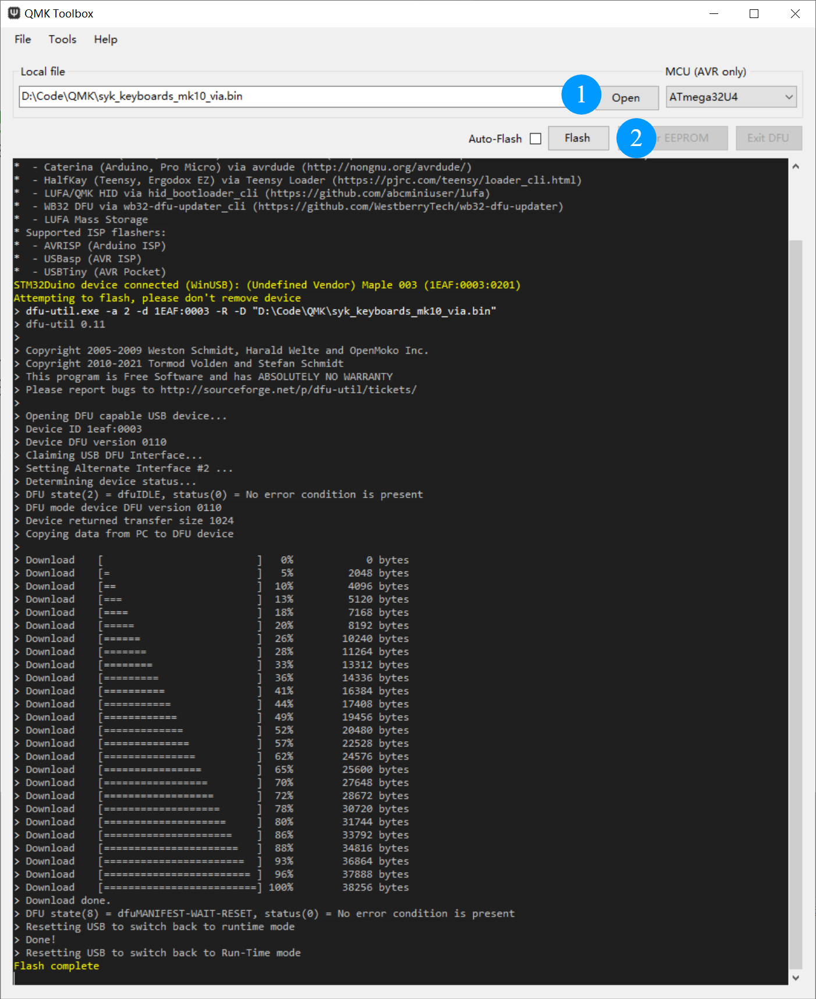

# QMK Non-Host Mode Key Scanning Fix — Firmware Upgrade

## Problem Description

The QMK keyboard cannot scan keys in non-host mode. This firmware has enabled the `NO_USB_STARTUP_CHECK = yes` configuration to fix this issue.

## Firmware Upgrade

1. Download QMK Toolbox:  
   <https://qmk.fm/toolbox>

2. Press the top-left key on the keyboard, then power on the device to put the keyboard into Bootloader/DFU mode.

3. Download the firmware (see image below):

   

4. Open QMK Toolbox, select the downloaded firmware file, click **Flash** to flash it, and wait for the flashing to complete.

5. After flashing is complete, unplug the USB cable and plug it back in to restart the device.

## Notes

- Before flashing, make sure the firmware matches your keyboard model.
- Do not disconnect the USB connection during flashing.
- If QMK Toolbox does not detect the device, re-enter Bootloader mode or try another USB port.